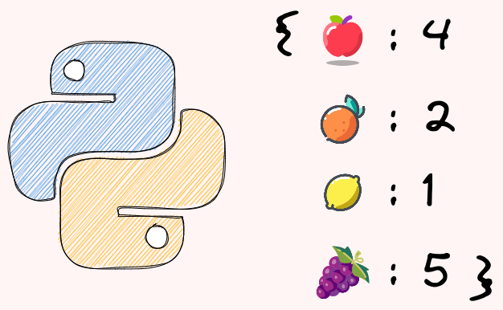

---
jupytext:
  text_representation:
    extension: .md
    format_name: myst
    format_version: 0.13
    jupytext_version: 1.16.7
kernelspec:
  display_name: Python 3 (ipykernel)
  language: python
  name: python3
---

## Dictionary

+++



+++

### Update a Dictionary With Items From Another Dictionary

+++

To update a dictionary with items from another dictionary, use the `update` method.

```{code-cell} ipython3
birth_year = {"Ben": 1997}
new_birth_year = {"Michael": 1993, 'Lauren': 1999}
birth_year.update(new_birth_year)
```

```{code-cell} ipython3
birth_year.update(Josh=1990, Olivia=1991)
```

```{code-cell} ipython3
birth_year 
```

### Key Parameter in Max(): Find the Key with the Largest Value

+++

Applying the `max` method on a Python dictionary will return the max key.

```{code-cell} ipython3
birth_year = {"Ben": 1997, "Alex": 2000, "Oliver": 1995}

max(birth_year)
```

To find the key with the max value instead, add `key=dictionary.get` to the `max` method.

```{code-cell} ipython3
max_val = max(birth_year, key=birth_year.get)
max_val
```

### Stop Writing Nested if-else: Use Python's .get() Instead

+++

When working with dictionaries in Python, it's common to encounter situations where you need to access values that may or may not exist. The traditional approach of using multiple nested if-else statements can result in verbose, repetitive code that's harder to maintain and more prone to errors.

Let's consider an example where we have a dictionary `user_data` with keys "name", "age", and possibly "email". We want to assign default values to these keys if they don't exist.

```{code-cell} ipython3
# Checking dictionary values with multiple if-else
user_data = {"name": "Alice", "age": 30}

# Repetitive code with multiple default values
if "name" in user_data:
    name = user_data["name"]
else:
    name = "Unknown"
    
if "age" in user_data:
    age = user_data["age"]
else:
    age = 0
    
if "email" in user_data:
    email = user_data["email"]
else:
    email = "no-email@example.com"


print(f"{name=}")
print(f"{age=}")
print(f"{email=}")
```

As you can see, this approach is tedious and prone to errors. 

+++

With the `.get()` method, we can access dictionary values with default values in a single line of code. This approach is not only more concise but also more readable and maintainable.

```{code-cell} ipython3
# Using .get() method for cleaner code
user_data = {"name": "Alice", "age": 30}

name = user_data.get("name", "Unknown")
age = user_data.get("age", 0)
email = user_data.get("email", "no-email@example.com")

print(f"{name=}")
print(f"{age=}")
print(f"{email=}")
```

If you want to get the default value when a key doesn't exist in a dictionary, use `dict.get`. In the code below, since there is no key `meeting3`, the default value `online` is returned. 

+++

### Double dict.get: Get Values in a Nested Dictionary with Missing Keys

+++

Assume you have a dictionary of fruits with missing keys, and you want to extract the colors from it.

```{code-cell} ipython3
fruits = [
    {"name": "apple", "attr": {"color": "red", "taste": "sweet"}},
    {"name": "orange", "attr": {"taste": "sour"}},
    {"name": "grape", "attr": {"color": "purple"}},
    {"name": "banana"},
]
```

Using an if-else statement to handle missing keys can make the code lengthy and less readable. 

```{code-cell} ipython3
colors = [
    fruit["attr"]["color"]
    if "attr" in fruit and "color" in fruit["attr"]
    else "unknown"
    for fruit in fruits
]
colors
```

A better alternative is to use the `get` method twice. 

```{code-cell} ipython3
colors = [fruit.get("attr", {}).get("color", "unknown") for fruit in fruits]
colors
```

In the code above:
- The first `get` method will return an empty dictionary if the "attr" key is missing
- The second `get` method will return `unknown` if either the "attr" key or the "color" key is missing.

+++

### dict.fromkeys: Get a Dictionary From a List and a Value

+++

To get a dictionary from a list and a value, use `dict.fromkeys.` 

```{code-cell} ipython3
furnitures = ['bed', 'table', 'chair']
loc1 = 'IKEA'

furniture_loc = dict.fromkeys(furnitures, loc1)
furniture_loc
```

### Reverse a Dictionary with Dictionary Comprehension 

+++

If you want to reverse a dictionary (turn keys into values and vice versa), use the combination of `items` and dictionary comprehension. 

```{code-cell} ipython3
colors = {"apple": "red", "pepper": "green", "onion": "yellow"}

# Get a list of key and value pairs
colors.items()
```

```{code-cell} ipython3
# Switch keys and values by looping the list of key-value pairs
{v: k for k, v in colors.items()}
```

### Merge Two Dictionaries Using the Union Operator in Python 3.9

+++

Before Python 3.9, there are two common ways to merge two dictionaries. The first way is to use the `update` method, but this approach modifies the original dictionary, which can lead to unexpected behavior. 

```{code-cell} ipython3
birth_year = {"Ben": 1997}
new_birth_year = {"Michael": 1993, 'Lauren': 1999}

birth_year.update(new_birth_year)
birth_year
```

The second approach is to use `**`, but this approach makes the code less readable.

```{code-cell} ipython3
birth_year = {"Ben": 1997}
new_birth_year = {"Michael": 1993, 'Lauren': 1999}
{**birth_year, **new_birth_year}
```

In Python 3.9 and above, you can use the `|` operator to merge two dictionaries.

```{code-cell} ipython3
birth_year | new_birth_year
```

To update a dictionary in place, use the `|=` operator.

```{code-cell} ipython3
birth_year |= new_birth_year
birth_year
```

### Iterable as a Key of a Dictionary

+++

Python dictionaries only accept hashable data types as a key in a dictionary. Using a list as a key will give a `TypeError` because it is not hashable. 

```{code-cell} ipython3
price = {['apple', 'orange']: 2, 'banana': 1}
```

If you want to use an iterable as a key of the dictionary, use a tuple instead. This works because tuples are immutable.

```{code-cell} ipython3
price = {('apple', 'orange'): 2, 'banana': 1}
```
