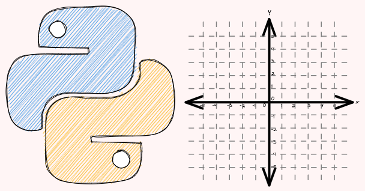

---
jupytext:
  text_representation:
    extension: .md
    format_name: myst
    format_version: 0.13
    jupytext_version: 1.16.7
kernelspec:
  display_name: Python 3.9.13 64-bit
  language: python
  name: python3
---

## Number

+++



+++

### Perform Floor Division with Double Forward Slash

+++

Normally, using `/` will perform a true division 

```{code-cell} ipython3
3/2
```

If you want to perform a floor division, use `//`

```{code-cell} ipython3
3//2
```

### fractions: Get Numerical Results in Fractions Instead of Decimals

+++

Normally, when you divide a number by another number, you will get a decimal:

```{code-cell} ipython3
2 / 3 + 1
```

Sometimes, you might prefer to get the results in fractions instead of decimals. There is Python built-in function called `fractions` that allows you to do exactly that. The code above shows how it works:

```{code-cell} ipython3
from fractions import Fraction

res = Fraction(2 / 3 + 1)
print(res)
```

Cool! We got a fraction instead of a decimal. To limit the number of decimals displayed, use `limit_denominator()`.

```{code-cell} ipython3
res = res.limit_denominator()
print(res)
```

If we divide the result we got from `Fraction` by another number, we got back a fraction without using the `Fraction` object again. 

```{code-cell} ipython3
print(res / 3)
```

### Use Underscores to Format Large Numbers in Python

+++

When working with a large number in Python, it can be difficult to figure out how many digits that number has. Python 3.6 and above allows you to use underscores as visual separators to group digits.

In the example below, I use underscores to group decimal numbers by thousands.


```{code-cell} ipython3
large_num = 1_000_000
large_num
```

### Confirm Whether a Variable Is a Number

+++

If you want to confirm whether a variable is a number without caring whether it is a float or an integer, numbers, use `numbers.Number`.

```{code-cell} ipython3
from numbers import Number

a = 2
b = 0.4

# Check if a is a number
isinstance(a, Number)
```

```{code-cell} ipython3
# Check if b is a number
isinstance(b, Number)
```

### Get Multiples of a Number Using Modulus

+++

If you want to get multiples of a number, use the modulus operator `%`. The modulus operator is used to get the remainder of a division. For example, `4 % 3 = 1`, `5 % 3 = 2`.

Thus, to get multiples of `n`, we select only numbers whose remainders are 0 when dividing them by `n`. 

```{code-cell} ipython3
def get_multiples_of_n(nums: list, n: int):
    """Select only numbers whose remainders
    are 0 when dividing them by n"""
    return [num for num in nums if num % n == 0]


nums = [1, 4, 9, 12, 15, 16]
```

```{code-cell} ipython3
get_multiples_of_n(nums, 2)  # multiples of 2
```

```{code-cell} ipython3
get_multiples_of_n(nums, 3)  # multiples of 3
```

```{code-cell} ipython3
get_multiples_of_n(nums, 4)  # multiples of 4
```
