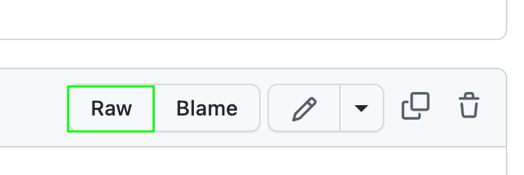

---
jupytext:
  text_representation:
    extension: .md
    format_name: myst
    format_version: 0.13
    jupytext_version: 1.16.7
kernelspec:
  display_name: 'Python 3.8.9 (''venv'': venv)'
  language: python
  name: python3
---

## Create a DataFrame

+++

This section shows some tips to read or create a DataFrame.

+++

### Leverage PyArrow for Efficient Parquet Data Filtering

+++

When dealing with Parquet files in pandas, it is common to first load the data into a pandas DataFrame and then apply filters.

To improve query execution speed, push down the filers to the PyArrow engine to leverage PyArrow's processing optimizations.

In the following code, filtering a dataset of 100 million rows using PyArrow is approximately 113 times faster than performing the same operation with pandas.

```{code-cell} ipython3
import pandas as pd
import numpy as np

file_path = "data.parquet"

# Define the number of rows
num_rows = 100_000_000

# Generate the DataFrame
data = {"id": range(1, num_rows + 1), "price": np.random.rand(num_rows) * 100}
df = pd.DataFrame(data)

# Write the result to a Parquet file
df.to_parquet(file_path, index=False, row_group_size=2_000_000)
```

```{code-cell} ipython3
# %%timeit
pd.read_parquet(file_path).query("id == 50000")
```

```{code-cell} ipython3
# %%timeit
pd.read_parquet(file_path, filters=[("id", "=", 50000)])
```

### Fix Unnamed:0 When Reading a CSV in pandas

+++

Sometimes, when reading a CSV in pandas, you will get an `Unnamed:0` column.

```{code-cell} ipython3
# Create data
import pandas as pd

df = pd.DataFrame({"a": [1, 2, 3], "b": [4, 5, 6]})
df.to_csv("data.csv")
```

```{code-cell} ipython3
import pandas as pd

df = pd.read_csv("data.csv")
print(df)
```

 To fix this, add `index_col=0` to `pandas.read_csv`.

```{code-cell} ipython3
df = pd.read_csv("data.csv", index_col=0)
print(df)
```

### Read Data from a Website

+++

pandas allows you to read data from a website without downloading the data. 

For example, to read a CSV from GitHub, click Raw then copy the link. 



```{code-cell} ipython3
import pandas as pd

df = pd.read_csv(
    "https://raw.githubusercontent.com/mwaskom/seaborn-data/master/exercise.csv",
    index_col=0,
)
```

```{code-cell} ipython3
df.head(5)
```

### Divide a Large pandas DataFrame into Chunks

+++

Large dataframes can consume a significant amount of memory. By processing data in smaller chunks, you can avoid running out of memory and access data faster.

In the code below, using `chunksize=100000` is approximately 5495 times faster than not using `chunksize`.

```{code-cell} ipython3
import pandas as pd
import warnings

warnings.filterwarnings("ignore")
```

```{code-cell} ipython3
# %%timeit
pd.read_csv("../data/flight_data_2018_to_2022.csv")
```

```{code-cell} ipython3
df = pd.read_csv("../data/flight_data_2018_to_2022.csv")
df.shape
```

```{code-cell} ipython3
# %%timeit
pd.read_csv("../data/flight_data_2018_to_2022.csv", chunksize=100000)
```

We can see that using `chunksize=100000` divides the DataFrame into 6 portions, 5 of which have 100000 rows. 

```{code-cell} ipython3
df_chunks = pd.read_csv("../data/flight_data_2018_to_2022.csv", chunksize=100000)
for df_ in df_chunks:
    print(df_.shape)
```

### Read HTML Tables Using Pandas

+++

If you want to quickly extract a table on a website and turn it into a Pandas DataFrame, use `pd.read_html`. In the code below, I extracted the table from a Wikipedia page in one line of code. 

```{code-cell} ipython3
import pandas as pd

df = pd.read_html("https://en.wikipedia.org/wiki/Poverty")
df[1]
```

### DataFrame.copy(): Make a Copy of a DataFrame

+++

Have you ever tried to make a copy of a DataFrame using `=`? You will not get a copy but a reference to the original DataFrame. Thus, changing the new DataFrame will also change the original DataFrame.  

```{code-cell} ipython3
import pandas as pd

df = pd.DataFrame({"col1": [1, 2, 3], "col2": [4, 5, 6]})
df
```

```{code-cell} ipython3
df2 = df
df2["col1"] = [7, 8, 9]
df
```

A better way to make a copy is to use `df.copy()`. Now, changing the copy will not affect the original DataFrame.

```{code-cell} ipython3
df = pd.DataFrame({"col1": [1, 2, 3], "col2": [4, 5, 6]})

# Create a copy of the original DataFrame
df3 = df.copy()

# Change the value of the copy
df3["col1"] = [7, 8, 9]

# Check if the original DataFrame has been changed
df
```

### Copy on Write Mode in pandas 2.0

```{code-cell} ipython3
:tags: [hide-cell]

!pip install pandas==2.0.0
```

pandas DataFrame returns a view by default when selecting a subset, meaning changes to the view will change the original. 

```{code-cell} ipython3
import pandas as pd

df1 = pd.DataFrame({"col1": [1, 2], "col2": [3, 4]})

# Create a view of the original DataFrame
df2 = df1["col1"]

# Change the value of the view
df2.iloc[0] = 10

# The original DataFrame has been changed
df1
```

pandas 2.0 offers the option to return a copy instead of a view by default, preventing changes to the copy from affecting the original.

```{code-cell} ipython3
pd.options.mode.copy_on_write = True

df1 = pd.DataFrame({"col1": [1, 2], "col2": [3, 4]})

# Create a copy of the original DataFrame
df2 = df1["col1"]

# Change the value of the copy
df2.iloc[0] = 10

# The original DataFrame has not been changed
df1
```

```{code-cell} ipython3
:tags: [remove-cell]

import pandas as pd
from datetime import datetime, timedelta

# Create a sample CSV file
data = {
    "start_date": [datetime.now() - timedelta(days=i) for i in range(5)],
    "end_date": [datetime.now() - timedelta(days=i - 1) for i in range(5)],
    "value": [100, 200, 300, 400, 500],
}

df = pd.DataFrame(data)

df.to_csv("data.csv", index=False)
```

### Specify Datetime Columns with parse_dates

+++

Use the `parse_dates` parameter to specify datetime columns when creating a pandas DataFrame from a CSV, rather than converting columns to datetime post-creation. This keeps the code concise and easier to read.

```{code-cell} ipython3
# Instead of this
import pandas as pd 

df = pd.read_csv('data.csv')
print(f'Datatypes before converting to datetime\n{df.dtypes}\n')

df['start_date'] = pd.to_datetime(df['start_date'])
df['end_date'] = pd.to_datetime(df['end_date'])
print(f'Datatypes after converting to datetime\n{df.dtypes}')
```

```{code-cell} ipython3
# Do this
df = pd.read_csv('data.csv', parse_dates=['start_date', 'end_date'])
df.dtypes
```
