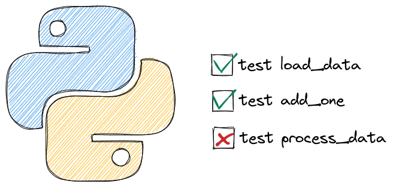

---
jupyter:
  jupytext:
    formats: ipynb,Rmd
    text_representation:
      extension: .Rmd
      format_name: rmarkdown
      format_version: '1.2'
      jupytext_version: 1.16.7
  kernelspec:
    display_name: Python 3 (ipykernel)
    language: python
    name: python3
---

# Testing





## Efficiently Resume Work After Breaks with Failing Tests


Do you forget what feature to implement when taking a break from work? 

To keep your train of thought, write a unit test that describes the desired behavior of the feature and makes it fail intentionally.

This will give you a clear idea of what to work on when returning to the project, allowing you to get back on track faster.


```python
def calculate_average(nums: list):
    return sum(nums)/len(nums) 
    # TODO: code to handle an empty list

def test_calculate_average_two_nums():
    # Will work
    nums = [2, 3]
    assert calculate_average(nums) == 2.5

def test_calculate_average_empty_list():
    # Will fail intentionally
    nums = []
    return calculate_average(nums) == 0 
```


## Choose a Descriptive Name Over a Short One When Naming Your Function


Using a short and unclear name for a testing function may lead to confusion and misunderstandings. To make your tests more readable, use a descriptive name instead, even if it results in a longer name. 


Instead of this:


```python
def contain_word(word: str, text: str):
    return word in text


def test_contain_word_1():
    assert contain_word(word="duck", text="This is a duck")


def test_contain_word_2():
    assert contain_word(word="duck", text="This is my coworker, Mr. Duck")
```


Write this:


```python
def contain_word(word: str, text: str):
    return word in text


def test_contain_word_exact():
    assert contain_word(word="duck", text="This is a duck")


def test_contain_word_different_case():
    assert contain_word(word="duck", text="This is my coworker, Mr. Duck")
```


## pytest benchmark: A Pytest Fixture to Benchmark Your Code

```{python tags=c("hide-cell")}
# !pip install pytest-benchmark
```

If you want to benchmark your code while testing with pytest, try pytest-benchmark. 


To use pytest-benchmark works, add `benchmark` to the test function that you want to benchmark. 

```{python}
# %%writefile pytest_benchmark_example.py
def list_comprehension(len_list=5):
    return [i for i in range(len_list)]


def test_concat(benchmark):
    res = benchmark(list_comprehension)
    assert res == [0, 1, 2, 3, 4]
```

On your terminal, type:
```bash
$ pytest pytest_benchmark_example.py
```
Now you should see the statistics of the time it takes to execute the test functions on your terminal:

```{python tags=c("remove-input")}
# !pytest pytest_benchmark_example.py
```

[Link to pytest-benchmark](https://github.com/ionelmc/pytest-benchmark).


## pytest.mark.parametrize: Test Your Functions with Multiple Inputs

```{python tags=c("hide-cell")}
# !pip install pytest 
```

If you want to test your function with different examples, use `pytest.mark.parametrize` decorator.

To use `pytest.mark.parametrize`, add `@pytest.mark.parametrize` to the test function that you want to experiment with. 

```{python}
# %%writefile pytest_parametrize.py
import pytest

def text_contain_word(word: str, text: str):
    '''Find whether the text contains a particular word'''
    
    return word in text

test = [
    ('There is a duck in this text',True),
    ('There is nothing here', False)
    ]

@pytest.mark.parametrize('sample, expected', test)
def test_text_contain_word(sample, expected):

    word = 'duck'

    assert text_contain_word(word, sample) == expected
```

In the code above, I expect the first sentence to contain the word “duck” and expect the second sentence not to contain that word. Let's see if my expectations are correct by running:
```bash
$ pytest pytest_parametrize.py
```

```{python tags=c("remove-input")}
# !pytest -v pytest_parametrize.py
```

Sweet! 2 tests passed when running pytest.


[Link to my article about pytest](https://towardsdatascience.com/pytest-for-data-scientists-2990319e55e6?sk=2d3a81903b154db0c7ca832b9f29fee8).


## pytest parametrize twice: Test All Possible Combinations of Two Sets of Parameters

```{python tags=c("hide-cell")}
# !pip install pytest 
```

If you want to test the combinations of two sets of parameters, writing all possible combinations can be time-consuming and is difficult to read. 

```python
import pytest

def average(n1, n2):
    return (n1 + n2) / 2

def perc_difference(n1, n2):
    return (n2 - n1)/n1 * 100

## Test the combinations of operations and inputs
@pytest.mark.parametrize("operation, n1, n2", [(average, 1, 2), (average, 2, 3), (perc_difference, 1, 2), (perc_difference, 2, 3)])
def test_is_float(operation, n1, n2):
    assert isinstance(operation(n1, n2), float)
```


You can save your time by using `pytest.mark.parametrize` twice instead.

```{python}
# %%writefile pytest_combination.py
import pytest

def average(n1, n2):
    return (n1 + n2) / 2

def perc_difference(n1, n2):
    return (n2 - n1)/n1 * 100

## Test the combinations of operations and inputs
@pytest.mark.parametrize("operation", [average, perc_difference])
@pytest.mark.parametrize("n1, n2", [(1, 2), (2, 3)])
def test_is_float(operation, n1, n2):
    assert isinstance(operation(n1, n2), float)
```

On your terminal, run:
```bash
$ pytest -v pytest_combination.py
```

```{python tags=c("remove-input")}
# !pytest -v pytest_combination.py
```

From the output above, we can see that all possible combinations of the given operations and inputs are tested.


## Assign IDs to Test Cases


When using pytest parametrize, it can be difficult to understand the role of each test case.

```{python}
# %%writefile pytest_without_ids.py
from pytest import mark


def average(n1, n2):
    return (n1 + n2) / 2

@mark.parametrize(
    "n1, n2",
    [(-1, -2), (2, 3), (0, 0)],
)
def test_is_float(n1, n2):
    assert isinstance(average(n1, n2), float)
```

```bash
$ pytest -v pytest_without_ids.py 
```

```{python tags=c("remove-input")}
# !pytest -v pytest_without_ids.py 
```

You can add `ids` to pytest parametrize to assign a name to each test case.

```{python}
# %%writefile pytest_ids.py
from pytest import mark

def average(n1, n2):
    return (n1 + n2) / 2

@mark.parametrize(
    "n1, n2",
    [(-1, -2), (2, 3), (0, 0)],
    ids=["neg and neg", "pos and pos", "zero and zero"],
)
def test_is_float(n1, n2):
    assert isinstance(average(n1, n2), float)
```

```bash
$ pytest -v pytest_ids.py 
```

```{python tags=c("remove-input")}
# !pytest -v pytest_ids.py 
```

We can see that instead of `[-1--2]`, the first test case is shown as `neg and neg`. This makes it easier for others to understand the roles of your test cases.  


If you want to specify the test IDs together with the actual data, instead of listing them separately, use `pytest.param`. 

```{python}
# %%writefile pytest_param.py
import pytest


def average(n1, n2):
    return (n1 + n2) / 2


examples = [
    pytest.param(-1, -2, id="neg-neg"),
    pytest.param(2, 3, id="pos-pos"),
    pytest.param(0, 0, id="0-0"),
]


@pytest.mark.parametrize("n1, n2", examples)
def test_is_float(n1, n2):
    assert isinstance(average(n1, n2), float)

```

```bash
$ pytest -v pytest_param.py
```

```{python tags=c("hide-inpy")}
# !pytest -v pytest_param.py
```

## Pytest Fixtures: Use The Same Data for Different Tests

```{python tags=c("hide-cell")}
# !pip install pytest textblob 
```

If you want to use the same data to test different functions, use pytest fixtures.


To use pytest fixtures,  add the decorator `@pytest.fixture` to the function that creates the data you want to reuse.

```{python}
# %%writefile pytest_fixture.py
import pytest 
from textblob import TextBlob

def extract_sentiment(text: str):
    """Extract sentimetn using textblob. Polarity is within range [-1, 1]"""
    
    text = TextBlob(text)
    return text.sentiment.polarity

@pytest.fixture 
def example_data():
    return 'Today I found a duck and I am happy'

def test_extract_sentiment(example_data):
    sentiment = extract_sentiment(example_data)
    assert sentiment > 0
```

On your terminal, type:
```bash
$ pytest pytest_fixture.py
```
Output:

```{python tags=c("remove-input")}
# !pytest pytest_fixture.py 
```

## Execute a Fixture Only Once per Session


By default, every time you use a pytest fixture in a test, a fixture will be executed.


```python
# example.py
import pytest 

@pytest.fixture
def my_data():
    print("Reading data...")
    return 1

def test_division(my_data):
    print("Test division...")
    assert my_data / 2 == 0.5

def test_modulus(my_data):
    print("Test modulus...")
    assert my_data % 2 == 1
```
From the output, we can see that the fixture `my_data` is executed twice.

```bash
$ pytest example.py -s
Reading data...
Test division...
Reading data...
Test modulus...
```


If a fixture is expensive to execute, you can make the fixture be executed only once per session using `scope=session`. 

```{python}
# %%writefile pytest_scope.py
import pytest 

@pytest.fixture(scope="session")
def my_data():
    print("Reading data...")
    return 1

def test_division(my_data):
    print("Test division...")
    assert my_data / 2 == 0.5

def test_modulus(my_data):
    print("Test modulus...")
    assert my_data % 2 == 1
```

From the output, we can see that the fixture `my_data` is executed only once.
```bash
$ pytest pytest_scope.py -s
Reading data...
Test division...
Test modulus...
```


## Pytest skipif: Skip a Test When a Condition is Not Met


If you want to skip a test when a condition is not met, use pytest `skipif`. For example, in the code below, I use `skipif` to skip a test if the python version is less than 3.9.

```{python}
# %%writefile pytest_skip.py
import sys
import pytest 

def add_two(num: int):
    return num + 2 

@pytest.mark.skipif(sys.version_info < (3, 9), reason="Eequires Python 3.9 or higher")
def test_add_two(): 
    assert add_two(3) == 5
```

On your terminal, type:
```bash
$ pytest pytest_skip.py -v 
```

Output:

```{python tags=c("remove-input")}
# !pytest pytest_skip.py -v 
```

## Pytest xfail: Mark a Test as Expected to Fail


If you expect a test to fail, use pytest `xfail` marker. This will prevent pytest from marking a test as failed when there is an exception.

To be more specific about what exception you expect to see, use the `raises` argument.

```{python}
import pandas as pd

df = pd.DataFrame(
    {
        "col1": [1, 2, 3, 4, 3],
        "col2": ["a", "a", "b", "b", "c"],
    }
)

df.groupby(["col2"]).agg({"col1": "mean"})
```

```{python}
# %%writefile pytest_mark_xfail.py
import pytest
import pandas as pd
import numpy as np


def get_mean(df, group_column, value_column):
    if df[group_column].isna().any():
        raise ValueError("Group column contains NaN values")
    return df.groupby(group_column)[value_column].mean()


@pytest.mark.xfail(raises=ValueError)
def test_cget_mean():
    df = pd.DataFrame({"group": ["a", np.nan, "b", "b"], "value": [1, 2, 3, 0]})
    get_mean(df, "group", "value")
```

On your terminal, type:

```bash
$ pytest pytest_mark_xfail.py
```

We can see that no test failed.

```{python tags=c("remove-input")}
# !pytest pytest_mark_xfail.py
```

## Stop Flaky Float Tests with pytest.approx()


When working with floating-point numbers in tests, comparing exact equality often fails due to inherent precision limitations, which results in flaky or unreliable tests.

You can use `pytest.approx()` to compare floating-point numbers with a reasonable tolerance, making your tests more robust and readable.

Here's a code example to show its usefulness:


```{python}
# %%writefile test_approx.py
import pytest


## Without pytest.approx - test fails
def test_calculation_without_approx():
    result = 0.1 + 0.2
    assert result == 0.3  # This fails!


## With pytest.approx - test passes
def test_calculation_with_approx():
    result = 0.1 + 0.2
    assert result == pytest.approx(0.3)  # This passes!


## Works with sequences too
def test_list_of_floats():
    results = [0.1 + 0.2, 0.2 + 0.4]
    expected = [0.3, 0.6]
    assert results == pytest.approx(expected)
```

```{python}
# !pytest test_approx.py -sv
```

In these examples:
- The first test fails because 0.1 + 0.2 in floating-point arithmetic doesn't exactly equal 0.3.
- The second test passes because `pytest.approx()` allows for a small tolerance in the comparison (by default, relative tolerance of 1e-6).
- The third example shows how it works with lists of numbers, making it convenient for comparing multiple results at once.


## Test for Specific Exceptions in Unit Testing


To test for a specific exception in unit testing, use `pytest.raises`.

For example, you can use it to test if a ValueError is thrown when there are NaN values in the group column.

```{python}
# %%writefile pytest_to_fail.py
import pytest
import pandas as pd
import numpy as np


def get_mean(df, group_column, value_column):
    if df[group_column].isna().any():
        raise ValueError("Group column contains NaN values")
    return df.groupby(group_column)[value_column].mean()


def test_get_mean():
    with pytest.raises(ValueError):
        df = pd.DataFrame({"group": ["a", np.nan, "b", "b"], "value": [1, 2, 3, 0]})
        get_mean(df, "group", "value")
```

```bash
$ pytest pytest_to_fail.py
```

```{python tags=c("remove-input")}
# !pytest pytest_to_fail.py
```

## Organize and Control Test Execution using pytest.mark


pytest.mark lets you label test functions for conditional or selective execution based on specific needs. 

For instance, you can mark slow tests or tests involving integration with external services to run them separately or exclude them from regular test runs. This helps you organize and execute your tests more effectively.

```{python}
# %%writefile pytest_mark.py
import pytest
import time


@pytest.mark.slow
def test_long_running_function():
    # Test that takes a long time to complete
    time.sleep(5)


@pytest.mark.db
def test_database_interaction():
    # Test that requires a database connection
    pass


def test_function_1():
    pass


def test_function_2():
    pass
```

Run only slow tests:

```bash
$ pytest pytest_mark.py -m slow
```

```{python tags=c("remove-input")}
# !pytest pytest_mark.py -m slow --disable-pytest-warnings
```

Skip slow tests:

```bash
$ pytest pytest_mark.py -m "not slow"
```

```{python tags=c("remove-input")}
# !pytest pytest_mark.py -m "not slow" --disable-pytest-warnings
```

Skip database tests:

```bash
$ pytest pytest_mark.py -m "not db" 
```

```{python tags=c("remove-input")}
# !pytest pytest_mark.py -m "not db" --disable-pytest-warnings
```

## Verify Logging Error with pytest


To ensure that your application logs an error under a specific condition, use the built-in fixture called `caplog` in pytest. 

This fixture allows you to capture log messages generated during the execution of your test.

```{python}
# %%writefile test_logging.py
from logging import getLogger

logger = getLogger(__name__)

def divide(num1: float, num2: float) -> float:
    if num2 == 0:
        logger.error(f"Can't divide {num1} by 0")
    else:
        logger.info(f"Divide {num1} by {num2}")
        return num1 / num2

def test_divide_by_0(caplog):
    divide(1, 0)
    assert "Can't divide 1 by 0" in caplog.text
```

```bash
$ pytest test_logging.py
```

```{python tags=c("remove-input")}
# !pytest test_logging.py 
```

## Pytest repeat


```{python tags=c("hide-cell")}
# !pip install pytest-repeat
```

It is a good practice to test your functions to make sure they work as expected, but sometimes you need to test 100 times until you found the rare cases when the test fails. That is when pytest-repeat comes in handy.

To use pytest-repeat, add the decorator `@pytest.mark.repeat(N)` to the test function you want to repeat `N` times

```{python}
# %%writfile pytest_repeat_example.py
import pytest 
import random 

def generate_numbers():
    return random.randint(1, 100)

@pytest.mark.repeat(100)
def test_generate_numbers():
    assert generate_numbers() > 1 and generate_numbers() < 100
```

On your terminal, type:
```bash
$ pytest pytest_repeat_example.py
```
We can see that 100 experiments are executed and passed:

```{python tags=c("remove-input")}
# !pytest pytest_repeat_example.py
```

[Link to pytest-repeat](https://github.com/pytest-dev/pytest-repeat)


## pytest-sugar: Show the Failures and Errors Instantly With a Progress Bar

```{python tags=c("hide-cell")}
# !pip install pytest-sugar 
```

It can be frustrating to wait for a lot of tests to run before knowing the status of the tests. If you want to see the failures and errors instantly with a progress bar, use pytest-sugar. 

pytest-sugar is a plugin for pytest. To see how pytest-sugar works, assume we have several test files in the `pytest_sugar_example` directory. 

```{python}
# %ls pytest_sugar_example
```

The code below shows how the outputs will look like when running pytest.


```bash
$ pytest pytest_sugar_example
```

```{python tags=c("remove-input")}
# !pytest pytest_sugar_example
```

[Link to pytest-sugar](https://github.com/Teemu/pytest-sugar).


## pytest-steps: Share Data Between Tests


Have you ever wanted to use the result of one test for another test? That is when pytest_steps comes in handy. 


In the code below, I use the result of `sum_test` as the input of `average_2_nums`. The argument `steps_data` allows me to share the data between 2 tests. 

```{python}
# %%writefile test_steps.py
from pytest_steps import test_steps


def sum(n1, n2):
    return n1 + n2


def average_2_nums(sum):
    return sum / 2


def sum_test(steps_data):
    res = sum(1, 3)
    assert res == 4
    steps_data.res = res


def perc_difference_test(steps_data):
    avg = average_2_nums(steps_data.res)
    assert avg == 2


@test_steps(sum_test, perc_difference_test)
def test_calc_suite(test_step, steps_data):
    if test_step == 'sum_test':
        sum_test(steps_data)
    elif test_step == 'perc_difference_test':
        perc_difference_test(steps_data)
```

```bash
$ pytest test_steps.py
```

```{python tags=c("remove-input")}
# !pytest test_steps.py
```

[Link to pytest_steps](https://smarie.github.io/python-pytest-steps/).


## pytest-picked: Run the Tests Related to the Unstaged Files in Git


It can be time-consuming to run all tests in your project. Wouldn't it be nice if you can run only the tests related to the unstaged files in Git? That is when pytest-picked comes in handy.

In the code below, only tests in the file `test_picked.py` are executed because it is an unstaged file.

```{python}
# %%writefile test_picked.py
def plus_one(num: int):
    return num + 1


def test_plus_one():
    assert plus_one(2) == 3
```

```bash
$ git status
```

```{python tags=c("remove-input")}
# !git status
```

```bash
$ pytest --picked
```

```{python tags=c("remove-input")}
# !pytest --picked
```

[Link to pytest-picked](https://github.com/anapaulagomes/pytest-picked).


## Efficient Testing of Python Class with setUp Method


When testing a Python class, it can be repetitive and time-consuming to create multiple instances to test a large number of instance methods. 

```{python}
# %%writefile get_dog.py 
class Dog:
    def __init__(self, name, age):
        self.name = name
        self.age = age

    def walk(self):
        return f"{self.name} is walking"

    def bark(self):
        return f"{self.name} is barking"
```

```{python}
# %%writefile test_get_dog.py
import unittest
from get_dog import Dog

class TestDog(unittest.TestCase):
    def test_walk(self):
        dog = Dog("Max", 3) 
        dog.walk() == "Max is walking"

    def test_bark(self):
        dog = Dog("Max", 3) 
        dog.bark() == "Max is barking"
```

A better approach is to use the `setUp` method to instantiate a class object before running each test.

```{python}
# %%writefile test_get_dog.py
import unittest
from get_dog import Dog

class TestDog(unittest.TestCase):
    def setUp(self):
        self.dog = Dog("Max", 3)

    def test_walk(self):
        self.dog.walk() == "Max is walking"

    def test_bark(self):
        self.dog.bark() == "Max is barking"
```

## FreezeGun: Freezing Time for Reliable Python Testing

```{python tags=c("hide-cell")}
# !pip install freezegun
```

Testing time-dependent functions can be challenging and unreliable as the results may vary based on when the test is executed. This results in flaky tests that pass or fail inconsistently.


With FreezeGun, you can freeze time at a particular point, ensuring your tests always run with the same date context.

```{python}
# %%writefile test_freezegun.py
from freezegun import freeze_time
import datetime 

def get_day_of_week():
    return datetime.datetime.now().weekday()

@freeze_time("2024-10-13")
def test_get_day_of_week():
    assert get_day_of_week() == 6

```

```bash
$ pytest test_freezegun.py
```

```{python tags=c("remove-input")}
# !pytest test_freezegun.py
```

This code uses `get_day_of_week()` to return the current weekday (0-6). The `@freeze_time("2024-10-13")` decorator sets a fixed date (Sunday, October 13, 2024).

The test calls `get_day_of_week()` and checks if it returns 6 (Sunday). This test will consistently pass because FreezeGun ensures `datetime.datetime.now()` always returns the specified frozen date.


[Link to FreezeGun](https://github.com/spulec/freezegun).


## Simulate External Services in Testing with Mock Objects


Testing code that relies on external services, like a database, can be difficult since the behaviors of these services can change. 

A mock object can control the behavior of a real object in a testing environment by simulating responses from external services.

Here are two common use cases with examples:


1. **Mocking Time-Dependent Functions**

When testing functions that depend on the current time or date, you can mock the time to ensure consistent results.

Example: Testing a function that returns data for the last week

```{python}
# %%writefile main.py
from datetime import datetime, timedelta


def get_data_for_last_week():
    end_date = datetime.now().date()
    start_date = end_date - timedelta(days=7)
    return {
        "start_date": start_date.strftime("%Y-%m-%d"),
        "end_date": end_date.strftime("%Y-%m-%d"),
    }
```

Now, let's create a test for this function using mock:


```{python}
# %%writefile test_main.py
from datetime import datetime
from unittest.mock import patch
from main import get_data_for_last_week


@patch("main.datetime")
def test_get_data_for_last_week(mock_datetime):
    # Set a fixed date for the test
    mock_datetime.now.return_value = datetime(2024, 8, 5)

    # Call the function
    result = get_data_for_last_week()

    # Assert the results
    assert result["start_date"] == "2024-07-29"
    assert result["end_date"] == "2024-08-05"

    # Verify that datetime.now() was called
    mock_datetime.now.assert_called_once()
```

This test mocks the `datetime.now()` method to return a fixed date, allowing for predictable and consistent test results.

```{python tags=c("hide-cell")}
# !pytest -sv test_main.py
```

2. **Mocking API calls**

When testing code that makes external API calls, mocking helps avoid actual network requests during testing.

Example: Testing a function that makes an API call

```{python}
# %%writefile main.py
import requests
from requests.exceptions import ConnectionError


def get_data():
    """Make an API call to Postgres"""
    try:
        response = requests.get("http://localhost:5432")
        return response.json()
    except ConnectionError:
        return None
```

```{python}
# %%writefile test_main.py
from unittest.mock import patch
from requests.exceptions import ConnectionError
from main import get_data


@patch("main.requests.get")
def test_get_data_fails(mock_get):
    """Test the get_data function when the API call fails"""
    # Define what happens when the function is called
    mock_get.side_effect = ConnectionError
    assert get_data() is None


@patch("main.requests.get")
def test_get_data_succeeds(mock_get):
    """Test the get_data function when the API call succeeds"""
    # Define the return value of the function
    mock_get.return_value.json.return_value = {"data": "test"}
    assert get_data() == {"data": "test"}
```

These tests mock the `requests.get()` function to simulate both successful and failed API calls, allowing us to test our function's behavior in different scenarios without making actual network requests.

```{python tags=c("hide-cell")}
# !pytest test_main.py
```

By using mocks in these ways, we can create more reliable and controlled unit tests for our data projects, ensuring that our code behaves correctly under various conditions.


## pytest-mock vs unittest.mock: Simplifying Mocking in Python Tests

```{python tags=c("hide-cell")}
# !pip install pytest-mock
```

Traditional mocking with unittest.mock often requires repetitive setup and teardown code, which can make test code harder to read and maintain. 

pytest-mock addresses this issue by leveraging pytest's fixture system, simplifying the mocking process and reducing boilerplate code.

Consider the following example that demonstrates the difference between unittest.mock and pytest-mock.

Using unittest.mock:

```{python}
# %%writefile test_rm_file.py
from unittest.mock import patch
import os


def rm_file(filename):
    os.remove(filename)


def test_with_unittest_mock():
    with patch("os.remove") as mock_remove:
        rm_file("file")
        mock_remove.assert_called_once_with("file")
```

```{python}
# !pytest test_rm_file.py
```

Using pytest-mock:

```{python}
# %%writefile test_rm_file.py
import os


def rm_file(filename):
    os.remove(filename)


def test_unix_fs(mocker):
    mocker.patch("os.remove")
    rm_file("file")
    os.remove.assert_called_once_with("file")
```

```{python}
# !pytest test_rm_file.py
```

Key differences:

1. Setup: pytest-mock uses the `mocker` fixture, automatically provided by pytest, eliminating the need to import patching utilities.

2. Patching: With pytest-mock, you simply call `mocker.patch('os.remove')`, whereas unittest.mock requires a context manager or decorator.

3. Cleanup: pytest-mock automatically undoes mocking after the test, while unittest.mock relies on the context manager for cleanup.

4. Accessing mocks: pytest-mock allows direct access to the patched function (e.g., `os.remove.assert_called_once_with()`), while unittest.mock requires accessing the mock through a variable (e.g., `mock_remove.assert_called_once_with()`).


[Link to pytest-mock](https://bit.ly/4dBDAOE).


## tmp_path: Create a Temporary Directory for Testing


Use the `tmp_path` fixture in pytest to create a temporary directory for testing the function that interacts with files. This will prevent any changes to the actual filesystem or production files.

```{python}
# %%writefile test_tmp_path.py
from pathlib import Path


def save_result(folder: str, file_name: str, text: str):
    # Create new file inside the folder
    file = Path(folder) / file_name
    file.touch()

    # Write result to the new file
    file.write_text(text)

def test_save_result(tmp_path):
    # Create a temporary folder
    folder = tmp_path / "new"
    folder.mkdir() 

    file_name = "my_file.txt"
    text = "Accuracy: 0.9"

    save_result(folder=folder, file_name=file_name, text=text)
    res = Path(f"{folder}/{file_name}").read_text()
    assert res == text
```

```bash
$ pytest test_tmp_path.py
```

```{python tags=c("remove-input")}
# !pytest test_tmp_path.py
```

## Pandera: a Python Library to Validate Your Pandas DataFrame

```{python tags=c("hide-cell")}
# !pip install -U pandera
```

Poor data quality can have severe consequences, including incorrect conclusions and subpar model performance. Moreover, processing invalid or incorrect data is a waste of time and resources. Therefore, it is crucial to verify the consistency and reliability of data before using it.

pandera makes it easy to perform data validation on dataframe-like objects. 

```{python}
import pandas as pd
import pandera as pa

student_df = pd.DataFrame(
    {
        "name": ["John", "Jane", "Bob"],
        "age": [25, 30, 35],
        "score": [95.5, 88.3, 92.7],
    }
)

student_schema = pa.DataFrameSchema(
    {
        "name": pa.Column(str),
        "age": pa.Column(int, pa.Check.between(0, 120)),
        "score": pa.Column(float, pa.Check.between(0, 100)),
    }
)

student_schema.validate(student_df)
```

This code defines a schema using `DataFrameSchema` with three columns:

1. `name`: a string column
2. `age`: an integer column that must be between 0 and 120
3. `score`: a float column that must be between 0 and 100

It then validates a DataFrame `student_df` against this schema, returning the validated DataFrame if all validations pass.


If the dataframe does not pass validation checks, pandera provides useful error messages.

```{python}
invalid_student_df = pd.DataFrame(
    {
        "name": ["John", "Jane", "Bob"],
        "age": [25, 30, 200],
        "score": [95.5, 88.3, 92.7],
    }
)

try:
    student_schema.validate(invalid_student_df)
except pa.errors.SchemaError as err:
    print("SchemarError:", err)
```

To validate the inputs of a function before calling that function, use the `check_input` decorator. In the code below, the decorator validates the value of the `data` argument against the `input_schema`:

```{python}
from pandera import check_input


@check_input(student_schema)
def calculate_grade(data: pd.DataFrame):
    data["grade"] = pd.cut(
        data["score"],
        bins=[0, 70, 80, 90, 100],
        labels=["F", "C", "B", "A"],
        include_lowest=True,
    )
    return data


student_df = pd.DataFrame(
    {
        "name": ["John", "Jane", "Bob"],
        "age": [25, 30, 35],
        "score": [95.5, 88.3, 92.7],
    }
)

calculate_grade(student_df)
```

If the input does not conform to the schema, an error will be raised, preventing the function from executing with invalid data.

```{python}
invalid_student_df = pd.DataFrame(
    {
        "name": ["John", "Jane", "Bob"],
        "age": [25, 30, 200],
        "score": [95.5, 88.3, 92.7],
    }
)

try:
    result = calculate_grade(invalid_student_df)
except pa.errors.SchemaError as err:
    print("SchemaError:", err)
```

[Link to Pandera](https://github.com/unionai-oss/pandera).


## Validating Polars DataFrames with Pandera


```{python}
# !pip install -U 'pandera[polars]'
```

Pandera is a Python library that makes it easy to validate pandas DataFrame. Now, Pandera also supports Polars, a blazingly fast DataFrame library written in Rust.

```{python}
import pandera.polars as pa
import polars as pl


class Schema(pa.DataFrameModel):
    state: str = pa.Field(isin=["FL", "CA"])
    city: str
    price: int = pa.Field(in_range={"min_value": 5, "max_value": 20})


lf = pl.LazyFrame(
    {
        "state": ["FL", "FL", "FL", "CA", "CA", "CA"],
        "city": [
            "Orlando",
            "Miami",
            "Tampa",
            "San Francisco",
            "Los Angeles",
            "San Diego",
        ],
        "price": [8, 12, 10, 16, 20, 18],
    }
)
Schema.validate(lf).collect()
```

You can also use the `check_types()` decorator to validate polars LazyFrame function annotations at runtime:


```{python}
from pandera.typing.polars import LazyFrame

@pa.check_types
def filter_state(lf: LazyFrame[Schema], state: str) -> LazyFrame[Schema]:
    return lf.filter(pl.col("state").eq(state))

filter_state(lf, "CA").collect()
```

[Link to Pandera](https://github.com/unionai-oss/pandera).


## Efficiently Generate Falsified Examples for Unit Tests with Pandera and Hypothesis

```{python tags=c("hide-cell")}
# !pip install hypothesis pandera pytest
```

Generating readable edge cases for unit tests can often be a challenging task. However, with the combined power of Pandera and Hypothesis, you can efficiently detect falsified examples and write cleaner tests.

Pandera allows you to define constraints for inputs and outputs, while Hypothesis automatically identifies edge cases that match the specified schema. Hypothesis further simplifies complex examples until it finds a smaller example that still reproduces the issue. 

```{python}
# %%writefile test_processing_fn.py
import hypothesis
import pandera as pa

## Specify the schema of the df used for testing
schema = pa.DataFrameSchema(
    {
        "val1": pa.Column(int, pa.Check.in_range(-2, 3)),
        "val2": pa.Column(int, pa.Check.in_range(-2, 3)),
    }
)

out_schema = schema.add_columns(
    {
        "val3": pa.Column(float, pa.Check.in_range(-2, 3)),
    },
)


@pa.check_output(out_schema)
def processing_fn(df):
    processed = df.assign(val3=df.val1/df.val2)
    return processed


@hypothesis.given(schema.strategy(size=5)) # Generate 5 examples
def test_processing_fn(dataframe):
    processing_fn(dataframe)
```

```{python tags=c("remove-cell")}
# !pytest test_processing_fn.py 
```

```bash
$ pytest test_processing_fn.py 
```


```bash
test_processing_fn.py F                                                  [100%]

=================================== FAILURES ===================================
______________________________ test_processing_fn ______________________________
pandera.errors.SchemaError: error in check_output decorator of function 'processing_fn': non-nullable series 'val3' contains null values:
0   NaN
1   NaN
2   NaN
3   NaN
4   NaN
Name: val3, dtype: float64
Falsifying example: test_processing_fn(
    dataframe=
           val1  val2
        0     0     0
        1     0     0
        2     0     0
        3     0     0
        4     0     0
)
```


## DeepDiff Find Deep Differences of Python Objects

```{python tags=c("hide-cell")}
# !pip install deepdiff
```

<!-- #region -->
When testing the outputs of your functions, it can be frustrated to see your tests fail because of something you don't care too much about such as: 

- order of items in a list

- different ways to specify the same thing such as abbreviation

- exact value up to the last decimal point, etc


Is there a way that you can exclude certain parts of the object from the comparison? That is when DeepDiff comes in handy. 
<!-- #endregion -->

```{python}
from deepdiff import DeepDiff 
```

DeepDiff can output a meaningful comparison like below:

```{python}
price1 = {'apple': 2, 'orange': 3, 'banana': [3, 2]}
price2 = {'apple': 2, 'orange': 3, 'banana': [2, 3]}

DeepDiff(price1, price2)
```

With DeepDiff, you also have full control of which characteristics of the Python object DeepDiff should ignore. In the example below, since the order is ignored `[3, 2]` is equivalent to `[2, 3]`.

```{python}
## Ignore orders 

DeepDiff(price1, price2, ignore_order=True)
```

We can also exclude certain part of our object from the comparison. In the code below, we ignore `ml` and `machine learning` since `ml` is a abbreviation of `machine learning`.

```{python}
experience1 = {"machine learning": 2, "python": 3}
experience2 = {"ml": 2, "python": 3}

DeepDiff(
    experience1,
    experience2,
    exclude_paths={"root['ml']", "root['machine learning']"},
)
```

Cmpare 2 numbers up to a specific decimal point:

```{python}
num1 = 0.258
num2 = 0.259

DeepDiff(num1, num2, significant_digits=2)
```

[Link to DeepDiff](https://github.com/seperman/deepdiff).


## dirty-equals: Write Declarative Assertions in Your Unit Tests

```{python tags=c("hide-cell")}
# !pip install dirty-equals
```

If you want to write declarative assertions and avoid boilerplate code in your unit tests, try dirty_equals. 

```{python}
from dirty_equals import IsNow, IsPartialDict, IsList, IsStr, IsTrueLike
```

```{python}
from datetime import datetime
from datetime import timedelta

shopping = {
    "time": datetime.today().now(),
    "quantity": {"apple": 1, "banana": 2, "orange": 1},
    "locations": ["Walmart", "Aldi"],
    "is_male": 1 
}

```

```{python}
assert shopping == {
    "time": IsNow(delta=timedelta(hours=1)),
    "quantity": IsPartialDict(apple=1, orange=1),
    "locations": IsList("Aldi", "Walmart", check_order=False),
    "is_male": IsTrueLike
}

```

[Link to dirty-equals](https://github.com/samuelcolvin/dirty-equals).


## hypothesis: Property-based Testing in Python

```{python tags=c("hide-code")}
# !pip install hypothesis
```

If you want to test some properties or assumptions, it can be cumbersome to write a wide range of scenarios. To automatically run your tests against a wide range of scenarios and find edge cases in your code that you would otherwise have missed, use hypothesis.


In the code below, I test if the addition of two floats is commutative. The test fails when either `x` or `y` is `NaN`. 

```{python}
# %%writefile test_hypothesis.py 
from hypothesis import given
from hypothesis.strategies import floats


@given(floats(), floats())
def test_floats_are_commutative(x, y):
    assert x + y == y + x
```

```bash
$ pytest test_hypothesis.py
```

```{python tags=c("remove-input")}
# !pytest test_hypothesis.py
```

Now I can rewrite my code to make it more robust against these edge cases. 


[Link to hypothesis](https://hypothesis.readthedocs.io/en/latest/quickstart.html).


## Deepchecks: Check Category Mismatch Between Train and Test Set

```{python tags=c("hide-cell")}
# !pip install deepchecks 
```

Sometimes, it is important to know if your test set contains the same categories in the train set. If you want to check the category mismatch between the train and test set, use Deepchecks's `CategoryMismatchTrainTest`.


In the example below, the result shows that there are 2 new categories in the test set. They are 'd' and 'e'.

```{python}
from deepchecks.checks.integrity.new_category import CategoryMismatchTrainTest
from deepchecks.base import Dataset
import pandas as pd
```

```{python}
train = pd.DataFrame({"col1": ["a", "b", "c"]})
test = pd.DataFrame({"col1": ["c", "d", "e"]})

train_ds = Dataset(train, cat_features=["col1"])
test_ds = Dataset(test, cat_features=["col1"])
```

```{python}
CategoryMismatchTrainTest().run(train_ds, test_ds)
```

[Link to Deepchecks](https://docs.deepchecks.com/en/stable/)


## leAB: AB Testing Analysis in Python

```{python tags=c("hide-cell")}
# !pip install leab
```

AB testing is crucial for assessing the effectiveness of changes in a controlled environment. With the leAB library, you can compute the appropriate sample size before launching the test.  

```{python}
from leab import before

## What is the number of sample needed per variation to detect a 1% result 
# difference in a population with a 15% conversion rate?
ab_test = before.leSample(conversion_rate=15, min_detectable_effect=1)
ab_test.get_size_per_variation()

```

After reaching the sample size, you can compare the successes between group A and group B. 

```{python}
from leab import after, leDataset

## Import sample data for A and B
data = leDataset.SampleLeSuccess()
data.A.head()

```

```{python}
ab_test = after.leSuccess(data.A, data.B, confidence_level=0.95)

## Get the conclusion on the test 
ab_test.get_verdict()
```

[Link to leAB](https://github.com/tlentali/leab).


## pytest-postgresql: Incorporate Database Testing into Your pytest Test Suite

```{python tags=c("hide-cell")}
# !pip install pytest-postgresql
```

If you want to incorporate database testing seamlessly within your pytest test suite, use pytest-postgresql.

pytest-postgres provides fixtures that manage the setup and cleanup of test databases, ensuring repeatable tests. Additionally, each test runs in isolation, preventing any impact on the production database from testing changes.


To see how pytest-postgres works, let's create a test function that sets up a test table in a PostgreSQL database, inserts some test data, and then verifies that the query results match the expected data.

```{python}
# %%writefile test_postgres.py 
def test_query_results(postgresql):
    """Check that the query results are as expected."""
    with postgresql.cursor() as cur:
        cur.execute("CREATE TABLE test_table (id SERIAL PRIMARY KEY, name VARCHAR);")
        cur.execute("INSERT INTO test_table (name) VALUES ('John'), ('Jane'), ('Alice');")

        # Assert the results
        cur.execute("SELECT * FROM test_table;")
        assert cur.fetchall() == [(1, 'John'), (2, 'Jane'), (3, 'Alice')]
```

```bash
$ pytest test_postgres.py 
```

```{python tags=c("remove-input")}
# !pytest test_postgres.py 
```

[Link to pytest-postgresql](https://github.com/ClearcodeHQ/pytest-postgresql).


## Maintain the Accuracy of Docstring Examples with Doctest


Including examples in a docstring is helpful. However, examples can become obsolete as the function evolves.

To ensure that the examples remain accurate, use doctest.

```{python tags=c("remove-output")}
# %%writefile example.py 
def perc_difference(n1, n2):
    """Return the percentage difference between two numbers, n1 and n2.

    Formula: ((n2 - n1) / n1) * 100

    Examples:
    >>> perc_difference(50, 60)
    20.0
    >>> perc_difference(100, 100)
    0.0

    :param n1: The first number (the original value).
    :param n2: The second number (the new value).
    :return: The percentage difference between n1 and n2 as a float.
    """
    return ((n2 - n1) / n1) * 100


if __name__ == "__main__":
    import doctest
    doctest.testmod()
```

```bash
$ python example.py -v
```

```{python tags=c("remove-input")}
# !python example.py -v
```

## DeepEval: Unit Testing for Your LLM Model

```{python tags=c("hide-cell")}
# !pip install -U deepeval
```

When deploying an LLM model to production, it's crucial that the model is accurate, relevant to the specific question, and free from biases.

DeepEval simplifies unit testing of LLM outputs in Python using these criteria.

In the following code, we use DeepEval to check if the LLM output is accurate and aligns with established facts. 

```{python tags=c("remove-output")}
# %%writefile test_chatbot.py
import pytest
from deepeval.metrics.factual_consistency import FactualConsistencyMetric
from deepeval.test_case import LLMTestCase
from deepeval.run_test import assert_test

def test_case():
    query = "What if these shoes don't fit?"
    context = "All customers are eligible for a 30 day full refund."

    # Replace this with the actual output from your LLM application
    actual_output = "We offer a 30-day full refund."
    factual_consistency_metric = FactualConsistencyMetric(minimum_score=0.7)
    test_case = LLMTestCase(query=query, output=actual_output, context=context)
    assert_test(test_case, [factual_consistency_metric])
```

```bash
$ deepeval test run test_chatbot.py
```

```{python tags=c("remove-input")}
# !deepeval test run test_chatbot.py
```

[Link to DeepEval](https://github.com/confident-ai/deepeval).
