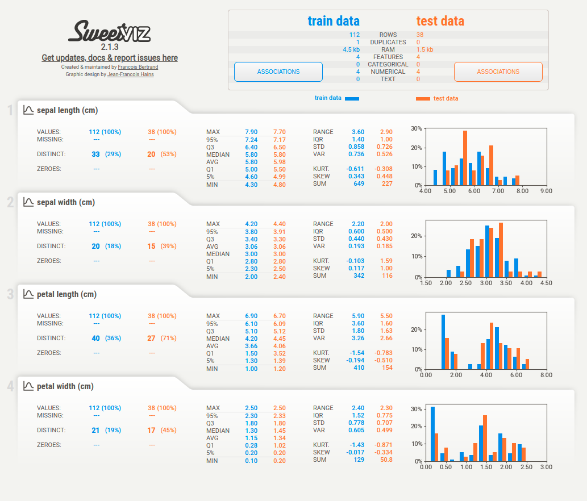

---
jupytext:
  text_representation:
    extension: .md
    format_name: myst
    format_version: 0.13
    jupytext_version: 1.16.7
kernelspec:
  display_name: venv
  language: python
  name: python3
---

## Manage Data

+++

This section covers some tools to work with your data. 

+++

### DVC: A Data Version Control Tool for Your Data Science Projects

```{code-cell} ipython3
:tags: [hide-cell]

!pip install dvc
```

While Git excels at versioning code, managing data versions can be tricky. DVC (Data Version Control) bridges this gap by allowing you to track data changes alongside your code, while keeping the actual data separate. It's like Git for data.

Here’s a quick start guide for DVC:

+++

```bash
# Initialize
$ dvc init

# Track data directory
$ dvc add data # Create data.dvc
$ git add data.dvc
$ git commit -m "add data"

# Store the data remotely
$ dvc remote add -d remote gdrive://lynNBbT-4J0ida0eKYQqZZbC93juUUUbVH

# Push the data to remote storage
$ dvc push 

# Get the data
$ dvc pull 

# Switch between different version
$ git checkout HEAD^1 data.dvc
$ dvc checkout
```

+++

[Link to DVC](https://dvc.org/)

+++

### sweetviz: Compare the similar features between 2 different datasets

```{code-cell} ipython3
:tags: [hide-cell]

!pip install sweetviz 
```

When comparing datasets, such as training and testing sets, sweetviz helps visualize similarities and differences with ease.

Here’s how to use it:

```{code-cell} ipython3
from sklearn.datasets import load_iris
from sklearn.model_selection import train_test_split
import sweetviz as sv

X, y = load_iris(return_X_y=True, as_frame=True)
X_train, X_test, y_train, y_test = train_test_split(X, y)

report = sv.compare([X_train, "train data"], [X_test, "test data"])
report.show_html()
```



+++

[Link to sweetviz](https://github.com/fbdesignpro/sweetviz)

+++

### quadratic: Data Science Speadsheet with Python and SQL

If you want to use Python or SQL in an Excel sheet, use quadratic.


[Link to quadratic](https://github.com/quadratichq/quadratic).

+++

### whylogs: Data Logging Made Easy

```{code-cell} ipython3
:tags: [hide-cell]

!pip install whylogs
```

Keeping track of dataset statistics is crucial for data quality and monitoring. whylogs makes logging dataset summaries straightforward.

Example usage:

```{code-cell} ipython3
import pandas as pd
import whylogs as why

data = {
    "Fruit": ["Apple", "Banana", "Orange"],
    "Color": ["Red", "Yellow", "Orange",],
    "Quantity": [5, 8, 3],
}

df = pd.DataFrame(data)

# Log the DataFrame using whylogs and create a profile
profile = why.log(df).profile()

# View the profile and convert it to a pandas DataFrame
prof_view = profile.view()
prof_df = prof_view.to_pandas()
prof_df
```

```{code-cell} ipython3
prof_df.iloc[:, :5]
```

```{code-cell} ipython3
prof_df.columns
```

[Link to whylogs](https://github.com/whylabs/whylogs).

+++

### Fluke: The Easiest Way to Move Data Around

+++

Transferring data between locations—such as from a remote server to cloud storage—can be cumbersome, especially with Python libraries that involve complex HTTP/SSH connections and directory handling. 

Fluke simplifies this process with a user-friendly API, making it easy to manage remote data transfers with just a few lines of code.

Example usage:

+++

```python
from fluke.auth import RemoteAuth, AWSAuth

# This object will be used to authenticate
# with the remote machine.
rmt_auth = RemoteAuth.from_password(
    hostname="host",
    username="user",
    password="password")

# This object will be used to authenticate
# with AWS.
aws_auth = AWSAuth(
    aws_access_key_id="aws_access_key",
    aws_secret_access_key="aws_secret_key")
```

+++

```python
from fluke.storage import RemoteDir, AWSS3Dir

with (
    RemoteDir(auth=rmt_auth, path='/home/user/dir') as rmt_dir,
    AWSS3Dir(auth=aws_auth, bucket="bucket", path='dir', create_if_missing=True) as aws_dir
):
    rmt_dir.transfer_to(dst=aws_dir, recursively=True)
```

+++

[Link to Fluke](https://github.com/manoss96/fluke).

+++

### safetensors: A Simple and Safe Way to Store and Distribute Tensors

```{code-cell} ipython3
:tags: [hide-cell]

!pip install torch safetensors
```

PyTorch defaults to using Pickle for tensor storage, which poses security risks as malicious pickle files can execute arbitrary code upon unpickling. In contrast, safetensors specialize in securely storing tensors, guaranteeing data integrity during storage and retrieval. 

safetensors also uses zero-copy operations, eliminating the need to copy data into new memory locations, thereby enabling fast and efficient data handling.

```{code-cell} ipython3
---
editable: true
slideshow:
  slide_type: ''
---
import torch
from safetensors import safe_open
from safetensors.torch import save_file

tensors = {
   "weight1": torch.zeros((1024, 1024)),
   "weight2": torch.zeros((1024, 1024))
}
save_file(tensors, "model.safetensors")

tensors = {}
with safe_open("model.safetensors", framework="pt", device="cpu") as f:
   for key in f.keys():
       tensors[key] = f.get_tensor(key)
```

[Link to safetensors](https://bit.ly/3vqzbhl).

+++

### datacompy: Smart Data Comparison Made Simple

```{code-cell} ipython3
---
editable: true
slideshow:
  slide_type: ''
tags: [hide-cell]
---
!pip install datacompy
```

Data analysts and data engineers often struggle with comparing two datasets. This results in writing complex code to compare values, identify mismatches, and generate comparison reports.

```{code-cell} ipython3
from io import StringIO
import pandas as pd

data1 = """acct_id,dollar_amt,name,float_fld,date_fld
10000001234,123.45,George Maharis,14530.1555,2017-01-01
10000001235,0.45,Michael Bluth,1,2017-01-01
10000001236,1345,George Bluth,,2017-01-01
10000001237,123456,Bob Loblaw,345.12,2017-01-01
10000001238,1.05,Lucille Bluth,,2017-01-01
10000001238,1.05,Loose Seal Bluth,,2017-01-01
"""

df1 = pd.read_csv(StringIO(data1))
df1
```

```{code-cell} ipython3
data2 = """acct_id,dollar_amt,name,float_fld
10000001234,123.4,George Michael Bluth,14530.155
10000001235,0.45,Michael Bluth,
10000001236,1345,George Bluth,1
10000001237,123456,Robert Loblaw,345.12
10000001238,1.05,Loose Seal Bluth,111
"""

df2 = pd.read_csv(StringIO(data2))
df2
```

```{code-cell} ipython3
# Check if shapes match
shape_match = df1.shape == df2.shape

# Compare values
merged = df1.merge(df2, on=['acct_id', 'name'], how='outer', suffixes=('_1', '_2'))
mismatches = merged[merged['dollar_amt_1'] != merged['dollar_amt_2']]
missing = merged[merged['dollar_amt_1'].isna() | merged['dollar_amt_2'].isna()]

# Manual reporting
print(f"Shapes match: {shape_match}")
print("\nMismatches:")
print(mismatches)
print("\nMissing records:")
print(missing)
```

With datacompy, you can easily compare datasets and get detailed reports about differences, including matching percentage, column-level comparison, and sample mismatches. You can use it with various data frameworks like Pandas, Spark, Polars, and Snowflake.

```{code-cell} ipython3
import datacompy

compare = datacompy.Compare(df1, df2, join_columns=['acct_id', 'name'])
```

```{code-cell} ipython3
print(compare.report())
```

[Link to datacompy](https://github.com/capitalone/datacompy).
