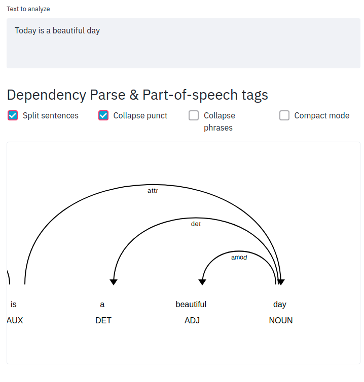
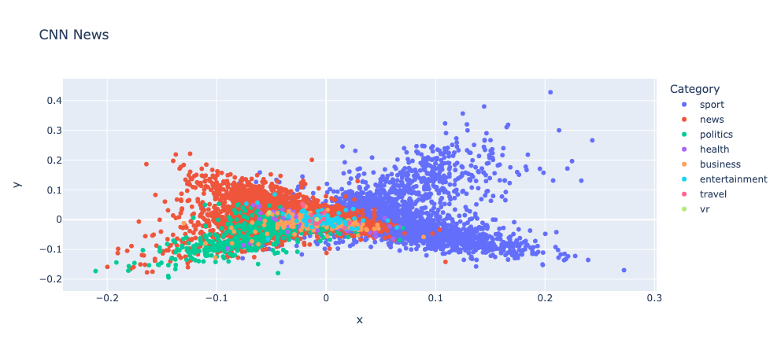

---
jupyter:
  jupytext:
    formats: ipynb,Rmd
    text_representation:
      extension: .Rmd
      format_name: rmarkdown
      format_version: '1.2'
      jupytext_version: 1.16.7
  kernelspec:
    display_name: Python 3 (ipykernel)
    language: python
    name: python3
---

## Natural Language Processing


This section some tools to process and work with text.


### TextBlob: Processing Text in One Line of Code

```{python tags=c("hide-cell")}
# !pip install textblob
```

```{python tags=c("hide-cell")}
# !python -m textblob.download_corpora
```

TextBlob offers quick text analysis, such as sentiment detection, tokenization, noun phrase extraction, word frequency analysis, and spelling correction. Start by creating a `TextBlob` instance:

```{python}
from textblob import TextBlob

text = "Today is a beautiful day"
blob = TextBlob(text)
```

Tokenize words:

```{python}
blob.words
```

Extract noun phrases:

```{python}
blob.noun_phrases
```

Analyze sentiment:

```{python}
blob.sentiment
```

Count words:

```{python}
blob.word_counts
```

Correct spelling:

```{python}
text = "Today is a beutiful day"
blob = TextBlob(text)
blob.correct()
```

[Link to TextBlob](https://github.com/sloria/TextBlob).


### Convert Names into a Generalized Format

```{python tags=c("hide-cell")}
# !pip install mlxtend
```

Names collected from different sources might have different formats. To convert names into the same format for further processing, use mlxtend's `generalize_names`. 

```{python}
from mlxtend.text import generalize_names

generalize_names("Tran, Khuyen")
```

```{python}
generalize_names("Khuyen Tran")
```

```{python}
generalize_names("Khuyen Tran", firstname_output_letters=2)
```

[Link to mlxtend](https://rasbt.github.io/mlxtend/).


### sumy: Summarize Text in One Line of Code

```{python tags=c("hide-cell")}
# !pip install sumy
```

Sumy is an easy-to-use tool for text summarization, offering 7 different methods. To summarize the article "How to Learn Data Science (Step-By-Step)" from DataQuest:


```bash
$ sumy lex-rank --length=10 --url=https://www.dataquest.io/blog/learn-data-science/ 
```

```{python}
# !sumy lex-rank --length=10 --url=https://www.dataquest.io/blog/learn-data-science/
```

[Link to Sumy](https://github.com/miso-belica/sumy).


### Spacy_streamlit: Create a Web App to Visualize Your Text in 3 Lines of Code

```{python tags=c("hide-cell")}
# !pip install spacy-streamlit
```

To quickly create an app to visualize the structure of a text, use spacy_streamlit. 


To understand how to use spacy_streamlit, we add the code below to a file called `streamlit_app.py`:

```{python}
# %%writefile streamlit_app.py
import spacy_streamlit

models = ["en_core_web_sm"]
text = "Today is a beautiful day"
spacy_streamlit.visualize(models, text)
```

On your terminal, type:
```bash
$ streamlit run streamlit_app.py
```
Output:

```{python tags=c("hide-cell")}
# !python -m spacy download en_core_web_sm
```

```{python tags=c("hide-input")}
# !streamlit run streamlit_app.py
```

Click the URL and you should see something like below:





[Link to spacy-streamlit](https://spacy.io/universe/project/spacy-streamlit).


### textacy: Extract a Contiguous Sequence of Words

```{python tags=c("hide-cell")}
# !pip install spacy textacy
```

```{python tags=c("hide-cell")}
# !python -m spacy download en_core_web_sm
```

To extract sequences of words (n-grams), use the `textacy` library:

```{python}
import spacy
from textacy.extract import ngrams

nlp = spacy.load("en_core_web_sm")

text = nlp("Ice cream is a soft frozen food made with sweetened and flavored milk fat.")

# extract sequences of 3 words
[n.text for n in ngrams(text, n=3)]
```

[Link to textacy](https://textacy.readthedocs.io/en/stable/quickstart.html#working-with-text)


### Num2Words: Convert Number to Words


```{python tags=c("hide-cell")}
# !pip install num2words
```

The `num2words` library helps convert numerical values into words, making NLP tasks like matching numeric data to their textual equivalents easier:

```{python}
from num2words import num2words

num2words(2019)
```

```{python}
num2words(2019, to="ordinal")
```

```{python}
num2words(2019, to="ordinal_num")
```

```{python}
num2words(2019, to="year")
```

It also supports multiple languages:

```{python}
num2words(2019, lang="vi")
```

```{python}
num2words(2019, lang="es")
```

[Link to num2words](https://bit.ly/3VkWYJO).

<!-- #region editable=true slideshow={"slide_type": ""} -->
### Numerizer: Standardizing Numerical Data in Text
<!-- #endregion -->

```{python editable=TRUE, slideshow={'slide_type': ''}, tags=c("hide-cell")}
# !pip install numerizer
```

<!-- #region editable=true slideshow={"slide_type": ""} -->
Converting textual numbers to numeric values is challenging due to diverse language representations.

Numerizer simplifies this process by turning various text formats into corresponding numbers.

<!-- #endregion -->

```{python editable=TRUE, slideshow={'slide_type': ''}}
from numerizer import numerize
```

```{python editable=TRUE, slideshow={'slide_type': ''}}
numerize("four hundred and sixty two")
```

```{python editable=TRUE, slideshow={'slide_type': ''}}
numerize("four hundred sixty two")
```

```{python editable=TRUE, slideshow={'slide_type': ''}}
numerize("four sixty two")
```

```{python editable=TRUE, slideshow={'slide_type': ''}}
numerize("four sixty-two")
```

<!-- #region editable=true slideshow={"slide_type": ""} -->
[Link to numerizer](https://github.com/jaidevd/numerizer).
<!-- #endregion -->

<!-- #region editable=true slideshow={"slide_type": ""} -->
### Preprocess Text in One Line of Code with Texthero
<!-- #endregion -->

```{python tags=c("hide-cell")}
# !pip install texthero
```

Processing text in a DataFrame often involves writing lengthy code. Texthero simplifies this by enabling one-line preprocessing, including: 
- filling missing values
- converting upper case to lower case
- removing digits
- removing punctuation
- removing stopwords
- removing whitespace

```{python}
import numpy as np
import pandas as pd
import texthero as hero

text = [
    "Today is a    beautiful day",
    "There are 3 ducks in this pond",
    "This is. very cool.",
    np.nan,
]
df = pd.DataFrame({"text": text})

df.text.pipe(hero.clean)
```

You can also create a custom cleaning pipeline by chaining different processing methods.

```{python}
(
    df.text.pipe(hero.fillna)
    .pipe(hero.remove_punctuation)
    .pipe(hero.remove_stopwords)
    .pipe(hero.remove_whitespace)
)
```

[Link to texthero](https://github.com/jbesomi/texthero).


### texthero: Reduce Dimension and Visualize Text in One Line of Code

```{python tags=c("hide-cell")}
# !pip install 'gensim==3.6.0'
# !pip install 'texthero==1.1.0'
# !pip install unidecode
```

To visualize text data in 2D, typically, you need to clean, encode, and reduce the dimensions of your text, which can be tedious. Texthero simplifies this process into just two lines of code.

Below is an example using descriptions from [CNN news articles](https://www.kaggle.com/datasets/hadasu92/cnn-articles-after-basic-cleaning). Each point represents an article, colored by its category.

```{python}
import pandas as pd
import texthero as hero
```

```{python tags=c("remove-cell")}
import gdown

gdown.download("https://drive.google.com/uc?id=1QPGCZ8mud5ptt8qJR79XQ6KoQnJuT-4D")
```

```{python}
df = pd.read_csv("small_CNN.csv")
```

```{python}
df["pca"] = df["Description"].pipe(hero.clean).pipe(hero.tfidf).pipe(hero.pca)
```

```{python}
import matplotlib.pyplot as plt

plt.figure(figsize=(10, 8))
hero.scatterplot(df, col="pca", color="Category", title="CNN News")
```




[Link to texthero](https://github.com/jbesomi/texthero).


### wordfreq: Estimate the Frequency of a Word in 36 Languages

```{python tags=c("hide-cell")}
# !pip install wordfreq
```

If you need to check the frequency of a word in 36 different languages, `wordfreq` is an excellent tool. 

It even covers words that occur as infrequently as once per 10 million words.

```{python}
import matplotlib.pyplot as plt
import seaborn as sns
from wordfreq import word_frequency

word_frequency("eat", "en")
```

```{python}
word_frequency("the", "en")
```

```{python}
sentence = "There is a dog running in a park"
words = sentence.split(" ")
word_frequencies = [word_frequency(word, "en") for word in words]

sns.barplot(words, word_frequencies)
plt.show()
```

[Link to wordfreq](https://github.com/khuyentran1401/Python-data-science-code-snippet/blob/master/code_snippets/data_science_tools/wordfreq_example.py).


### newspaper3k: Extract Meaningful Information From an Articles in 2 Lines of Code

```{python tags=c("hide-cell")}
# !pip install newspaper3k nltk
```

To quickly extract meaningful information from an article in a few lines of code, use `newspaper3k`. 

```{python}
import nltk
from newspaper import Article

nltk.download("punkt")
```

```{python}
url = "https://mathdatasimplified.com/2023/05/08/build-an-efficient-data-pipeline-is-dbt-the-key/"
article = Article(url)
article.download()
article.parse()
```

```{python}
article.title
```

```{python}
print(article.publish_date)
```

```{python}
article.top_image
```

```{python}
article.nlp()
```

```{python}
print(article.summary)
```

```{python}
article.keywords
```

[Link to newspaper3k](https://github.com/codelucas/newspaper).


### Questgen.ai: Question Generator in Python

```{python tags=c("hide-cell")}
# !pip install git+https://github.com/ramsrigouthamg/Questgen.ai
# !pip install git+https://github.com/boudinfl/pke.git

# !python -m nltk.downloader universal_tagset
# !python -m spacy download en
```

```{python tags=c("hide-cell")}
# !wget https://github.com/explosion/sense2vec/releases/download/v1.0.0/s2v_reddit_2015_md.tar.gz
# !tar -xvf  s2v_reddit_2015_md.tar.gz
```

Generating questions manually from a document can be time-consuming. `Questgen.ai` automates this task, allowing you to quickly generate Boolean or FAQ-style questions.

```{python}
from pprint import pprint

import nltk

nltk.download("stopwords")
from Questgen import main
```

```{python}
payload = {
    "input_text": """The weather today was nice so I went for a walk. I stopped for a quick chat with my neighbor.
    It turned out that my neighbor just got a dog named Pepper. It is a black Labrador Retriever."""
}
```

```{python}
qe = main.BoolQGen()
output = qe.predict_boolq(payload)
pprint(output)
```

```{python}
output = qg.predict_shortq(payload)
pprint(output)
```

[Link to Questgen.ai](https://github.com/ramsrigouthamg/Questgen.ai).


### Word Ninja: Slice Your Lumped-Together Words

```{python tags=c("hide-cell")}
# !pip install wordninja
```

Want to split compound words? `Word Ninja` is surprisingly effective at doing just that. Here are a few examples:

```{python}
import wordninja

wordninja.split("honeyinthejar")
```

```{python}
wordninja.split("ihavetwoapples")
```

```{python}
wordninja.split("aratherblusterday")
```

[Link to Word Ninja](https://github.com/keredson/wordninja).


### textstat: Calculate Statistics From Text

```{python tags=c("hide-cell")}
# !pip install textstat
```

To analyze text statistics such as readability scores and reading time, use the `textstat` library.


To calculate the Automated Readability Index (ARI), which indicates the grade level required to understand a text, use `automated_readability_index`. For example, an ARI of 10.8 means the text is suitable for 10th to 11th graders.

```{python}
import textstat
```

```{python}
text = "The working memory system is a form of conscious learning. But not all learning is conscious. Psychologists have long marveled at children’s ability to acquire perfect pronunciation in their first language or recognize faces."
```

```{python}
textstat.automated_readability_index(text)
```

You can also measure the reading time of a text in seconds using `reading_time`:

```{python}
textstat.reading_time(text, ms_per_char=14.69)
```

[Link to textstat](https://github.com/shivam5992/textstat).


### Accelerate String Matching with RapidFuzz

```{python tags=c("hide-cell")}
# !pip install rapidfuzz
```

String matching and comparison are essential tasks in data cleaning and processing. Traditional exact matching often fails to capture similar entries due to typos or inconsistent formatting:

```{python}
companies = ["Apple Inc.", "Microsoft Corp.", "Google LLC"]
search_term = "apple incorporated"

# Traditional exact matching
matches = [company for company in companies if company.lower() == search_term.lower()]
print(f"Exact matches: {matches}")  # Returns empty list
```

RapidFuzz provides powerful fuzzy string matching capabilities. Let's see how to use them effectively:

```{python}
from rapidfuzz import fuzz, process

# Compare two strings
similarity = fuzz.ratio("Apple Inc.", "APPLE INC")
print(f"Similarity score: {similarity:.3f}")
```

```{python}
# Sample company names with variations
companies = [
    "Apple Inc.",
    "Apple Incorporated",
    "APPLE INC",
    "Microsoft Corporation",
    "Microsoft Corp.",
    "Google LLC",
    "Alphabet Inc.",
]


# Find best matches for "apple incorporated"
matches = process.extract("apple incorporated", companies, scorer=fuzz.WRatio, limit=2)

print("Best matches:")
for match in matches:
    print(f"Match: {match[0]}, Score: {match[1]:.3f}")
```

What makes RapidFuzz powerful:
- Handles case sensitivity automatically
- Provides multiple matching algorithms
- Returns confidence scores for matches
- Written in C++ for superior performance
- MIT licensed for maximum flexibility

[Link to RapidFuzz](https://github.com/rapidfuzz/RapidFuzz)


### Checklist: Create Data to Test Your NLP Model

```{python tags=c("hide-cell")}
# !pip install checklist torch
```

It can be time-consuming to create data to test edge cases of your NLP model. To quickly create data to test your NLP models, use `Checklist`. 

In the code below, I use Checklist's `Editor` to create multiple examples of negation in one line of code. 

```{python}
import checklist
from checklist.editor import Editor

editor = Editor()
editor.template("{mask} is not {a:pos} option.", pos=["good", "cool"], nsamples=5).data
```

```{python}
editor.template("{mask} is not {a:neg} option.", neg=["bad", "awful"], nsamples=5).data
```

[Link to Checklist](https://github.com/marcotcr/checklist).


### Top2Vec: Quick Topic Modeling in Python

```{python}
# !pip install top2vec
```

Manually identifying topics from large text collections and having to specify the number of topics beforehand results in subjective, inconsistent topic modeling and requires significant trial and error.

Top2Vec automatically discovers topics by finding dense clusters of semantically similar documents and identifying the words that attract those documents together.

In this example, we will use the Top2Vec library to detect topics in a dataset of fake news articles. 

Load the "Fake-News" dataset from OpenML:

```{python}
from sklearn.datasets import fetch_openml
from top2vec import Top2Vec
```

```{python}
news = fetch_openml("Fake-News")
text = news.data["text"].to_list()
```

Create a Top2Vec model with the text data, using the "learn" speed and 8 worker threads:

```{python}
model = Top2Vec(documents=text, speed="learn", workers=8)
```

Get the number of topics detected by the model:

```{python}
model.get_num_topics()
```

In this example, Top2Vec automatically determines the number and content of topics by analyzing document similarities in the embedding space


Get the topics in decreasing size:

```{python}
topic_words, word_scores, topic_nums = model.get_topics(72)

print("\nSecond Topic - Top 5 Words and Scores:")
for word, score in zip(topic_words[1][:5], word_scores[1][:5]):
    print(f"Word: {word:<20} Score: {score:.4f}")
```

```{python}
print(f"Second Topic - Top 5 Words: {topic_words[1][:5]}")
```

Search for topics most similar to the keyword "president":

```{python}
topic_words, word_scores, topic_scores, topic_nums = model.search_topics(
    keywords=["president"], num_topics=2
)

first_five_words = [topic[:5] for topic in topic_words]

print("Topics most similar to president:")
for topic_num, words in zip(topic_nums, first_five_words):
    print(f"Topic {topic_num}: {words}")
```

Generate word clouds for the topics most similar to "president":

```{python}
for topic in topic_nums:
    model.generate_topic_wordcloud(topic)
```

[Link to Top2Vec](https://github.com/ddangelov/Top2Vec).


### Expanding English Contractions in Text

```{python tags=c("hide-cell")}
# !pip install contractions
```

Contraction can cause issues when processing text. To expand contractions using Python, use the library contractions

```{python}
import contractions

sent = "I'm not sure, but I'd like to do it"

contractions.fix(sent)
```

### inflect: Generate Plurals, Singulars, and Indefinite Articles

```{python tags=c("hide-cell")}
# !pip install inflect
```

To generate plurals, singulars, or indefinite articles from given words, use inflect. 

```{python}
import inflect

p = inflect.engine()
```

```{python}
p.plural_noun("he")
```

```{python}
p.plural_verb("sees")
```

```{python}
p.gender("feminine")
p.singular_noun("they")
```

```{python}
if p.compare_verbs("sees", "see"):
    print("same word")
```

```{python}
# Add the correct "a" or "an" for a given word
fruit1 = "apple"
fruit2 = "banana"
print(f"I got you {p.a(fruit1)} " f"and {p.a(fruit2)}")
```

[Link to inflect](https://github.com/jaraco/inflect).


### ekphrasis: Text Processing Tool For Social Media Text

```{python tags=c("hide-cell")}
# !pip install ekphrasis==0.5.4
```

It is challenging to process text from social media such as Twitter or Facebook. ekphrasis allows you to incorporate social tokenizers, word segmentation, spell correction, and more into a pipeline to process those texts. 

```{python}
from ekphrasis.classes.preprocessor import TextPreProcessor
from ekphrasis.classes.tokenizer import SocialTokenizer
from ekphrasis.dicts.emoticons import emoticons

text_processor = TextPreProcessor(
    # terms that will be normalized
    normalize=["url", "user"],
    # terms that will be annotated
    annotate={"hashtag", "allcaps", "elongated", "repeated", "emphasis", "censored"},
    # corpus for word segmentation
    segmenter="twitter",
    unpack_hashtags=True,  # perform word segmentation on hashtags
    unpack_contractions=True,  # Unpack contractions (can't -> can not)
    spell_correct_elong=False,  # spell correction for elongated words
    tokenizer=SocialTokenizer(lowercase=True).tokenize,
    # Replace emojis with words
    dicts=[emoticons],
)

sent = "@coolyazzy94 I'm learning to retweeeet!! Least it sucks LESS than Facebook haha :P #learn-twitter https://t.co/7RdyMCVPKx"

print(" ".join(text_processor.pre_process_doc(sent)))
```

[Link to ekphrasis](https://github.com/cbaziotis/ekphrasis).


### Chroma: The Lightning-Fast Solution to Text Embeddings and Querying

```{python tags=c("hide-cell")}
# !pip install chromadb
```

Semantic search uses embedding to understand the meaning of search queries instead of relying solely on keyword matches to locate documents.

Embedding is like a translator converting words into numbers so that computers can understand. Chroma makes it easy to create embeddings from documents and find similar results with a few lines of code.

In the code below, the documents with IDs 1 and 2 closely match the given query text.


```{python}
import chromadb

client = chromadb.Client()

collection = client.get_or_create_collection("test")

collection.add(
    documents=[
        "A man is eating food.",
        "A man is eating yellow noodles.",
        "The girl is carrying a baby.",
        "A man is riding a horse.",
    ],
    ids=["1", "2", "3", "4"],
)

query_result = collection.query(query_texts=["A man is eating pasta."], n_results=2)

print(query_result)
```

[Link to Chroma](https://github.com/chroma-core/chroma).


### Galatic: Clean and Analyze Massive Text Datasets

```{python tags=c("hide-cell")}
# !pip install galactic-ai
```

To clean, gain insights, and create embeddings from massive unstructured text datasets, use Galatic.

```{python}
from galactic import GalacticDataset

filter_func = lambda x: len(x["content"]) < 1024
dataset = GalacticDataset.from_hugging_face_stream(
    "tiiuae/falcon-refinedweb",
    split="train",
    filters=[filter_func],
    dedup_fields=["content"],
    max_samples=5000,
)
```

```{python}
# Detect the language of the text
from collections import Counter

dataset.detect_language(field="content")
Counter(dataset["__language"])
```

```python
Counter({'en': 4975,
         'es': 7,
         'fr': 7,
         'de': 3,
         'da': 2,
         'ru': 1,
         'nl': 1,
         'pt': 1,
         'sh': 1,
         'eo': 1,
         'ceb': 1})
```

```{python}
# Get personal information from the text
dataset.detect_pii(fields=["content"])
print("Email:", sum(dataset["__pii__email"]))
print("Phone:", sum(dataset["__pii__phone"]))
print("Username/Password:", sum(dataset["__pii__credential"]))
```

```{python}
# Filter out all examples that have "blogspot" in the URL.
dataset = dataset.filter_string(fields=["url"], values=["blogspot"])
```

```{python}
# Create embeddings
dataset.get_embeddings(input_field="content", backend="cpu")
```

```{python}
# Cluster the embeddings with kmeans
dataset.cluster(n_clusters=5, overwrite=True)
dataset.get_cluster_info()
```

[Link to Galatic](https://github.com/taylorai/galactic).


### Efficient Keyword Extraction and Replacement with FlashText

```{python tags=c("hide-cell")}
# !pip install flashtext
```

If you want to perform fast keyword extraction and replacement in text, use FlashText. 

```{python}
from flashtext import KeywordProcessor

keyword_processor = KeywordProcessor()

# Adding keywords with replacements
keyword_processor.add_keyword(keyword="Python")
keyword_processor.add_keyword(keyword="DS", clean_name="data science")

# Replacing keywords in text
new_sentence = keyword_processor.replace_keywords("PYTHON is essential for DS.")
new_sentence
```

[Link to FlashText](https://bit.ly/4bQ1eqt).


### BERTopic: Harnessing BERT for Interpretable Topic Modeling

```{python editable=TRUE, id="SNa-KtKDRnus", slideshow={'slide_type': ''}, tags=c("hide-cell")}
# !pip install bertopic
```

Managing and understanding large collections of text documents results in complex workflows with multiple preprocessing steps and difficult-to-interpret results. This causes data scientists to spend significant time trying to make sense of their document clusters and explaining them to stakeholders.

<!-- #region editable=true slideshow={"slide_type": ""} -->
With BERTopic, you can leverage state-of-the-art language models to create more meaningful and interpretable topics. You get automatic topic labeling, visualization capabilities, and the flexibility to customize the modeling process according to your needs.
<!-- #endregion -->

<!-- #region editable=true id="Y3VGFZ1USMTu" slideshow={"slide_type": ""} -->
For this example, we use the popular 20 Newsgroups dataset which contains roughly 18000 newsgroups posts
<!-- #endregion -->

```{python editable=TRUE, id="JJij3WP6SEQD", slideshow={'slide_type': ''}}
from sklearn.datasets import fetch_20newsgroups

docs = fetch_20newsgroups(subset="all", remove=("headers", "footers", "quotes"))["data"]
```

<!-- #region id="SBcNmZJzSTY8" -->
In this example, we will go through the main components of BERTopic and the steps necessary to create a strong topic model.


<!-- #endregion -->

<!-- #region id="QI6vwelqnTL-" -->
We start by instantiating BERTopic. We set language to `english` since our documents are in the English language.
<!-- #endregion -->

```{python colab={'base_uri': 'https://localhost:8080/', 'height': 453, 'referenced_widgets': ['11f92fdcd9734ee883a98bf7d64441b2', 'ab97eac14145428c8977aa81fa223865', 'b16e51d7467547aa96f17b076d1fffe3', '7afada084577495dac21948c8723de75', '90a601e96edf46e488cd9f66356475cc', 'c9bb9d766e5c4fa5bbf496e571547aff', '37692e481ffe49d7b6ddaa84844deb01', 'a6f200cf31dc497b86ada1752118e59f', 'fcadde72381f42c6beff807fe5517933', '6144fe4535d4467f9ab7618afd3a0de2', '5ba767c6a7384e10b89f546a648137cb', '050f3bd3b7604af4bc04faf9c2d24aca', 'a1d0cae4886a46f4a7df1cf609de2941', '6e1271d7eb7a4d55b0c57f554e2eee6c', '08c0cbefee4c4233959252be914e9651', 'eed5268b499849879beb87df1577820e', '64abaa2714654f6498111dd4060d6c85', 'e34ef193f7d54751b149e5f5cf42cded', '5171da807c304800b63dda419fe505f6', 'f1120d69f45d4940b803b74d38aa4267', '9db81cfed22549edb65871adfada1f38', '8dc04f61740a470ebc2ddaf9ca985b2c', '8bab1f41e55345f1b32c9ed549b7cacb', '1f444df7dc41409ba737cc34fd3759b1', '6b6c11fd3f6f43118f833cac813e7a95', '89748a71005e40a6a430d139957dba74', 'd9e56e12fb8e4468b12be19aeb439058', '201fe878ad1b4487ae09c5feb5c68c2e', '2c65c96c214e4c8f8bf8e0b2ddc8f15c', '5cd8823600334387b6f820b9c13ff875', '236722fa23624b3e9d1fd2db3597c41a', 'b1399b9c3c8c41fb9ab561fff04adf88', '0dedaca218f940269b1fa2c77d197e69', '4993487dda804769be12ed80f5a0ba1f', 'db84a621349b478aa2dd0f0c51613ee4', 'a084c426f4f1406caa4b61ea5f7d0597', '7a2219db3e224357bbfe2c67d85e7f1b', '9195b74202c9493e884bad686a49e687', 'ef0f6e08164441dcbd2ffd70c6a7837d', '69fe53a8a50d4bf58f29b12652650c95', '72a920198eb74ba794804f7416585f8f', 'dc8d955025f64ba08854e834540b55c8', 'a96c566423124ad1af6cbbf426c23714', '1af379c21da04f5eb76c30a28c793d2a', '1ac1ec5ccc9e49b7b1f4d5d0f75a28cc', '2694fe1ceeeb43f5bc7d48753d6cfa3c', '1a34ebfc412f4852bfc75f1403ca9711', '88dee3b64c644e8c987d215590666367', '38f35a2054b64376b4520e5468b5a5c9', '0d109983418a44e494026cc2e1d01a4d', '493787120d774090b375fb718d281b8d', '302635d5f94147a4bd805341691d225c', 'cd2a773537a34f62b122b271f2eba9a3', '49baeecf41ac49148c1582fc011b38f6', '119d56c86dfc40ecb082c5a4877b4896', '058890a9257b495c882114efcd8c6987', '3c4095a5470041dcb87b02ff7d501b8e', '0b051498baf947319c474179eefa239d', '4cf7524d16b24dc2aa49f378682869ea', '5242f947dd2643cf86d3c595af13c8fb', '5f7616ac5c694906a31c65c19a57333a', '4fcfb5edfe8e4205b7496d1f3d01fa07', '22b846963a10408591f8519170114cd9', '9c169e0cf33a44ce883d640a08a59c48', '4eb5d68b7f16457b923ff0c1645686a2', 'ebd1ee7483b046ba9b538eea82db69be', '0768adbd8c554e0a923d55fa62140f70', 'd548b44b4f5d4281acf61e37f18bb7d6', 'c1dd125cf61d4438a26ee57a1efcb1de', '7d8c4dfecc474c1aa757ef7ded4cdd55', '74e7ab4585324e4f9e18f6a0ad4f54f5', '604456945f8a45139f0a29e82acbfb25', 'c6dbfcf25a8a4a1381879f84c5d6f8a4', '38b5984b43124e02a883d27fb0fd94f5', '7bb5a260a7854b51b66957ebf68bea5f', 'ad3d2452bdd64279be86bbafb65f5fe7', 'b3250c2f180d418abc1f92594a1915e5', '95e9a59d2fd84febb8c0fbda398e295f', 'e6a4c53239884fb9b1813d905d05592f', '73ae6c75741145339bad4f6e9e169b49', '0cb87870f9c543dcb792e32fa95ee324', '3b98f41d250545dea21203bbca27c11e', '658573d1b72948fd9c2026b57e29b09f', '04e4da585a2a4f4883afe0438ffe2c9c', '8f8188bddcb8442ba8b4a4ef7ab16718', '2a6560a4894d4e589f6d16598a103c70', 'a263765c073947dfa86b9aef86cba81f', 'b2369edc51504835b7022c99ba5ef46d', '9451969faa6c4dfca3e91f976aed6398', '8a479cae31b64ec59348111daae3a303', '5d1d1822fcd44d3fbcf7fa46b730f7c9', '9bfdd3910e8f4fd88065594ef25b29de', 'aef4cd0d462846438eb98abe01d74cb6', 'c0344970c2e74ddc913c62cbc148d472', '6e3bed9d7a994e82b17d10f35b797832', 'de1505fd50e64305859aa71c9dfcdb78', '9550a4100a204e1596e7659db1bd8127', '38c0f36324054c29a8c1ad3fb592c8f0', '73514077146d4b069495b184009f6b87', '6b945640a2884e9c9e2bb5064e953862', '8cdf6d0427ba49f8af99883d7f15185d', 'bd585fe8c3914b01b6da8a5e97dee8ce', 'a965671bb5964c3cb759d4908fc7d05d', '62f3e02df14d44f28de9e99973046760', '595c0c6fb73d4d598d201a8ebd2cec36', '4ca4c7c771954283b6918527f0c18009', 'e754dd72b44540b8a9476f7a64fb752f', '285cb4d8cb934472bce29b9dfe6e5d67', '39390b9f5f14430ea65cf66cada721d6', 'd1974f3fc978409eb0cd5380a6cdf6e5', 'd1a1a7a2d3724979ac8c80479a0478c2', '8d0c27b3c1784fa886266e95c795023f', 'e1c7544dda374d1a94c1d9a2da0bf7f7', '75411ae0f844419fbc987ae25c10c8ef', 'afb465ed9c8f453391e33a06f19bf0c2', '5d2b16e655774462aad43487425d6e37', '105ec09c7139491eb0212678f4418884', 'dc43bcd09db94cf09bf979a45766a35c', '46c4854e59294187ab98ca4beea9d227', 'f546d47a4ce44e50b1caaaee7059e800', '0cfd2a010ba140db8bc8d05e2d195a2c', '774ec98d68994b97abe86ff3ed3b76f3', '95e813a2d777402b8e3e463a80fc18d2', '720aeed12981455898fe676801ad31d0', '5ae311098bdc4820905b27cdc24e5d91', 'b0179833d14247e48a49e8c7852586db', 'c84640a03d8d4881ba230233976eaf18', 'af63d7a0ddde4e7b897ce1cba5292529', 'd957bd0a7ddc43758f302bbf1cb01947', '1350f8de7a7e46d2bac62044405ab30d', '49429184f2244ce6b6a9e0d9b3aa1040', '219a32964b984c90a33acf72981a499c']}, editable=TRUE, id="TfhfzqkoSJ1I", outputId="d69cb33b-91b7-4423-899c-98471f411ed3", slideshow={'slide_type': ''}, tags=c("hide-output")}
from bertopic import BERTopic

topic_model = BERTopic(language="english", verbose=True)
topics, probs = topic_model.fit_transform(docs)
```

<!-- #region id="A5O3KpHTnVpz" -->
After fitting our model, we can start by looking at the results. Typically, we look at the most frequent topics first as they best represent the collection of documents.
<!-- #endregion -->

```{python id="ScBUgXn06IK6"}
freq = topic_model.get_topic_info()
freq.head(5)
```

<!-- #region id="-BtOgifV7Q-H" -->
-1 refers to all outliers and should typically be ignored. Next, let's take a look at a frequent topic that were generated:
<!-- #endregion -->

```{python colab={'base_uri': 'https://localhost:8080/'}, id="IVpvT4bA6KiN", outputId="9cf99b89-30bb-45fe-b98b-063f8f3624d9"}
topic_model.get_topic(0)  # Select the most frequent topic
```

Access the predicted topics for the first 10 documents:

```{python id="uCMHaWVMpbo3"}
topic_model.topics_[:10]
```

<!-- #region id="M8c8LenB8Zyl" -->
Visualize topics:
<!-- #endregion -->

```{python colab={'base_uri': 'https://localhost:8080/', 'height': 667}, editable=TRUE, id="S9qDqEHddgKq", outputId="3fddd5f1-194e-4708-a7dc-f0c5602c140a", slideshow={'slide_type': ''}}
topic_model.visualize_topics()
```

<!-- #region id="4spXl2_C6flq" -->
We can visualize the selected terms for a few topics by creating bar charts out of the c-TF-IDF scores for each topic representation. Insights can be gained from the relative c-TF-IDF scores between and within topics. Moreover, you can easily compare topic representations to each other.
<!-- #endregion -->

```{python colab={'base_uri': 'https://localhost:8080/', 'height': 617}, editable=TRUE, id="zpm9LsKW6mi5", outputId="1197affc-dde2-44c1-9ba7-c9fb36a1143c", slideshow={'slide_type': ''}}
fig = topic_model.visualize_barchart(top_n_topics=8)
fig.show()
```

<!-- #region editable=true slideshow={"slide_type": ""} -->
[Link to BertTopic](https://bit.ly/4fjwU9T).
<!-- #endregion -->

### BertTopic: Enhance Topic Models with Expert-Defined Themes

```{python}
# !pip install -U bertopic
```

Data scientists and analysts often need to guide their topic modeling process with domain knowledge or specific themes they want to extract, but traditional topic modeling approaches don't allow for this kind of control over the generated topics.

BERTopic is a topic modeling library that leverages BERT embeddings and c-TF-IDF to create easily interpretable topics. 

Seed words are predefined sets of words that represent themes or topics you expect or want to find in your documents. BERTopic allows you to guide the topic modeling process using these seed words. By providing seed words, you can:

- Direct the model towards specific themes of interest
- Incorporate domain expertise into the topic discovery process
- Ensure certain important themes are captured

Here's how to implement guided topic modeling with seed words:

```{python}
from bertopic import BERTopic
from sklearn.datasets import fetch_20newsgroups

# Load example data
docs = fetch_20newsgroups(subset="all", remove=("headers", "footers", "quotes"))["data"]
```

```{python}
# Define seed topics
seed_topic_list = [
    ["drug", "cancer", "drugs", "doctor"],
    ["windows", "drive", "dos", "file"],
    ["space", "launch", "orbit", "lunar"],
]

# Create and train the model with seed topics
topic_model = BERTopic(seed_topic_list=seed_topic_list)
topics, probs = topic_model.fit_transform(docs)
```

```{python}
# Look at three different topics in detail
print("\nFirst topic (Sports):")
print(topic_model.get_topic(0))

print("\nSecond topic (Cryptography):")
print(topic_model.get_topic(1))

print("\nFifth topic (Space Exploration):")
print(topic_model.get_topic(4))
```

The results show how seed words influence topic discovery:

- **Seed Word Integration**: In Topic 5, space-related seed words ('space', 'launch', 'orbit', 'lunar') have high weights. The model expands on these words to include related terms like 'shuttle', 'mission', and 'station'.
- **Natural Topic Discovery**: The model discovers prominent topics like sports (Topic 0) and cryptography (Topic 1), despite being seeded with medical and computer themes. This shows that seed words guide the model without constraining it.


[Link to BertTopic](https://github.com/MaartenGr/BERTopic).


### BertViz: Visualize NLP Model Attention Patterns

```{python editable=TRUE, slideshow={'slide_type': ''}, tags=c("hide-cell")}
# !pip install bertviz
```

Understanding how attention mechanisms work in transformer models is challenging due to the complex interactions between multiple attention heads across different layers. 

BertViz allows you to interactively visualize and explore attention patterns through multiple views.

```{python}
from transformers import AutoModel, AutoTokenizer, utils

utils.logging.set_verbosity_error()  # Suppress standard warnings

# Find popular HuggingFace models here: https://huggingface.co/models
model_name = "microsoft/xtremedistil-l12-h384-uncased"
input_text = "The cat sat on the mat"

# Configure model to return attention values
model = AutoModel.from_pretrained(model_name, output_attentions=True)
tokenizer = AutoTokenizer.from_pretrained(model_name)

# Tokenize input text
inputs = tokenizer.encode(input_text, return_tensors="pt")

# Run model
outputs = model(inputs)

# Retrieve attention from model outputs
attention = outputs[-1]

# Convert input ids to token strings
tokens = tokenizer.convert_ids_to_tokens(inputs[0])
```

```{python}
from bertviz import head_view, model_view

# Display model view
model_view(attention, tokens)
```

```{python}
# Display head view
head_view(attention, tokens)
```

[Link to BertViz](https://github.com/jessevig/bertviz).


### Beyond Keywords: Building a Semantic Recipe Search Engine


Semantic search enables content discovery based on meaning rather than just keywords. This approach uses vector embeddings - numerical representations of text that capture semantic essence. 

By converting text to vector embeddings, we can quantify semantic similarity between different pieces of content in a high-dimensional vector space. This allows for comparison and search based on underlying meaning, surpassing simple keyword matching.

Here's a Python implementation of semantic search for recipe recommendations using sentence-transformers:

```{python}
from sentence_transformers import SentenceTransformer
from sklearn.metrics.pairwise import cosine_similarity

# Step 1: Prepare our data
recipes = [
    "Banana and Date Sweetened Oatmeal Cookies",
    "No-Bake Berry Chia Seed Pudding",
    "Deep-Fried Oreo Sundae with Caramel Sauce",
    "Loaded Bacon Cheeseburger Pizza",
]

# Step 2: Load a pre-trained model for creating embeddings
model = SentenceTransformer("all-MiniLM-L6-v2")

# Step 3: Create embeddings for our recipe descriptions
recipe_embeddings = model.encode(recipes)


# Step 4: Function to find similar recipes
def find_similar_recipes(query, top_k=2):
    # Create embedding for the query
    query_embedding = model.encode([query])

    # Calculate similarity
    similarities = cosine_similarity(query_embedding, recipe_embeddings)[0]

    # Get top k similar recipes
    top_indices = similarities.argsort()[-top_k:][::-1]

    return [(recipes[i], similarities[i]) for i in top_indices]


# Step 5: Test our semantic search
query = "healthy dessert without sugar"
results = find_similar_recipes(query)

print(f"Query: {query}")
print("Most similar recipes:")
for recipe, score in results:
    print(f"- {recipe} (Similarity: {score:.2f})")
```

### SkillNER: Automating Skill Extraction in Python

```{python tags=c("hide-cell")}
# !pip install skillNer
```

```{python tags=c("hide-cell")}
# !python -m spacy download en_core_web_lg
```

Extracting skills from job postings, resumes, or other unstructured text can be time-consuming if done manually. SkillNER automates this process, making it faster and more efficient.

This tool can be useful for:
- Recruiters to automate skill extraction for faster candidate screening.
- Data scientists to extract structured data from unstructured job-related text.

Here's a quick example:

```{python jupyter={'source_hidden': True}, tags=c("remove-output")}
import spacy
from skillNer.general_params import SKILL_DB
from skillNer.skill_extractor_class import SkillExtractor
from spacy.matcher import PhraseMatcher

# Load the spaCy model
nlp = spacy.load("en_core_web_lg")

# Initialize the SkillExtractor
skill_extractor = SkillExtractor(nlp, SKILL_DB, PhraseMatcher)

# Sample job description
job_description = """
You are a data scientist with strong expertise in Python. You have solid experience in 
data analysis and visualization, and can manage end-to-end data science projects. 
You quickly adapt to new tools and technologies, and are fluent in both English and SQL.
"""

# Extract skills from the job description
annotations = skill_extractor.annotate(job_description)
```

```{python}
annotations
```

```{python}
skill_extractor.describe(annotations)
```

### nlpaug: Enhancing NLP Model Performance with Data Augmentation

```{python tags=c("hide-cell")}
# !pip install nlpaug
```

Limited training data for natural language processing tasks often results in overfitting and poor generalization of models.

The nlpaug library offers diverse NLP data augmentation techniques, helping researchers expand datasets and create robust models.

```{python}
import nlpaug.augmenter.char as nac
import nlpaug.augmenter.sentence as nas
import nlpaug.augmenter.word as naw
```

Substitute character by keyboard distance:

```{python}
text = "The quick brown fox jumps over the lazy dog."

aug = nac.KeyboardAug()
augmented_text = aug.augment(text)

print("Original:")
print(text)
print("Augmented Text:")
print(augmented_text)
```

Insert character randomly:

```{python}
aug = nac.RandomCharAug(action="insert")
augmented_text = aug.augment(text)
print("Original:")
print(text)
print("Augmented Text:")
print(augmented_text)
```

Substitute word by spelling mistake words dictionary:


```{python}
aug = naw.SpellingAug()
augmented_texts = aug.augment(text, n=3)
print("Original:")
print(text)
print("Augmented Texts:")
print(augmented_texts)
```

Insert word by contextual word embeddings (BERT, DistilBERT, RoBERTA or XLNet):

```{python}
aug = naw.ContextualWordEmbsAug(model_path="bert-base-uncased", action="substitute")
augmented_text = aug.augment(text)
print("Original:")
print(text)
print("Augmented Text:")
print(augmented_text)
```

Substitute word by WordNet's synonym:

```{python}
aug = naw.SynonymAug(aug_src="wordnet")
augmented_text = aug.augment(text)
print("Original:")
print(text)
print("Augmented Text:")
print(augmented_text)
```

Split word to two tokens randomly:

```{python}
aug = naw.SplitAug()
augmented_text = aug.augment(text)
print("Original:")
print(text)
print("Augmented Text:")
print(augmented_text)
```

[Link to nlpaug](https://github.com/makcedward/nlpaug).


### GLiNER: The Lightweight Alternative to LLMs for Custom NER

```{python editable=TRUE, slideshow={'slide_type': ''}, tags=c("hide-cell")}
# !pip install gliner spacy
```

```{python editable=TRUE, slideshow={'slide_type': ''}, tags=c("hide-cell")}
# !python -m spacy download en_core_web_sm
```

<!-- #region -->
Traditional NER models are limited to predefined entity types. For example, spaCy's default English model is trained to recognize only the follwoing entity types:

- PERSON (e.g., "John Smith")
- ORG (e.g., "Microsoft")
- GPE (e.g., "New York")
- DATE (e.g., "June 15th")
- MONEY (e.g., "$500")


Example of a traditional approach with spaCy:
<!-- #endregion -->

```{python}
import spacy

# Load a pre-trained model with fixed entity types
nlp = spacy.load("en_core_web_sm")

text = """
Maria Rodriguez loves making sushi and pizza in her spare time. She practices yoga 
and rock climbing on weekends in Boulder, Colorado. Her friend Tom enjoys baking 
fresh croissants and often brings them when they go hiking together in the Rocky Mountains.
"""

# Can only detect pre-defined entity types
doc = nlp(text)
for ent in doc.ents:
    print(f"{ent.text} => {ent.label_}")
```

Identifying and extracting other types of entities from text requires either training separate models for each entity type or using large language models, which results in high computational costs and resource requirements.

GLiNER allows you to extract any custom entity types from text using a lightweight model. You can specify the entity types you want to extract at inference time without retraining the model.

```{python}
from gliner import GLiNER

# Initialize the model
model = GLiNER.from_pretrained("urchade/gliner_medium-v2.1")

text = """
Maria Rodriguez loves making sushi and pizza in her spare time. She practices yoga 
and rock climbing on weekends in Boulder, Colorado. Her friend Tom enjoys baking 
fresh croissants and often brings them when they go hiking together in the Rocky Mountains.
"""

# Define custom entity types
labels = ["Person", "Food", "Hobby", "Location"]

# Extract entities
entities = model.predict_entities(text, labels)

# Print the extracted entities
for entity in entities:
    print(f"{entity['text']} => {entity['label']}")
```

This example shows how GLiNER can identify multiple custom entity types (persons, foods, hobbies, and locations) in a single pass without needing separate models or extensive training for each category.


[Link to GLiNER](https://github.com/urchade/GLiNER).
