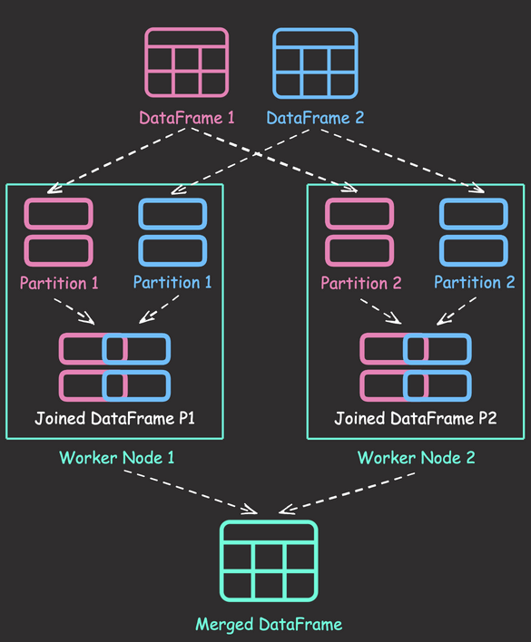

---
jupyter:
  jupytext:
    formats: ipynb,Rmd
    text_representation:
      extension: .Rmd
      format_name: rmarkdown
      format_version: '1.2'
      jupytext_version: 1.16.7
  kernelspec:
    display_name: Python 3 (ipykernel)
    language: python
    name: python3
---

## PySpark


### 3 Powerful Ways to Create PySpark DataFrames

```{python}
from pyspark.sql import SparkSession

spark = SparkSession.builder.getOrCreate()
```

Here are the three powerful methods to create DataFrames in PySpark, each with its own advantages:


1. Using StructType and StructField:

```{python}
from pyspark.sql.types import IntegerType, StringType, StructField, StructType

data = [("Alice", 25), ("Bob", 30), ("Charlie", 35)]
schema = StructType(
    [StructField("name", StringType(), True), StructField("age", IntegerType(), True)]
)

df = spark.createDataFrame(data, schema)
df.show()
```

Pros:
- Explicit schema definition, giving you full control over data types
- Helps catch data type mismatches early
- Ideal when you need to ensure data consistency and type safety
- Can improve performance by avoiding schema inference


2. Using Row objects:

```{python}
from pyspark.sql import Row

data = [Row(name="Alice", age=25), Row(name="Bob", age=30), Row(name="Charlie", age=35)]
df = spark.createDataFrame(data)
df.show()
```

Pros:
- More Pythonic approach, leveraging named tuples
- Good for scenarios where data structure might evolve


3. From Pandas DataFrame:

```{python}
import pandas as pd

pandas_df = pd.DataFrame({"name": ["Alice", "Bob", "Charlie"], "age": [25, 30, 35]})
df = spark.createDataFrame(pandas_df)
df.show()
```

Pros:
- Familiar to data scientists who frequently use Pandas


### Distributed Data Joining with Shuffle Joins in PySpark

```{python tags=c("hide-cell")}
# !pip install 'pyspark[sql]'
```

Shuffle joins in PySpark distribute data across worker nodes, enabling parallel processing and improving performance compared to single-node joins. By dividing data into partitions and joining each partition simultaneously, shuffle joins can handle large datasets efficiently.




Here's an example of performing a shuffle join in PySpark:

```{python}
from pyspark.sql import SparkSession

spark = SparkSession.builder.getOrCreate()
```

```{python}
employees = spark.createDataFrame(
    [(1, "John", "Sales"), (2, "Jane", "Marketing"), (3, "Bob", "Engineering")],
    ["id", "name", "department"],
)

salaries = spark.createDataFrame([(1, 5000), (2, 6000), (4, 7000)], ["id", "salary"])

# Perform an inner join using the join key "id"
joined_df = employees.join(salaries, "id", "inner")

joined_df.show()
```

In this example, PySpark performs a shuffle join behind the scenes to combine the two DataFrames. The process involves partitioning the data based on the join key ("id"), shuffling the partitions across the worker nodes, performing local joins on each worker node, and finally merging the results.


### PySpark DataFrame Transformations: select vs withColumn

```{python tags=c("hide-cell")}
# !pip install 'pyspark[sql]'
```

```{python tags=c("hide-cell")}
from pyspark.sql import SparkSession

spark = SparkSession.builder.getOrCreate()
```

PySpark's `select` and `withColumn` both can be used to add or modify existing columns. However, their behavior are different.

To demonstrate this, let's start with creating a sample DataFrame:

```{python}
from pyspark.sql.functions import col, upper

data = [
    ("Alice", 28, "New York"),
    ("Bob", 35, "San Francisco"),
]
df = spark.createDataFrame(data, ["name", "age", "city"])
df.show()
```


`select` only keeps specified columns.

```{python}
df_select = df.select(upper(col("city")).alias("upper_city"))
df_select.show()
```

`withColumn` retains all original columns plus the new/modified one.

```{python}
df_withColumn = df.withColumn("upper_city", upper(col("city")))
df_withColumn.show()
```

### Spark DataFrame: Avoid Out-of-Memory Errors with Lazy Evaluation

```{python tags=c("hide-cell")}
# !pip install 'pyspark[sql]'
```

```{python tags=c("remove-cell")}
# Create a parquet file for testing

import numpy as np
import pandas as pd

# Set the number of rows
num_rows = 1_000_000

# Create a categorical column with three categories as strings
category_column = np.random.choice(["a", "b", "c"], size=num_rows)

# Create two numerical columns
num_col1 = np.random.randint(0, 100, num_rows)
num_col2 = np.random.randint(0, 100, num_rows)

# Create the DataFrame
df = pd.DataFrame({"cat": category_column, "val1": num_col1, "val2": num_col2})

df.to_parquet("test_data.parquet")
```

Retrieving all rows from a large dataset into memory can cause out-of-memory errors. When creating a Spark DataFrame, computations are not executed until the `collect()` method is invoked. This allows you to reduce the size of the DataFrame through operations such as filtering or aggregating before bringing them into memory. 

As a result, you can manage memory usage more efficiently and avoid unnecessary computations.

```{python}
from pyspark.sql import SparkSession

spark = SparkSession.builder.getOrCreate()
```

```{python}
df = spark.read.parquet("test_data.parquet")
df.show(5)
```

```{python}
processed_df = df.filter(df["val1"] >= 50).groupBy("cat").agg({"val2": "mean"})
```

```{python}
processed_df.collect()
```

### Pandas-Friendly Big Data Processing with Spark

```{python}
# !pip install "pyspark[pandas_on_spark]"
```

Spark enables scaling of your pandas workloads across multiple nodes. However, learning PySpark syntax can be daunting for pandas users. 

Pandas API on Spark enables leveraging Spark's capabilities for big data while retaining a familiar pandas-like syntax.

The following code compares the syntax between PySpark and the Pandas API on Spark.

```{python}
import warnings

warnings.simplefilter(action="ignore", category=FutureWarning)
```

Pandas API on Spark:

```{python}
import numpy as np
import pyspark.pandas as ps
```

```{python}
psdf = ps.DataFrame(
    {
        "A": ["foo", "bar", "foo"],
        "B": ["one", "one", "two"],
        "C": [0.1, 0.3, 0.5],
        "D": [0.2, 0.4, 0.6],
    }
)
```

```{python}
psdf.sort_values(by="B")
```

```{python}
psdf.groupby("A").sum()
```

```{python}
psdf.query("C > 0.4")
```

```{python}
psdf[["C", "D"]].abs()
```

PySpark:

```{python}
from pyspark.sql import SparkSession
from pyspark.sql.functions import abs, col
```

```{python}
spark = SparkSession.builder.getOrCreate()
```

```{python}
spark_data = spark.createDataFrame(
    [
        ("foo", "one", 0.1, 0.2),
        ("bar", "one", 0.3, 0.4),
        ("foo", "two", 0.5, 0.6),
    ],
    ["A", "B", "C", "D"],
)
```

```{python}
spark_data.sort(col("B")).show()
```

```{python}
spark_data.groupBy("A").sum().show()
```

```{python}
spark_data.filter(col("C") > 0.4).show()
```

```{python}
spark_data.select(abs(spark_data["C"]).alias("C"), abs(spark_data["D"]).alias("D"))
```

### Writing Safer and Cleaner Spark SQL with PySpark's Parameterized Queries

```{python tags=c("hide-cell")}
# !pip install "pyspark[sql]"
```

```{python}
from datetime import date, timedelta

import pandas as pd
from pyspark.sql import SparkSession

spark = SparkSession.builder.getOrCreate()
```

When working with Spark SQL queries, using regular Python string interpolation can lead to security vulnerabilities and require extra steps like creating temporary views. PySpark offers a better solution with parameterized queries, which:

- Protect against SQL injection
- Allow using DataFrame objects directly in queries
- Automatically handle date formatting
- Provide a more expressive way to write SQL queries

Let's compare the traditional approach with parameterized queries:

```{python}
# Create a Spark DataFrame
item_price_pandas = pd.DataFrame(
    {
        "item_id": [1, 2, 3, 4],
        "price": [4, 2, 5, 1],
        "transaction_date": [
            date(2023, 1, 15),
            date(2023, 2, 1),
            date(2023, 3, 10),
            date(2023, 4, 22),
        ],
    }
)

item_price = spark.createDataFrame(item_price_pandas)
item_price.show()
```

Traditional approach (less secure, requires temp view and wrapping the date in quotes):

```{python}
item_price.createOrReplaceTempView("item_price_view")
transaction_date = "2023-02-15"

query = f"""SELECT *
FROM item_price_view 
WHERE transaction_date > '{transaction_date}'
"""

spark.sql(query).show()
```

PySpark's parameterized query approach (secure, no temp view and quotes needed):

```{python}
query = """SELECT *
FROM {item_price} 
WHERE transaction_date > {transaction_date}
"""

spark.sql(query, item_price=item_price, transaction_date=transaction_date).show()
```

This method allows for easy parameter substitution and direct use of DataFrames, making your Spark SQL queries both safer and more convenient to write and maintain.


### Working with Arrays Made Easier in Spark 3.5

```{python tags=c("hide-cell")}
# !pip install "pyspark[sql]"
```

Spark 3.5 added new array helper functions that simplify the process of working with array data. Below are a few examples showcasing these new array functions.

```{python tags=c("hide-cell")}
from pyspark.sql import SparkSession

spark = SparkSession.builder.getOrCreate()
```

```{python tags=c("hide-input")}
from pyspark.sql import Row

df = spark.createDataFrame(
    [
        Row(customer="Alex", orders=["🍋", "🍋"]),
        Row(customer="Bob", orders=["🍊"]),
    ]
)

df.show()
```

```{python}
from pyspark.sql.functions import (
    array_append,
    array_contains,
    array_distinct,
    array_prepend,
    col,
)

df.withColumn("orders", array_append(col("orders"), "🍇")).show()
```

```{python}
df.withColumn("orders", array_prepend(col("orders"), "🍇")).show()
```

```{python}
df.withColumn("orders", array_distinct(col("orders"))).show()
```

```{python}
df.withColumn("has_🍋", array_contains(col("orders"), "🍋")).show()
```

[View other array functions](https://bit.ly/4c0txD1).


### Simplify Complex SQL Queries with PySpark UDFs

```{python tags=c("hide-cell")}
# !pip install "pyspark[sql]"
```

```{python tags=c("hide-cell")}
from pyspark.sql import SparkSession

spark = SparkSession.builder.getOrCreate()
```

Duplicated SQL logic across queries makes code hard to maintain and introduces risk of inconsistencies:

```{python}
customers_df = spark.createDataFrame(
    [(1, "John", 25, 60000), (2, "Jane", 17, 0), (3, "Bob", 68, 45000)],
    ["customer_id", "name", "age", "income"],
)

# Register the DataFrame as a temporary table or view
customers_df.createOrReplaceTempView("customers")
```

```{python}
# Complex SQL query
spark.sql(
    """
SELECT 
  customer_id,
  CASE 
    WHEN age < 18 THEN 'minor'
    WHEN age BETWEEN 18 AND 65 AND income > 50000 THEN 'prime'
    WHEN age > 65 THEN 'senior'
    ELSE 'standard'
  END as customer_segment
FROM customers
"""
).show()
```

```{python}
spark.sql("""
    SELECT CASE 
            WHEN age < 18 THEN 'minor'
            WHEN age > 65 THEN 'senior'
            WHEN income > 50000 THEN 'prime'
            ELSE 'standard'
        END as segment,
    COUNT(*) as count
    FROM customers
    GROUP BY CASE 
        WHEN age < 18 THEN 'minor'
        WHEN age > 65 THEN 'senior'
        WHEN income > 50000 THEN 'prime'
        ELSE 'standard'
    END
""").show()
```

PySpark UDFs allow you to centralize this logic in reusable Python functions. Here's how to implement it:

Define the UDF to encapsulate customer segmentation logic:

```{python}
from pyspark.sql.types import StringType

def segment_customers(age, income):
    if age is None or income is None:
        return None
    if age < 18:
        return "minor"
    elif age > 65:
        return "senior"
    elif income > 50000:
        return "prime"
    return "standard"

spark.udf.register("segment_customers", segment_customers, StringType())
```

Use the UDF in your queries:

```{python}
# Query 1: Simple segmentation
query1 = spark.sql("""
    SELECT 
        customer_id,
        segment_customers(age, income) AS segment
    FROM customers
""")

# Query 2: Segment counts
query2 = spark.sql("""
    SELECT 
        segment_customers(age, income) AS segment,
        COUNT(*) as count
    FROM customers
    GROUP BY segment_customers(age, income)
""")
```

```{python}
query1.show()
```

```{python}
query2.show()
```

[Learn more about PySPark UDFs](https://bit.ly/3TEYPHh).


### Leverage Spark UDFs for Reusable Complex Logic in SQL Queries

```{python tags=c("hide-cell")}
# !pip install "pyspark[sql]"
```

```{python tags=c("hide-cell")}
from pyspark.sql import SparkSession
from pyspark.sql.functions import col, udf
from pyspark.sql.types import StringType

# Create SparkSession
spark = SparkSession.builder.getOrCreate()
```

Duplicated code in SQL queries can lead to inconsistencies if changes are made to one instance of the duplicated code but not to others.

```{python}
# Sample DataFrame
df = spark.createDataFrame(
    [("Product 1", 10.0, 5), ("Product 2", 15.0, 3), ("Product 3", 8.0, 2)],
    ["name", "price", "quantity"],
)

# Use df within Spark SQL queries
df.createOrReplaceTempView("products")

# Select Statement 1
result1 = spark.sql(
    """
    SELECT name, price, quantity,
        CASE
            WHEN price < 10.0 THEN 'Low'
            WHEN price >= 10.0 AND price < 15.0 THEN 'Medium'
            ELSE 'High'
        END AS category
    FROM products
"""
)

# Select Statement 2
result2 = spark.sql(
    """
    SELECT name,
        CASE
            WHEN price < 10.0 THEN 'Low'
            WHEN price >= 10.0 AND price < 15.0 THEN 'Medium'
            ELSE 'High'
        END AS category
    FROM products
    WHERE quantity > 3
"""
)

# Display the results
result1.show()
result2.show()
```

Spark UDFs (User-Defined Functions) can help address these issues by encapsulating complex logic that is reused across multiple SQL queries. 

In the code example above, we define a UDF `assign_category_label` that assigns category labels based on price. This UDF is then reused in two different SQL statements.

```{python}
# Define UDF to assign category label based on price
@udf(returnType=StringType())
def assign_category_label(price):
    if price < 10.0:
        return "Low"
    elif price >= 10.0 and price < 15.0:
        return "Medium"
    else:
        return "High"


# Register UDF
spark.udf.register("assign_category_label", assign_category_label)

# Select Statement 1
result1 = spark.sql(
    """
    SELECT name, price, quantity, assign_category_label(price) AS category
    FROM products
"""
)

# Select Statement 2
result2 = spark.sql(
    """
    SELECT name, assign_category_label(price) AS category
    FROM products
    WHERE quantity > 3
"""
)

# Display the results
result1.show()
result2.show()
```

### Transform Single Inputs into Tables Using PySpark UDTFs

```{python editable=TRUE, slideshow={'slide_type': ''}, tags=c("hide-cell")}
# !pip install "pyspark[sql]"
```

```{python editable=TRUE, slideshow={'slide_type': ''}, tags=c("hide-cell")}
from pyspark.sql import SparkSession

# Create SparkSession
spark = SparkSession.builder.getOrCreate()
```

In PySpark, User-Defined Functions (UDFs) and User-Defined Table Functions (UDTFs) are custom functions that perform complex data transformations.

UDFs take input columns and return a single value. However, they are cumbersome when returning multiple rows and columns, resulting in complex and inefficient code.

```{python}
from pyspark.sql.functions import explode, udf
from pyspark.sql.types import ArrayType, IntegerType, StructField, StructType

# Define the schema of the output
schema = ArrayType(
    StructType(
        [
            StructField("num", IntegerType(), False),
            StructField("squared", IntegerType(), False),
        ]
    )
)


# Define the UDF
@udf(returnType=schema)
def square_numbers_udf(start: int, end: int):
    return [(num, num * num) for num in range(start, end + 1)]


# Use in Python
df = spark.createDataFrame([(1, 3)], ["start", "end"])
result_df = df.select(explode(square_numbers_udf(df.start, df.end)).alias("result"))
result_df.select("result.num", "result.squared").show()
```

With UDTFs, you can create functions that return entire tables from a single input, making it easier to work with multiple rows and columns.

```{python editable=TRUE, slideshow={'slide_type': ''}}
from pyspark.sql.functions import lit, udtf
from pyspark.sql.types import StringType


@udtf(returnType="num: int, squared: int")
class SquareNumbers:
    def eval(self, start: int, end: int):
        for num in range(start, end + 1):
            yield (num, num * num)


SquareNumbers(lit(1), lit(3)).show()
```

### Best Practices for PySpark DataFrame Comparison Testing

```{python editable=TRUE, slideshow={'slide_type': ''}, tags=c("hide-cell")}
# !pip install "pyspark[sql]"
```

```{python editable=TRUE, slideshow={'slide_type': ''}, tags=c("hide-cell")}
from pyspark.sql import SparkSession

# Create SparkSession
spark = SparkSession.builder.getOrCreate()
```

Manually comparing PySpark DataFrame outputs using `collect()` and equality comparison leads to brittle tests due to ordering issues and unclear error messages when data doesn't match expectations.

For example, the following test will fail due to ordering issues, resulting in an unclear error message.


```{python}
# Manual DataFrame comparison
result_df = spark.createDataFrame(
    [(1, "Alice", 100), (2, "Bob", 200)], ["id", "name", "value"]
)

expected_df = spark.createDataFrame(
    [(2, "Bob", 200), (1, "Alice", 100)], ["id", "name", "value"]
)

try:
    assert result_df.collect() == expected_df.collect()
except AssertionError as e:
    print(e)
```

`assertDataFrameEqual` provides a robust way to compare DataFrames, allowing for order-independent comparison.


```{python}
# Testing with DataFrame equality
from pyspark.testing.utils import assertDataFrameEqual
```

```{python}
assertDataFrameEqual(result_df, expected_df)
```

Using `collect()` for comparison cannot detect type mismatch, whereas `assertDataFrameEqual` can.

For example, the following test will pass, even though there is a type mismatch.


```{python}
# Manual DataFrame comparison
result_df = spark.createDataFrame(
    [(1, "Alice", 100), (2, "Bob", 200)], ["id", "name", "value"]
)

expected_df = spark.createDataFrame(
    [(1, "Alice", 100.0), (2, "Bob", 200.0)], ["id", "name", "value"]
)

assert result_df.collect() == expected_df.collect()
```

The error message produced by `assertDataFrameEqual` is clear and informative, highlighting the difference in schemas.

```{python}
try:
    assertDataFrameEqual(result_df, expected_df)
except AssertionError as e:
    print(e)
```

<!-- #region editable=true slideshow={"slide_type": ""} -->
### Simplify Unit Testing of SQL Queries with PySpark
<!-- #endregion -->

```{python tags=c("hide-cell")}
# !pip install ipytest "pyspark[sql]"
```

```{python tags=c("remove-cell")}
import ipytest

ipytest.autoconfig()
```

Testing your SQL queries helps to ensure that they are correct and functioning as intended.

PySpark enables users to parameterize queries, which simplifies unit testing of SQL queries. In this example, the `df` and `amount` variables are parameterized to verify whether the `actual_df` matches the `expected_df`.

```{python}
# %%ipytest -qq
import pytest
from pyspark.testing import assertDataFrameEqual


@pytest.fixture
def query():
    return "SELECT * from {df} where price > {amount} AND name LIKE '%Product%';"


def test_query_return_correct_number_of_rows(query):
    spark = SparkSession.builder.getOrCreate()

    # Create a sample DataFrame
    df = spark.createDataFrame(
        [
            ("Product 1", 10.0, 5),
            ("Product 2", 15.0, 3),
            ("Product 3", 8.0, 2),
        ],
        ["name", "price", "quantity"],
    )

    # Execute the query
    actual_df = spark.sql(query, df=df, amount=10)

    # Assert the result
    expected_df = spark.createDataFrame(
        [
            ("Product 2", 15.0, 3),
        ],
        ["name", "price", "quantity"],
    )
    assertDataFrameEqual(actual_df, expected_df)
```

### Update Multiple Columns in Spark 3.3 and Later

```{python tags=c("hide-cell")}
# !pip install -U "pyspark[sql]"
```

```{python tags=c("hide-cell")}
from pyspark.sql import SparkSession

# Create SparkSession
spark = SparkSession.builder.getOrCreate()
```

```{python}
from pyspark.sql.functions import col, trim

# Create a sample DataFrame
data = [("   John   ", 35), ("Jane", 28)]
columns = ["first_name", "age"]
df = spark.createDataFrame(data, columns)
df.show()
```

Prior to PySpark 3.3, appending multiple columns to a Spark DataFrame required chaining multiple `withColumn` calls.

```{python}
# Before Spark 3.3
new_df = df.withColumn("first_name", trim(col("first_name"))).withColumn(
    "age_after_10_years", col("age") + 10
)

new_df.show()
```

In PySpark 3.3 and later, you can use the withColumns method in a dictionary style to append multiple columns to a DataFrame. This syntax is more user-friendly for pandas users.

```{python}
new_df = df.withColumns(
    {
        "first_name": trim(col("first_name")),
        "age_after_10_years": col("age") + 10,
    }
)

new_df.show()
```

### Vectorized Operations in PySpark: pandas_udf vs Standard UDF

```{python tags=c("hide-cell")}
# !pip install -U pyspark
```

```{python}
from pyspark.sql import SparkSession

# Create SparkSession
spark = SparkSession.builder.getOrCreate()
```

Standard UDF functions process data row-by-row, resulting in Python function call overhead. 

In contrast, pandas_udf uses Pandas' vectorized operations to process entire columns in a single operation, significantly improving performance.

```{python}
# Sample DataFrame
data = [(1.0,), (2.0,), (3.0,), (4.0,)]
df = spark.createDataFrame(data, ["val1"])

df.show()
```

```{python}
from pyspark.sql.functions import udf


# Standard UDF
@udf("double")
def plus_one(val):
    return val + 1


# Apply the Standard UDF
df.withColumn("val2", plus_one(df.val1)).show()
```

```{python}
import pandas as pd
from pyspark.sql.functions import pandas_udf


# Pandas UDF
@pandas_udf("double")
def pandas_plus_one(val: pd.Series) -> pd.Series:
    return val + 1


# Apply the Pandas UDF
df.withColumn("val2", pandas_plus_one(df.val1)).show()
```

[Learn more about pandas_udf](https://bit.ly/4aRBNTX).


### Optimizing PySpark Queries: DataFrame API or SQL?

```{python tags=c("hide-cell")}
# !pip install "pyspark[sql]"
```

```{python tags=c("hide-cell")}
from pyspark.sql import SparkSession

spark = SparkSession.builder.getOrCreate()
```

PySpark queries with different syntax (DataFrame API or parameterized SQL) can have the same performance, as the physical plan is identical. Here is an example:


```{python}
from pyspark.sql.functions import col

fruits = spark.createDataFrame(
    [("apple", 4), ("orange", 3), ("banana", 2)], ["item", "price"]
)
fruits.show()
```

Use the DataFrame API to filter rows where the price is greater than 3.

```{python}
fruits.where(col("price") > 3).explain()
```

Use the spark.sql() method to execute an equivalent SQL query.

```{python}
spark.sql("select * from {df} where price > 3", df=fruits).explain()
```

The physical plan for both queries is the same, indicating identical performance.


Thus, the choice between DataFrame API and spark.sql() depends on the following:
- **Familiarity**: Use spark.sql() if your team prefers SQL syntax. Use the DataFrame API if chained method calls are more intuitive for your team.
- **Complexity of Transformations**: The DataFrame API is more flexible for complex manipulations, while SQL is more concise for simpler queries.


### Enhance Code Modularity and Reusability with Temporary Views in PySpark

```{python tags=c("hide-cell")}
# !pip install -U 'pyspark[sql]'
```

```{python tags=c("hide-cell")}
from pyspark.sql import SparkSession

# Create SparkSession
spark = SparkSession.builder.getOrCreate()
```

In PySpark, temporary views are virtual tables that can be queried using SQL, enabling code reusability and modularity.

To demonstrate this, let's create a PySpark DataFrame called `orders_df`.

```{python}
# Create a sample DataFrame
data = [
    (1001, "John Doe", 500.0),
    (1002, "Jane Smith", 750.0),
    (1003, "Bob Johnson", 300.0),
    (1004, "Sarah Lee", 400.0),
    (1005, "Tom Wilson", 600.0),
]

columns = ["customer_id", "customer_name", "revenue"]
orders_df = spark.createDataFrame(data, columns)
```

Next, create a temporary view called `orders` from the `orders_df` DataFrame using the `createOrReplaceTempView` method. 

```{python}
# Create a temporary view
orders_df.createOrReplaceTempView("orders")
```

With the temporary view created, we can perform various operations on it using SQL queries. 

```{python}
# Perform operations on the temporary view
total_revenue = spark.sql("SELECT SUM(revenue) AS total_revenue FROM orders")
order_count = spark.sql("SELECT COUNT(*) AS order_count FROM orders")

# Display the results
print("Total Revenue:")
total_revenue.show()

print("\nNumber of Orders:")
order_count.show()
```

<!-- #region editable=true slideshow={"slide_type": ""} -->
### PySpark Best Practices: Simplifying Logical Chain Conditions
<!-- #endregion -->

```{python editable=TRUE, slideshow={'slide_type': ''}, tags=c("hide-cell")}
# !pip install -U 'pyspark[sql]'
```

```{python editable=TRUE, slideshow={'slide_type': ''}, tags=c("hide-cell")}
from pyspark.sql import SparkSession

spark = SparkSession.builder.getOrCreate()
```

Long chains of logical conditions in PySpark can make code difficult to understand and modify. 

```{python}
data = [(1200, 3, 1), (2000, 2, 0), (1500, 3, 2), (1100, 2, 1)]

df = spark.createDataFrame(data, ["total_purchases", "loyalty_years", "returns"])
```

```{python}
from pyspark.sql import functions as F

df.withColumn(
    "discount_eligible",
    F.when(
        (F.col("total_purchases") > 1000)
        & (F.col("loyalty_years") >= 2)
        & (F.col("returns") < 3),
        True,
    ).otherwise(False),
).show()
```

To improve readability and maintainability, break down complex logic into meaningful variables:

```{python}
# Define loyal customer conditions
has_high_spend = F.col("total_purchases") > 1000
is_long_term = F.col("loyalty_years") >= 2
has_few_returns = F.col("returns") < 3

# Combine conditions for discount eligibility
loyal_customer_condition = has_high_spend & is_long_term & has_few_returns

(
    df.withColumn(
        "discount_eligible", F.when(loyal_customer_condition, True).otherwise(False)
    )
).show()
```

Benefits of this approach:

- Business logic is clearly documented through function names.
- Easier to add new conditions without cluttering main logic.


### Optimizing PySpark Queries with Nested Data Structures

```{python tags=c("hide-cell")}
# !pip install -U 'pyspark[sql]'
```

Using multiple tables and joins to represent hierarchical relationships results in:

- Increased query complexity and reduced readability
- Performance overhead from multiple join operations
- Complex maintenance when schema changes are needed

In the following example, we need to have three separate DataFrames and join them later with multiple joins.

```{python}
from pyspark.sql import SparkSession
from pyspark.sql.types import (
    FloatType,
    IntegerType,
    StringType,
    StructField,
    StructType,
)

spark = SparkSession.builder.getOrCreate()
```

```{python}
# Traditional way with separate DataFrames
# Define schemas
customer_schema = StructType(
    [
        StructField("customer_id", IntegerType()),
        StructField("first_name", StringType()),
        StructField("last_name", StringType()),
    ]
)

order_schema = StructType(
    [
        StructField("order_id", IntegerType()),
        StructField("customer_id", IntegerType()),
        StructField("order_date", StringType()),
        StructField("total", FloatType()),
    ]
)

# Create DataFrames with schemas
customer_df = spark.createDataFrame(
    [(1, "John", "Doe"), (2, "Emma", "Wilson"), (3, "Michael", "Brown")],
    ["customer_id", "first_name", "last_name"],
)

order_df = spark.createDataFrame(
    [
        (1, 1, "2023-01-01", 100.0),
        (2, 2, "2023-01-02", 150.0),
        (3, 3, "2023-01-03", 200.0),
    ],
    ["order_id", "customer_id", "order_date", "total"],
)

# Join customer and order data
result_df = customer_df.join(order_df, "customer_id")
result_df.show()
```

With nested StructType in PySpark, you can:

- Maintain data hierarchy in a single DataFrame
- Reduce join operations
- Simplify queries and aggregations
- Make schema changes more manageable

In the following example, we combine three DataFrames into one nested DataFrame with StructType.

```{python}
# Define nested schema
order_schema = StructType(
    [
        StructField("order_id", IntegerType()),
        StructField(
            "customer",
            StructType(
                [
                    StructField("customer_id", IntegerType()),
                    StructField("first_name", StringType()),
                    StructField("last_name", StringType()),
                ]
            ),
        ),
        StructField(
            "order_info",
            StructType(
                [
                    StructField("order_date", StringType()),
                    StructField("total", FloatType()),
                ]
            ),
        ),
    ]
)

# Sample data with nested structure
data = [
    (1, (1, "John", "Doe"), ("2023-01-01", 100.0)),
    (2, (2, "Emma", "Wilson"), ("2023-01-02", 150.0)),
    (3, (3, "Michael", "Brown"), ("2023-01-03", 200.0)),
]

df = spark.createDataFrame(data, order_schema)
df.show(truncate=False)
```

With this, you can access all related data in one place using intuitive dot notation.


```{python}
# Select specific nested fields
df.select("customer.first_name", "customer.last_name", "order_info.total").show()
```

```{python}
# Filter orders above $150
df.where("order_info.total >= 150").show()
```

### Tempo: Simplified Time Series Analysis in PySpark

```{python editable=TRUE, slideshow={'slide_type': ''}, tags=c("hide-cell")}
# !pip install -U 'pyspark[sql]' 'dbl-tempo'
```

```{python editable=TRUE, slideshow={'slide_type': ''}, tags=c("hide-cell")}
import pyspark.sql.functions as F
from pyspark.sql import SparkSession, Window
from pyspark.sql.types import *

spark = SparkSession.builder.getOrCreate()
```

Tempo is a high-level API built on top of Apache Spark that simplifies the process of working with time-series data. While PySpark provides a robust foundation for data processing, Tempo provides a more intuitive API for working with time-series data, making it easier to perform common tasks like resampling and aggregating time-series data

Here are some examples that compare PySpark and Tempo:

```{python}
from pyspark.sql import Window
from pyspark.sql import functions as F

# Create sample market data
market_data = [
    ("AAPL", "2024-01-01 09:30:00", 180.50, 1000, 180.45, 180.55),
    ("AAPL", "2024-01-01 09:30:05", 180.52, 1200, 180.48, 180.58),
    ("AAPL", "2024-01-01 09:30:10", 180.48, 800, 180.45, 180.52),
    ("AAPL", "2024-01-01 09:30:15", 180.55, 1500, 180.50, 180.60),
    ("GOOGL", "2024-01-01 09:30:00", 140.25, 500, 140.20, 140.30),
    ("GOOGL", "2024-01-01 09:30:05", 140.30, 600, 140.25, 140.35),
    ("GOOGL", "2024-01-01 09:30:10", 140.28, 450, 140.25, 140.32),
    ("GOOGL", "2024-01-01 09:30:15", 140.32, 700, 140.28, 140.38),
]

# Create DataFrame
market_df = spark.createDataFrame(
    market_data, ["symbol", "event_ts", "price", "volume", "bid", "ask"]
)

# Convert timestamp string to timestamp type
market_df = market_df.withColumn("event_ts", F.to_timestamp("event_ts"))
```

```{python}
from tempo import *

# Create Tempo TSDF
market_tsdf = TSDF(market_df, ts_col="event_ts", partition_cols=["symbol"])
```

Get data at specific time:

```{python}
# PySpark Version
target_time = "2024-01-01 09:30:10"
pyspark_at_target = market_df.filter(F.col("event_ts") == target_time)
pyspark_at_target.show()

# Tempo Version
tempo_at_target = market_tsdf.at(target_time)
tempo_at_target.show()
```

Get data between time interval:


```{python}
# PySpark Version
start_ts = "2024-01-01 09:30:05"
end_ts = "2024-01-01 09:30:15"
pyspark_interval = market_df.filter(
    (F.col("event_ts") >= start_ts) & (F.col("event_ts") <= end_ts)
)
pyspark_interval.show()

# Tempo Version
tempo_interval = market_tsdf.between(start_ts, end_ts)
tempo_interval.show()
```

Get oldest n records per symbol:


```{python}
# PySpark Version
n = 2
windowSpec = Window.partitionBy("symbol").orderBy("event_ts")
pyspark_oldest = (
    market_df.withColumn("row_num", F.row_number().over(windowSpec))
    .filter(F.col("row_num") <= n)
    .drop("row_num")
)
pyspark_oldest.show()

# Tempo Version
tempo_oldest = market_tsdf.earliest(n)
tempo_oldest.show()
```

Moving averages (10-second window):


```{python}
# PySpark Version
market_df = market_df.withColumn("event_ts_seconds", F.unix_timestamp("event_ts"))
movingWindowSpec = (
    Window.partitionBy("symbol").orderBy("event_ts_seconds").rangeBetween(-10, 0)
)

pyspark_moving_stats = market_df.withColumn(
    "mean_price", F.avg("price").over(movingWindowSpec)
)

pyspark_moving_stats.select("symbol", "event_ts", "price", "mean_price").show()

# Tempo Version
tempo_moving_stats = market_tsdf.withRangeStats("price", rangeBackWindowSecs=10)
tempo_moving_stats.select("symbol", "event_ts", "price", "mean_price").show()
```

Grouped statistics:


```{python}
# PySpark Version
pyspark_grouped = market_df.groupBy("symbol", F.window("event_ts", "5 seconds")).agg(
    F.avg("price").alias("mean_price"),
    F.min("price").alias("min_price"),
    F.max("price").alias("max_price"),
)
pyspark_grouped.show()

# Tempo Version
tempo_grouped = market_tsdf.withGroupedStats(metricCols=["price"], freq="5 seconds")
tempo_grouped.select(
    "symbol", "event_ts", "mean_price", "min_price", "max_price"
).show()
```

[Link to Tempo](https://github.com/databrickslabs/tempo).
