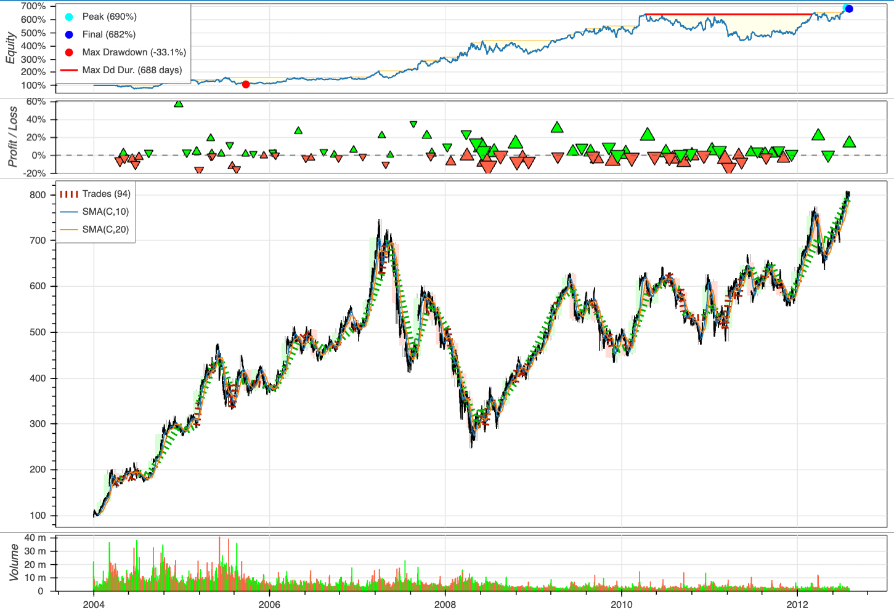

---
jupyter:
  jupytext:
    formats: ipynb,Rmd
    text_representation:
      extension: .Rmd
      format_name: rmarkdown
      format_version: '1.2'
      jupytext_version: 1.16.7
  kernelspec:
    display_name: Python 3 (ipykernel)
    language: python
    name: python3
---

## Time Series


This section shows some tools to work with datetime and time series. 


### datefinder: Automatically Find Dates and Time in a Python String

```{python tags=c("hide-cell")}
# !pip install datefinder
```

To automatically find date and time with different formats in a Python string, use datefinder. 

```{python}
from datefinder import find_dates

text = """"We have one meeting on May 17th, 2021 at 9:00am 
and another meeting on 5/18/2021 at 10:00. 
I hope you can attend one of the meetings."""

matches = find_dates(text)

for match in matches:
    print("Date and time:", match)
    print("Only day:", match.day)
```

[Link to datefinder](https://github.com/akoumjian/datefinder).


### Fastai's add_datepart: Add Relevant DateTime Features in One Line of Code

```{python tags=c("hide-cell")}
# !pip install fastai
```

Time series analysis often benefits from date-based features like year, month, and day of week. Fastai's `add_datepart` method generates these features in one line of code, simplifying data preparation.

```{python}
import pandas as pd
from fastai.tabular.core import add_datepart
from datetime import datetime

df = pd.DataFrame(
    {
        "date": [
            datetime(2020, 2, 5),
            datetime(2020, 2, 6),
            datetime(2020, 2, 7),
            datetime(2020, 2, 8),
        ],
        "val": [1, 2, 3, 4],
    }
)

df
```

```{python}
df = add_datepart(df, "date")
df.columns
```

[Link to Fastai's methods to work with tabular data](https://docs.fast.ai/tabular.core.html)


### Maya: Convert the string to datetime automatically

```{python tags=c("hide-cell")}
# !pip install maya
```

Date string conversion to datetime can be tedious using `strptime()`. The `maya` library simplifies this process by automatically parsing date strings without needing to specify the format.

```{python}
import maya

# Automatically parse datetime string
string = "2016-12-16 18:23:45.423992+00:00"
maya.parse(string).datetime()
```

Better yet, if you want to convert the string to a different time zone (for example, CST), you can parse that into maya’s datetime function.

```{python}
maya.parse(string).datetime(to_timezone="US/Central")
```

[Link to maya](https://github.com/timofurrer/maya).


### Pendulum: Python Datetimes Made Easy

```{python tags=c("hide-cell")}
# !pip install pendulum
```

While native datetime instances are sufficient for simple cases, they can become difficult to work with when dealing with more complex scenarios. 

Conversely, Pendulum offers a more intuitive and user-friendly API, making it a convenient drop-in replacement for the standard datetime class.

The examples below demonstrate the syntax differences between using the standard datetime library and Pendulum.


Datetime:

```{python}
from datetime import datetime, timedelta
import pytz

# Creating a datetime
now = datetime.now()
print(f"Current time: {now}")

# Date arithmetic
future = now + timedelta(days=7)
print(f"7 days from now: {future}")

# Timezone handling
utc_now = datetime.now(pytz.UTC)
tokyo_tz = pytz.timezone('Asia/Tokyo')
tokyo_time = utc_now.astimezone(tokyo_tz)
print(f"Time in Tokyo: {tokyo_time}")

# Parsing (requires exact format)
parsed = datetime.strptime("2023-05-15 14:30:00", "%Y-%m-%d %H:%M:%S")

# Time difference (not human-readable)
diff = parsed - now 
print(f"Difference: {diff}")
```

Pendulum:

```{python}
import pendulum

# Creating a datetime
now = pendulum.now()
print(f"Current time: {now}")

# Date arithmetic (more intuitive than datetime)
future = now.add(days=7)
print(f"7 days from now: {future}")

# Timezone handling
tokyo_time = now.in_timezone("Asia/Tokyo")
print(f"Time in Tokyo: {tokyo_time}")

# Parsing without specifying format
parsed = pendulum.parse("2023-05-15 14:30:00")
print(f"Parsed date: {parsed}")

# Human-readable differences
diff = parsed - now
print(f"Difference: {diff.in_words()}")
```

[Link to Pendulum](https://bit.ly/49aJ4gS).


### traces: A Python Library for Unevenly-Spaced Time Series Analysis


```{python tags=c("hide-cell")}
# !pip install traces
```

To analyze unevenly-spaced time series, you can use the `traces` library. It allows you to infer missing values in your time series based on the data you already have.


Here’s an example where we log working hours for several dates but miss a few:

```{python}
# Log working hours for each date
import traces 
from datetime import datetime 

working_hours = traces.TimeSeries()
working_hours[datetime(2021, 9, 10)] = 10
working_hours[datetime(2021, 9, 12)] = 5
working_hours[datetime(2021, 9, 13)] = 6
working_hours[datetime(2021, 9, 16)] = 2
```

To retrieve the hours for dates where no data was logged, `traces` fills in the gaps using neighboring values:

```{python}
# Get value on 2021/09/11
working_hours[datetime(2021, 9, 11)]
```

```{python}
# Get value on 2021/09/14
working_hours[datetime(2021, 9, 14)]
```

You can also calculate the distribution of working hours over a range of dates:

```{python}
distribution = working_hours.distribution(
    start=datetime(2021, 9, 10),
    end=datetime(2021, 9, 16)
)
distribution
```

From this, we can infer that 50% of the time, 6 hours were logged per day.


To get the median and mean working hours across the range:

```{python}
distribution.median()
```

```{python}
distribution.mean()
```

[Link to traces](https://github.com/datascopeanalytics/traces)


### Extract holiday from date column

```{python tags=c("hide-cell")}
# !pip install holidays
```

To identify holidays from a date, use the `holidays` package. This package offers a dictionary of holidays for various countries. 

The following code checks if "2020-07-04" is a US holiday and retrieves its name:

```{python}
from datetime import date
import holidays

us_holidays = holidays.UnitedStates()

"2014-07-04" in us_holidays
```

The package handles various date formats:

```{python}
us_holidays.get("2014-7-4")
```

```{python}
us_holidays.get("2014/7/4")
```

[Link to holidays](https://pypi.org/project/holidays/).


### Workalendar: Handle Working-Day Computation in Python  

```{python tags=c("hide-cell")}
# !pip install workalendar
```

To manage calendars, holidays, and working-day computations, use the `workalendar` package. It supports nearly 100 countries worldwide.

```{python}
from datetime import date 
from workalendar.usa import UnitedStates
from workalendar.asia import Japan
```

```{python}
# Get all holidays in the US

US_cal = UnitedStates()
US_cal.holidays(2024)
```

```{python}
US_cal.is_working_day(date(2024, 9, 15)) # Sunday
```

```{python}
US_cal.is_working_day(date(2024, 9, 2)) # Labor Day
```

```{python}
# Calculate working days between 2024/1/19 and 2024/5/15
US_cal.get_working_days_delta(date(2024, 1, 19), date(2024, 5, 15))
```

```{python}
# Get holidays in Japan
JA_cal = Japan()
JA_cal.holidays(2024)
```

[Link to Workalendar](https://github.com/workalendar/workalendar).


### Pmdarima: Harness R's auto.arima Power with a scikit-learn-Like Interface

```{python tags=c("hide-cell")}
# !pip install pmdarima
```

To achieve functionality similar to R's `auto.arima` within a scikit-learn-like interface, use Pmdarima.

```{python}
import pmdarima as pm
from pmdarima.model_selection import train_test_split
import numpy as np
import matplotlib.pyplot as plt

# Load/split your data
y = pm.datasets.load_wineind()
train, test = train_test_split(y, train_size=150)

# Fit your model
model = pm.auto_arima(train, seasonal=True, m=12)

# Make your forecasts
forecasts = model.predict(test.shape[0])  # predict N steps into the future

# Visualize the forecasts (blue=train, green=forecasts)
x = np.arange(y.shape[0])
plt.plot(x[:150], train, c="blue")
plt.plot(x[150:], forecasts, c="green")
plt.show()

```

Fitting a more complex pipeline on the sunspots dataset, serializing it, and then loading it from disk to make predictions:

```{python}
import pmdarima as pm
from pmdarima.model_selection import train_test_split
from pmdarima.pipeline import Pipeline
from pmdarima.preprocessing import BoxCoxEndogTransformer
import pickle

# Load/split your data
y = pm.datasets.load_sunspots()
train, test = train_test_split(y, train_size=2700)

# Define and fit your pipeline
pipeline = Pipeline([
    ('boxcox', BoxCoxEndogTransformer(lmbda2=1e-6)),
    ('arima', pm.AutoARIMA(seasonal=True, m=12,
                           suppress_warnings=True,
                           trace=True))
])

pipeline.fit(train)

# Serialize your model just like you would in scikit:
with open('model.pkl', 'wb') as pkl:
    pickle.dump(pipeline, pkl)
    
# Load it and make predictions seamlessly:
with open('model.pkl', 'rb') as pkl:
    mod = pickle.load(pkl)
    print(mod.predict(15))
```

[Link to Pmdarima](https://github.com/alkaline-ml/pmdarima).


### aeon: The Ultimate Library for Time-Series Forecasting and Classification

```{python tags=c("hide-cell")}
# !pip install aeon
```

aeon is a library for time-series data that is compatible with scikit-learn and offers a variety of advanced algorithms for learning tasks like forecasting and classification.

```{python}
import pandas as pd
from aeon.forecasting.trend import TrendForecaster

y = pd.Series([20.0, 40.0, 60.0, 80.0, 100.0])
forecaster = TrendForecaster()

# fit the forecaster
forecaster.fit(y)  

# forecast the next 3 values
forecaster.predict(fh=[1, 2, 3])  
```

```{python}
import numpy as np
from aeon.classification.distance_based import KNeighborsTimeSeriesClassifier

# 3 samples and 6 time steps 
X =  np.array([[1, 2, 3, 4, 5, 5], [1, 2, 3, 4, 4, 2], [8, 7, 6, 5, 4, 4]])

# class labels for each sample
y = np.array(["low", "low", "high"])

# Define the classifier
clf = KNeighborsTimeSeriesClassifier(distance="dtw")

# fit the classifier on train data
clf.fit(X, y)

# Test data
X_test = np.array([[2, 2, 2, 2, 2, 2], [6, 6, 6, 6, 6, 6]])

# Make class predictions on new data
y_pred = clf.predict(X_test)
y_pred
```

[Link to aeon](https://github.com/aeon-toolkit/aeon).


### Ruptures: Detecting Change Points in Non-Stationary Signals

```{python tags=c("hide-cell")}
# !pip install ruptures
```

Use ruptures to detect change points from non-stationary signals such as trend, seasonality, and variance.

With change points, you can detect anomalies or deviations from the expected behavior and gain insights into when these transitions occur.

```{python}
import matplotlib.pyplot as plt
import ruptures as rpt

# generate signal
n_samples, n_features, sigma = 1000, 3, 3
num_breakpoints = 3
signal, true_breakpoints = rpt.pw_constant(
    n_samples, n_features, num_breakpoints, noise_std=sigma
)

# detection
algo = rpt.Pelt(model="rbf").fit(signal)
predicted_breakpoints = algo.predict(pen=10)

# display
rpt.display(signal, predicted_breakpoints)
plt.show()
```

[Link to ruptures](https://github.com/deepcharles/ruptures).


### GluonTS: Probabilistic Time Series Modeling in Python


Probabilistic models offer a range of possible future outcomes, rather than a single fixed prediction, allowing for the assessment of risk associated with adverse events. 

GluonTS streamlines the process of using probabilistic models for time series data.


```python
import pandas as pd
import matplotlib.pyplot as plt

from gluonts.dataset.pandas import PandasDataset
from gluonts.dataset.split import split
from gluonts.torch import DeepAREstimator

# Load data from a CSV file into a PandasDataset
df = pd.read_csv(
    "https://raw.githubusercontent.com/AileenNielsen/"
    "TimeSeriesAnalysisWithPython/master/data/AirPassengers.csv",
    index_col=0,
    parse_dates=True,
)
dataset = PandasDataset(df, target="#Passengers")

# Split the data for training and testing
training_data, test_gen = split(dataset, offset=-36)
test_data = test_gen.generate_instances(prediction_length=12, windows=3)

# Train the model and make predictions
model = DeepAREstimator(
    prediction_length=12, freq="M", trainer_kwargs={"max_epochs": 5}
).train(training_data)

forecasts = list(model.predict(test_data.input))

# Plot predictions
plt.plot(df["1954":], color="black")
for forecast in forecasts:
  forecast.plot()
plt.legend(["True values"], loc="upper left", fontsize="xx-large")
plt.show()
```


[Link to GluonTS](https://github.com/awslabs/gluonts).


### tfcausalimpact: Understand Causal Relationships in Time Series Data

```{python tags=c("hide-cell")}
# !pip install tfcausalimpact
```

You're running a marketing campaign and see a user increase. But how do you know if it's due to the campaign or just a coincidence?

That is when tfcausalimpact comes in handy. It forecasts future data trends using a Bayesian structural model and compares them to actual data to give you meaningful insights.

```{python}
import pandas as pd
from causalimpact import CausalImpact


data = pd.read_csv(
    "https://raw.githubusercontent.com/WillianFuks/tfcausalimpact/master/tests/fixtures/arma_data.csv"
)[["y", "X"]]
data.iloc[70:, 0] += 5


ci = CausalImpact(data, pre_period=[0, 69], post_period=[70, 99])
print(ci.summary())
print(ci.summary(output="report"))
ci.plot()
```

<!-- #region -->
Posterior Inference {Causal Impact}
                          Average            Cumulative
Actual                    125.23             3756.86
Prediction (s.d.)         120.33 (0.3)       3609.94 (9.11)
95% CI                    [119.75, 120.94]   [3592.64, 3628.34]

Absolute effect (s.d.)    4.9 (0.3)          146.93 (9.11)
95% CI                    [4.28, 5.47]       [128.52, 164.23]

Relative effect (s.d.)    4.07% (0.25%)      4.07% (0.25%)
95% CI                    [3.56%, 4.55%]     [3.56%, 4.55%]

Posterior tail-area probability p: 0.0
Posterior prob. of a causal effect: 100.0%

For more details run the command: `print(impact.summary('report'))`

Analysis report {CausalImpact}


During the post-intervention period, the response variable had
an average value of approx. 125.23. By contrast, in the absence of an
intervention, we would have expected an average response of 120.33.
The 95% interval of this counterfactual prediction is [119.75, 120.94].
Subtracting this prediction from the observed response yields
an estimate of the causal effect the intervention had on the
response variable. This effect is 4.9 with a 95% interval of
[4.28, 5.47]. For a discussion of the significance of this effect,
see below.


Summing up the individual data points during the post-intervention
period (which can only sometimes be meaningfully interpreted), the
response variable had an overall value of 3756.86.
By contrast, had the intervention not taken place, we would have expected
a sum of 3609.94. The 95% interval of this prediction is [3592.64, 3628.34].


The above results are given in terms of absolute numbers. In relative
terms, the response variable showed an increase of +4.07%. The 95%
interval of this percentage is [3.56%, 4.55%].


This means that the positive effect observed during the intervention
period is statistically significant and unlikely to be due to random
fluctuations. It should be noted, however, that the question of whether
this increase also bears substantive significance can only be answered
by comparing the absolute effect (4.9) to the original goal
of the underlying intervention.


The probability of obtaining this effect by chance is very small
(Bayesian one-sided tail-area probability p = 0.0).
This means the causal effect can be considered statistically
significant.


<!-- #endregion -->

[Link to tfcausalimpact](https://github.com/WillianFuks/tfcausalimpact).


### QuantStats: Simplify Stock Performance Analysis in Python

```{python tags=c("hide-cell")}
# !pip install quantstats
```

To visualize and analyze the performance of specific stocks using just a few lines of Python, try QuantStats.

The code below shows how to use QuantStats to visualize stock performance.

```{python}
import quantstats as qs

qs.extend_pandas()

# fetch the daily returns for a stock
stock = qs.utils.download_returns('SPY')

# visualize stock performance
qs.plots.snapshot(stock, title='SPY Performance', show=True)
```

```{python}
qs.reports.html(stock, "SPY")

```

Running the code above will generate a report that looks similar to this:


[Link to QuantStats](https://github.com/ranaroussi/quantstats).


### kneed: Knee-Point Detection in Time Series

```{python tags=c("hide-cell")}
# !pip install "kneed[plot]"
```

Knee-point detection in time series identifies the point of maximum curvature. The knee point can identify anomalies or outliers in the time series. If a data point is far away from the knee point, it may indicate an anomaly or unexpected behavior.

The kneed library makes it easy to implement knee-point detection in Python.

```{python}
from kneed import DataGenerator, KneeLocator

x, y = DataGenerator.figure2()

kneedle = KneeLocator(x, y, S=1.0, curve="concave", direction="increasing")
kneedle.plot_knee_normalized()
```

[Link to kneed](https://github.com/arvkevi/kneed).


### NeuralForecast: Streamline Neural Forecasting with Familiar Sklearn Syntax

```{python tags=c("hide-cell")}
pip install neuralforecast
```

Neural forecasting methods can enhance the accuracy of forecasting, but they are often difficult to use and computationally expensive.

NeuralForecast provides a simple way to use proven accurate and efficient models, using familiar sklearn syntax. The models available in NeuralForecast range from classic networks like RNN to the latest transformers.

```{python}
from neuralforecast import NeuralForecast
from neuralforecast.models import NBEATS
from neuralforecast.utils import AirPassengersDF

nf = NeuralForecast(models=[NBEATS(input_size=24, h=12, max_steps=100)], freq="M")

nf.fit(df=AirPassengersDF)
nf.predict()
```

[Link to NeuralForecast](https://github.com/Nixtla/neuralforecast).


### Scaling Time-Series Forecasting with StatsForecast and Spark

```{python tags=c("hide-cell")}
# !pip install statsforecast pyspark
```

Traditional time series libraries are typically built to run in-memory on single machines, which poses challenges when handling extremely large datasets.

StatsForecast, however, provides seamless compatibility with Spark, allowing users to perform scalable and efficient time-series forecasting on large datasets directly within Spark.

```{python}
from pyspark.sql import SparkSession

spark = SparkSession.builder.config(
    "spark.executorEnv.NIXTLA_ID_AS_COL", "1"
).getOrCreate()
```

```{python}
from statsforecast.core import StatsForecast
from statsforecast.models import AutoETS
from statsforecast.utils import generate_series
from tqdm.autonotebook import tqdm

n_series = 4
horizon = 7

series = generate_series(n_series)

# Convert to Spark
spark_df = spark.createDataFrame(series)
spark_df.show(5)
```

```{python}
sf = StatsForecast(models=[AutoETS(season_length=7)], freq="D")

# Returns a Spark DataFrame
sf.forecast(df=spark_df, h=horizon, level=[90]).show(5)
```

[Link to StatsForecast.](https://github.com/Nixtla/statsforecast/)


### Beyond Point Estimates: Leverage Prediction Intervals for Robust Forecasting

```{python tags=c("hide-cell")}
# !pip install mlforecast utilsforecast
```

Generating a forecast typically produces a single point estimate, which does not reflect the uncertainty associated with the prediction.

To quantify this uncertainty, we need prediction intervals - a range of values the forecast can take with a given probability. MLForecast allows you to train sklearn models to generate both point forecasts and prediction intervals.


To demonstrate this, let's consider the following example:

```{python}
import pandas as pd
from utilsforecast.plotting import plot_series

```

```{python}
train = pd.read_csv("https://auto-arima-results.s3.amazonaws.com/M4-Hourly.csv")
test = pd.read_csv("https://auto-arima-results.s3.amazonaws.com/M4-Hourly-test.csv")
train.head()
```

We’ll only use the first series of the dataset.

```{python}
n_series = 1
uids = train["unique_id"].unique()[:n_series]  
train = train.query("unique_id in @uids")
test = test.query("unique_id in @uids")
```

Plot these series using the `plot_series` function from the utilsforecast library

```{python}
fig = plot_series(
    df=train,
    forecasts_df=test.rename(columns={"y": "y_test"}),
    models=["y_test"],
    palette="tab10",
)

fig.set_size_inches(8, 3)
fig
```

Train multiple models that follow the sklearn syntax:


```{python}
from mlforecast import MLForecast
from mlforecast.target_transforms import Differences
from mlforecast.utils import PredictionIntervals
from sklearn.linear_model import LinearRegression
from sklearn.neighbors import KNeighborsRegressor
```

```{python}
mlf = MLForecast(
    models=[
        LinearRegression(),
        KNeighborsRegressor(),
    ],
    freq=1,
    target_transforms=[Differences([1])],
    lags=[24 * (i + 1) for i in range(7)],
)
```

Apply the feature engineering and train the models:

```{python}
mlf.fit(
    df=train,
    prediction_intervals=PredictionIntervals(n_windows=10, h=48),
)
```

Generate forecasts with prediction intervals:

```{python}
# A list of floats with the confidence levels of the prediction intervals
levels = [50, 80, 95]

# Predict the next 48 hours
horizon = 48

# Generate forecasts with prediction intervals
forecasts = mlf.predict(h=horizon, level=levels)
forecasts.head()
```

Merge the test data with forecasts:

```{python}
test_with_forecasts = test.merge(forecasts, how="left", on=["unique_id", "ds"])
```

Plot the point and the prediction intervals:

```{python}
levels = [50, 80, 95]
fig = plot_series(
    train,
    test_with_forecasts,
    plot_random=False,
    models=["KNeighborsRegressor"],
    level=levels,
    max_insample_length=48,
    palette='tab10',
)
fig.set_size_inches(8, 4)
fig
```

[Link to MLForecast](https://github.com/Nixtla/mlforecast).


### Sliding Window Approach to Time Series Cross-Validation

```{python tags=c("hide-cell")}
# !pip install mlforecast
```

Time series cross-validation evaluates a model's predictive performance by training on past data and testing on subsequent time periods using a sliding window approach. 

MLForecast offers an efficient and easy-to-use implementation of this technique.


To see how to implement time series cross-validation with MLForecast, let's start reading a subset of the M4 Competition hourly dataset.

```{python}
import pandas as pd
from utilsforecast.plotting import plot_series
```

```{python}
Y_df = pd.read_csv("https://datasets-nixtla.s3.amazonaws.com/m4-hourly.csv").query(
    "unique_id == 'H1'"
)
print(Y_df)
```

Plot the time series:

```{python}
fig = plot_series(Y_df, plot_random=False, max_insample_length=24 * 14)
fig
```

Instantiate a new MLForecast object:

```{python}
from mlforecast import MLForecast
from mlforecast.target_transforms import Differences
from sklearn.linear_model import LinearRegression


mlf = MLForecast(
    models=[LinearRegression()],
    freq=1,
    target_transforms=[Differences([24])],
    lags=range(1, 25),
)
```

Once the MLForecast object has been instantiated, we can use the `cross_validation` method.

For this particular example, we’ll use 3 windows of 24 hours.

```{python}
# use 3 windows of 24 hours
cross_validation_df = mlf.cross_validation(
    df=Y_df,
    h=24,
    n_windows=3,
)
```

```{python}
print(cross_validation_df.head())
```

We’ll now plot the forecast for each cutoff period.

```{python}
import matplotlib.pyplot as plt


def plot_cv(df, df_cv, last_n=24 * 14):
    cutoffs = df_cv["cutoff"].unique()
    fig, ax = plt.subplots(
        nrows=len(cutoffs), ncols=1, figsize=(14, 6), gridspec_kw=dict(hspace=0.8)
    )
    for cutoff, axi in zip(cutoffs, ax.flat):
        df.tail(last_n).set_index("ds").plot(ax=axi, y="y")
        df_cv.query("cutoff == @cutoff").set_index("ds").plot(
            ax=axi,
            y="LinearRegression",
            title=f"{cutoff=}",
        )


plot_cv(Y_df, cross_validation_df)
```

Notice that in each cutoff period, we generated a forecast for the next 24 hours using only the data y before said period.


[Link to MLForecast](https://github.com/Nixtla/mlforecast).


### Hierarchical Forecasting in Python

```{python tags=c("hide-cell")}
# %%capture
# !pip install hierarchicalforecast
# !pip install -U statsforecast numba
```

In complex datasets, forecasts at detailed levels (e.g., regions, products) should align with higher-level forecasts (e.g., countries, categories). Inconsistent forecasts can lead to poor decisions.

Hierarchical forecasting ensures forecasts are consistent across all levels to reconcile and match forecasts from lower to higher levels.

HierarchicalForecast, an open-source library from Nixtla, offers tools and methods specifically designed for creating and reconciling hierarchical forecasts.


For illustrative purposes, consider a sales dataset with the following columns:

*   **Country**: The country where the sales occurred.
*   **Region**: The region within the country.
*   **State**: The state within the region.
*   **Purpose**: The purpose of the sale (e.g., Business, Leisure).
*   **ds**: The date of the sale.
*   **y**: The sales amount.

```{python}
import numpy as np
import pandas as pd
```

```{python}
# %%capture
Y_df = pd.read_csv('https://raw.githubusercontent.com/Nixtla/transfer-learning-time-series/main/datasets/tourism.csv')
Y_df = Y_df.rename({'Trips': 'y', 'Quarter': 'ds'}, axis=1)
Y_df.insert(0, 'Country', 'Australia')
Y_df = Y_df[['Country', 'State', 'Region', 'Purpose', 'ds', 'y']]
Y_df['ds'] = Y_df['ds'].str.replace(r'(\d+) (Q\d)', r'\1-\2', regex=True)
Y_df['ds'] = pd.to_datetime(Y_df['ds'])
Y_df.head()
```


The dataset can be grouped in the following non-strictly hierarchical structure:

*   **Country**
*   **Country, State**
*   **Country, Purpose**
*   **Country, State, Region**
*   **Country, State, Purpose**
*   **Country, State, Region, Purpose**


```{python}
spec = [
    ['Country'],
    ['Country', 'State'], 
    ['Country', 'Purpose'], 
    ['Country', 'State', 'Region'], 
    ['Country', 'State', 'Purpose'], 
    ['Country', 'State', 'Region', 'Purpose']
]
```

Using the aggregate function from HierarchicalForecast we can get the full set of time series.

```{python}
from hierarchicalforecast.utils import aggregate

Y_df, S_df, tags = aggregate(Y_df, spec)
Y_df = Y_df.reset_index()
Y_df.sample(10)
```

Get all the distinct 'Country/Purpose' combinations present in the dataset:

```{python}
tags['Country/Purpose']
```

We use the final two years (8 quarters) as test set.


```{python}
Y_test_df = Y_df.groupby('unique_id').tail(8)
Y_train_df = Y_df.drop(Y_test_df.index)
```

```{python}
Y_test_df = Y_test_df.set_index('unique_id')
Y_train_df = Y_train_df.set_index('unique_id')
```

```{python}
Y_train_df.groupby('unique_id').size()
```

The following cell generates **base forecasts** for each time series in `Y_df` using the `ETS` model. The forecasts and fitted values are stored in `Y_hat_df` and `Y_fitted_df`, respectively.

```{python}
# %%capture
from statsforecast.models import ETS
from statsforecast.core import StatsForecast

fcst = StatsForecast(df=Y_train_df, 
                     models=[ETS(season_length=4, model='ZZA')], 
                     freq='QS', n_jobs=-1)
Y_hat_df = fcst.forecast(h=8, fitted=True)
Y_fitted_df = fcst.forecast_fitted_values()
```

Since `Y_hat_df` contains forecasts that are not coherent—meaning forecasts at detailed levels (e.g., by State, Region, Purpose) may not align with those at higher levels (e.g., by Country, State, Purpose)—we will use the `HierarchicalReconciliation` class with the `BottomUp` approach to ensure coherence.

```{python}
from hierarchicalforecast.methods import BottomUp
from hierarchicalforecast.core import HierarchicalReconciliation

reconcilers = [BottomUp()]
hrec = HierarchicalReconciliation(reconcilers=reconcilers)
Y_rec_df = hrec.reconcile(Y_hat_df=Y_hat_df, Y_df=Y_fitted_df, S=S_df, tags=tags)
```


The dataframe `Y_rec_df` contains the reconciled forecasts.

```{python}
Y_rec_df.head()
```

[Link to Hierarchical Forecast](https://github.com/Nixtla/hierarchicalforecast)


### Generative Pre-trained Forecasting with TimeGPT

```{python tags=c("hide-cell")}
# !pip install nixtla
```

TimeGPT is a powerful generative pre-trained forecasting model that can generate accurate forecasts for new time series without the need for training. TimeGPT can be used across a variety of tasks including demand forecasting, anomaly detection, financial forecasting, and more.

```{python}
from nixtla import NixtlaClient

nixtla_client = NixtlaClient(api_key="my_api_key_provided_by_nixtla")
```

```{python}
import pandas as pd

time_column = "Month"
value_column = "Sales"
df = pd.read_csv(
    "https://raw.githubusercontent.com/jbrownlee/Datasets/master/monthly-car-sales.csv",
    parse_dates=[time_column],
)

df.head()
```

```{python}
nixtla_client.plot(df, time_col=time_column, target_col=value_column)
```

```{python}
timegpt_fcst_df = nixtla_client.forecast(
    df=df, h=12, freq="MS", time_col=time_column, target_col=value_column
)
timegpt_fcst_df.head()
```

```{python}
nixtla_client.plot(df, timegpt_fcst_df, time_col=time_column, target_col=value_column, max_insample_length=40)

```

[Link to TimeGPT](https://github.com/Nixtla/nixtla).


### Automate Time Series Feature Engineering with tsfresh

```{python tags=c("hide-cell")}
# !pip install tsfresh
```

Data scientists spend much of their time cleaning data or building features. While the former is unavoidable, the latter can be automated. 

tsfresh uses a robust feature selection algorithm to automatically extract relevant time series features, freeing up data scientists' time.


To demonstrate this, start with loading an example dataset:

```{python}
from tsfresh.examples.robot_execution_failures import (
    download_robot_execution_failures,
    load_robot_execution_failures,
)

download_robot_execution_failures()
timeseries, y = load_robot_execution_failures()
```

```{python}
timeseries.head()
```

Extract features and select only relevant features for each time series.

```{python}
from tsfresh import extract_relevant_features

# extract relevant features
features_filtered = extract_relevant_features(
    timeseries, y, column_id="id", column_sort="time"
)
```

You can now use the features in `features_filtered` to train your classification model. 

```{python}
# perform model training with the extracted features
```

[Link to tsfresh](https://github.com/blue-yonder/tsfresh).


### tsmoothie: Fast and Flexible Tool for Exponential Smoothing

```{python tags=c("hide-cell")}
pip install --upgrade tsmoothie
```

Exponential smoothing is useful for capturing the underlying pattern in the data, especially for data with a strong trend or seasonal component.

tsmoothie is designed to be fast and efficient and provides a wide range of smoothing techniques.

To see how tsmoothie works, let's generate a single random walk time series of length 200 using the `sim_randomwalk()` function.

```{python}
import numpy as np
import matplotlib.pyplot as plt
from tsmoothie.utils_func import sim_randomwalk
from tsmoothie.smoother import LowessSmoother

# generate a random walk of length 200
np.random.seed(123)
data = sim_randomwalk(n_series=1, timesteps=200, process_noise=10, measure_noise=30)
```

Next, create a `LowessSmoother` object with a `smooth_fraction` of `0.1` (i.e., 10% of the data points are used for local regression) and 1 iteration. We then apply the smoothing operation to the data using the `smooth()` method.

```{python}
# operate smoothing
smoother = LowessSmoother(smooth_fraction=0.1, iterations=1)
smoother.smooth(data)
```

After smoothing the data, we use the `get_intervals()` method of the `LowessSmoother` object to calculate the lower and upper bounds of the prediction interval for the smoothed time series.

```{python}
# generate intervals
low, up = smoother.get_intervals("prediction_interval")
```

Finally, we plot the smoothed time series (as a blue line), and the prediction interval (as a shaded region) using matplotlib.

```{python}
# plot the smoothed time series with intervals
plt.figure(figsize=(10, 5))

plt.plot(smoother.smooth_data[0], linewidth=3, color="blue")
plt.plot(smoother.data[0], ".k")
plt.title(f"timeseries")
plt.xlabel("time")

plt.fill_between(range(len(smoother.data[0])), low[0], up[0], alpha=0.3)
```

This graph effectively highlights the trend and seasonal components present in the time series data through the use of a smoothed representation. 


[Link to tsmoothie](https://github.com/cerlymarco/tsmoothie).


### Backtesting: Assess Trading Strategy Performance Effortlessly in Python

```{python tags=c("hide-cell")}
# !pip install -U backtesting
```

Evaluating trading strategies' effectiveness is crucial for financial decision-making, but it's challenging due to the complexities of historical data analysis and strategy testing. 

Backtesting allows users to simulate trades based on historical data and visualize the outcomes through interactive plots in three lines of code.

To see how Backtesting works, let's create our first strategy to backtest on these Google data, a simple moving average (MA) cross-over strategy.

```{python}
from backtesting.test import GOOG

print(GOOG.tail())
```

```{python}
import pandas as pd


def SMA(values, n):
    """
    Return simple moving average of `values`, at
    each step taking into account `n` previous values.
    """
    return pd.Series(values).rolling(n).mean()
```

```{python}
from backtesting import Strategy
from backtesting.lib import crossover


class SmaCross(Strategy):
    # Define the two MA lags as *class variables*
    # for later optimization
    n1 = 10
    n2 = 20

    def init(self):
        # Precompute the two moving averages
        self.sma1 = self.I(SMA, self.data.Close, self.n1)
        self.sma2 = self.I(SMA, self.data.Close, self.n2)

    def next(self):
        # If sma1 crosses above sma2, close any existing
        # short trades, and buy the asset
        if crossover(self.sma1, self.sma2):
            self.position.close()
            self.buy()

        # Else, if sma1 crosses below sma2, close any existing
        # long trades, and sell the asset
        elif crossover(self.sma2, self.sma1):
            self.position.close()
            self.sell()
```

To assess the performance of our investment strategy, we will instantiate a `Backtest` object, using Google stock data as our asset of interest and incorporating the `SmaCross` strategy class. We'll start with an initial cash balance of 10,000 units and set the broker's commission to a realistic rate of 0.2%.

```{python}
from backtesting import Backtest

bt = Backtest(GOOG, SmaCross, cash=10_000, commission=.002)
stats = bt.run()
stats
```

Plot the outcomes:

```{python}
bt.plot()
```




[Link to Backtesting](https://github.com/kernc/backtesting.py).

<!-- #region editable=true slideshow={"slide_type": ""} -->
### Chronos: Unleashing Pre-trained Language Models for Time Series Forecasting
<!-- #endregion -->

```{python editable=TRUE, slideshow={'slide_type': ''}, tags=c("hide-cell")}
# !pip install git+https://github.com/amazon-science/chronos-forecasting.git
```

<!-- #region editable=true slideshow={"slide_type": ""} -->
Probabilistic time series forecasting helps data scientists and analysts predict future values with uncertainty estimates. To leverage pre-trained language models for accurate time series predictions, use Chronos.

The power of Chronos lies in its ability to generate accurate forecasts right out of the box, eliminating the need for extensive model training or fine-tuning in many cases.

Here's a quick example of using Chronos for forecasting:
<!-- #endregion -->

```{python editable=TRUE, slideshow={'slide_type': ''}}
import pandas as pd
import torch
from chronos import ChronosPipeline

pipeline = ChronosPipeline.from_pretrained(
    "amazon/chronos-t5-small", torch_dtype=torch.bfloat16
)

df = pd.read_csv(
    "https://raw.githubusercontent.com/AileenNielsen/TimeSeriesAnalysisWithPython/master/data/AirPassengers.csv"
)

# forecast shape: [num_series, num_samples, prediction_length]
forecast = pipeline.predict(
    context=torch.tensor(df["#Passengers"]), prediction_length=12, num_samples=20
)
```

<!-- #region editable=true slideshow={"slide_type": ""} -->
This code loads the air passenger data, uses the pretrained Chronos model to generate 20 possible forecasts for the next 12 months, and then calculates the median forecast along with a 90% prediction interval.

The Chronos model internally transforms the numerical time series into tokens, processes them through a language model architecture, and then converts the output back into numerical forecasts. This approach allows it to capture complex patterns and dependencies in the data, potentially outperforming traditional forecasting methods, especially in zero-shot scenarios where the model hasn't been specifically trained on the target time series.
<!-- #endregion -->

[Link to Chronos](https://github.com/amazon-science/chronos-forecasting).
