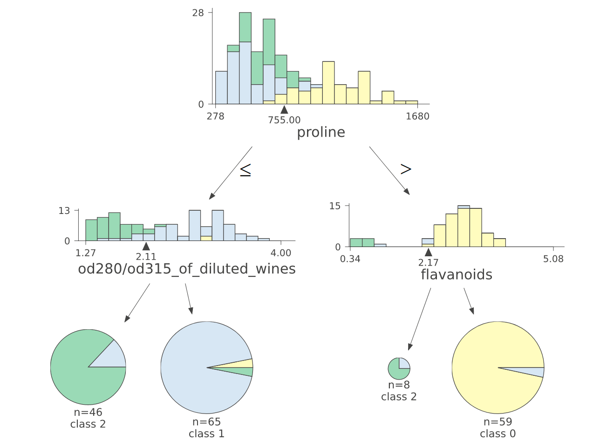
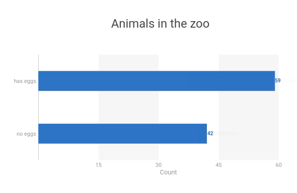
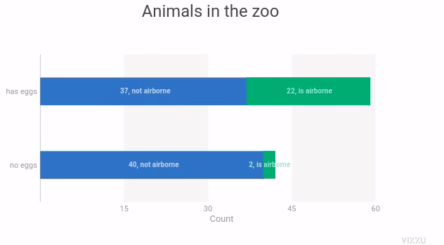
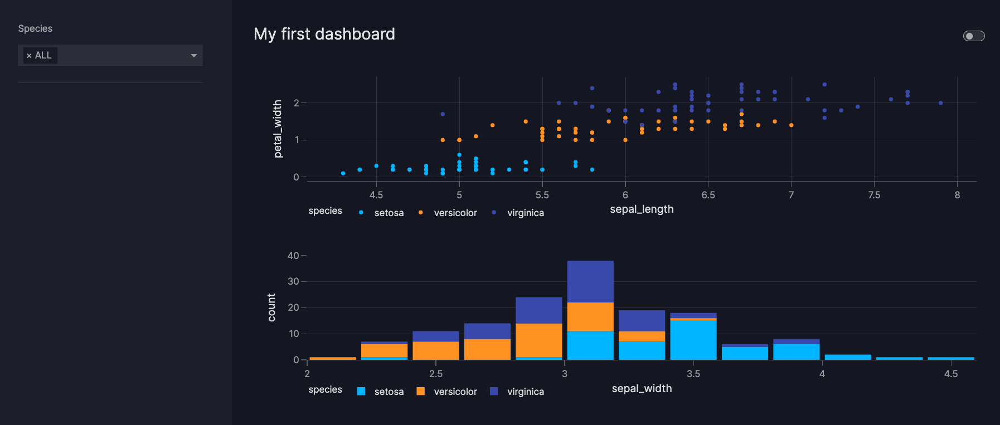
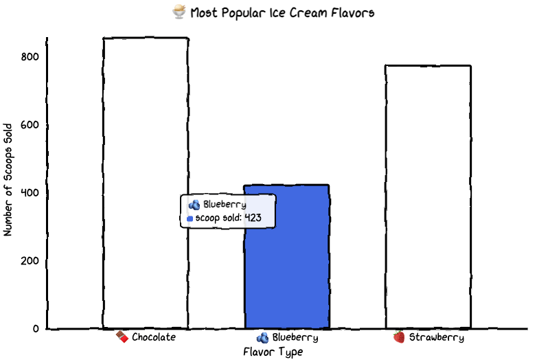

---
jupytext:
  text_representation:
    extension: .md
    format_name: myst
    format_version: 0.13
    jupytext_version: 1.16.7
kernelspec:
  display_name: Python 3 (ipykernel)
  language: python
  name: python3
---

## Visualization

+++

This section covers some tools to visualize your data and model.

+++

### Use Seaborn Style on Matplotlib Plots

+++

Seaborn style looks nicer than the default style of matplotlib, but matplotlib is more customizable. If you want to apply seaborn style on matplotlib plots, use `seaborn.set_theme()`.

```{code-cell} ipython3
import matplotlib.pyplot as plt
import numpy as np
import seaborn as sns

# Set seaborn style
sns.set_theme()

# Data for plotting
t = np.arange(0.0, 2.0, 0.01)
s = 1 + np.sin(2 * np.pi * t)

# Plot the data
plt.figure(figsize=(7, 5))
plt.plot(t, s)

plt.show()
```

### Graphviz: Create a Flowchart to Capture Your Ideas in Python

```{code-cell} ipython3
:tags: [hide-cell]

!pip install graphviz
```

Visualizing complex data and systems is difficult. Creating diagrams by hand is slow and prone to mistakes, especially with large datasets.

Graphviz offers an easy method to generate graphs using a declarative language.

Here's a short code example to demonstrate the utility of Graphviz:


```{code-cell} ipython3
from graphviz import Graph 

# Instantiate a new Graph object
dot = Graph('Data Science Process', format='png')

# Add nodes
dot.node('A', 'Get Data')
dot.node('B', 'Clean, Prepare, & Manipulate Data')
dot.node('C', 'Train Model')
dot.node('D', 'Test Data')
dot.node('E', 'Improve')

# Connect these nodes
dot.edges(['AB', 'BC', 'CD', 'DE'])

# Save chart
dot.render('data_science_flowchart', view=True)
```

```{code-cell} ipython3
dot 
```

[Link to graphviz](https://graphviz.readthedocs.io/en/stable/manual.html)

+++

### folium: Create an Interactive Map in Python

```{code-cell} ipython3
:tags: [hide-cell]

!pip install folium
```

If you want to create a map provided the location in a few lines of code, try folium. Folium is a Python library that allows you to create an interactive map.

```{code-cell} ipython3
import folium
m = folium.Map(location=[45.5236, -122.6750])

tooltip = 'Click me!'
folium.Marker([45.3288, -121.6625], popup='<i>Mt. Hood Meadows</i>',
              tooltip=tooltip).add_to(m)
m 
```

View the document of folium [here](https://python-visualization.github.io/folium/quickstart.html#Getting-Started).

+++

### dtreeviz: Visualize and Interpret a Decision Tree Model

```{code-cell} ipython3
:tags: [hide-cell]

!pip install dtreeviz
```

If you want to find an easy way to visualize and interpret a decision tree model, use dtreeviz.

```{code-cell} ipython3
:tags: [hide-output]


from dtreeviz.trees import dtreeviz
from sklearn import tree
from sklearn.datasets import load_wine

wine = load_wine()
classifier = tree.DecisionTreeClassifier(max_depth=2)
classifier.fit(wine.data, wine.target)

vis = dtreeviz(
    classifier,
    wine.data,
    wine.target,
    target_name="wine_type",
    feature_names=wine.feature_names,
)

vis.view()
```

The image below shows the output of dtreeviz when applying it on DecisionTreeClassifier.

+++



+++

[Link to dtreeviz](https://github.com/parrt/dtreeviz).

+++ {"editable": true, "slideshow": {"slide_type": ""}}

### supertree: Interactive Decision Tree Visualization for Python

```{code-cell} ipython3
---
editable: true
slideshow:
  slide_type: ''
tags: [hide-cell]
---
!pip install supertree
```

+++ {"editable": true, "slideshow": {"slide_type": ""}}

Visualizing complex decision trees with static plots can make it hard to analyze and explain model decisions.

supertree is a Python package that addresses this by providing interactive and user-friendly decision tree visualizations within notebooks.

Key features include:

* Zooming and panning through large trees
* Collapsing and expanding selected nodes

```{code-cell} ipython3
---
editable: true
slideshow:
  slide_type: ''
---
from sklearn.tree import DecisionTreeClassifier
from sklearn.datasets import load_iris
from supertree import SuperTree # <- import supertree :)

# Load the iris dataset
iris = load_iris()
X, y = iris.data, iris.target

# Train model
model = DecisionTreeClassifier()
model.fit(X, y)

# Initialize supertree
super_tree = SuperTree(model, X, y, iris.feature_names, iris.target_names)

# show tree in your notebook
super_tree.show_tree()
```

+++ {"editable": true, "slideshow": {"slide_type": ""}}


+++ {"editable": true, "slideshow": {"slide_type": ""}}

[Link to supertree](https://github.com/mljar/supertree).

+++ {"editable": true, "slideshow": {"slide_type": ""}}

### HiPlot - High Dimensional Interactive Plotting

```{code-cell} ipython3
:tags: [hide-cell]

!pip install hiplot 
```

If you are tuning hyperparameters of your machine learning model, it can be difficult to understand the relationships between different combinations of hyperparameters and a specific metric. 

That is when HiPlot comes in handy. HiPlot allows you to discover patterns in high-dimensional data using parallel plots like below. 

```{code-cell} ipython3
import hiplot as hip
data = [{'lr': 0.001, 'loss': 10.0, 'r2': 0.8, 'optimizer': 'SGD'},
        {'lr': 0.01, 'loss': 2.5, 'r2': 0.9, 'optimizer': 'Adam'},
        {'lr': 0.1, 'loss': 4, 'r2': 0.86, 'optimizer': 'Adam'}]
hip.Experiment.from_iterable(data).display()
```

[Link to HiPlot.](https://github.com/facebookresearch/hiplot)

+++

### missingno.dendogram: Visualize Correlation Between Missing Data 

```{code-cell} ipython3
:tags: [hide-cell]

!pip install missingno sklearn
```

Missing values can sometimes tell you how strongly the presence or absence of one variable affects the presence of another. To visualize the correlation between different columns based on the missing values, use `missingno.dendogram`. 

```{code-cell} ipython3
:tags: [hide-output]

from sklearn.datasets import fetch_openml

soybean = fetch_openml(name="soybean", as_frame=True)['data']
```

```{code-cell} ipython3
import missingno as msno

msno.dendrogram(soybean)
```

The dendrogram uses a hierarchical clustering algorithm to bin variables against one another by their nullity correlation. Cluster leaves which linked together at a distance of zero fully predict one another's presence. In the graph above, the nullity of `seed-discolor` fully predicts the `nullity` of `germination`.

+++

[Link to missingno](https://github.com/ResidentMario/missingno).

+++

### matplotlib-venn: Create a Venn Diagram Using Python

```{code-cell} ipython3
:tags: [hide-cell]

!pip install matplotlib-venn
```

If you want to draw a venn diagram using Python, try matplotlib-venn. To create a venn diagram using matplotlib-venn, you can specify the size of each region:

```{code-cell} ipython3
import matplotlib.pyplot as plt
from matplotlib_venn import venn2

venn2(subsets = (8, 10, 5), set_labels = ('Are Healthy', 'Do Exercise'))
plt.show()
```

... or specify the elements in each set:

```{code-cell} ipython3
venn2([set(['A', 'B', 'C', 'D']), set(['D', 'E', 'F'])], set_labels=['Group1', 'Group2'])
plt.show()
```

You can also draw three cicles using `venn3`:

```{code-cell} ipython3
from matplotlib_venn import venn3
venn3(subsets = (5, 5, 3, 5, 3, 3, 2), set_labels = ('Are Healthy', 'Do Exercise', 'Eat Well'))
plt.show()
```

[Link to matplotlib-venn](https://github.com/konstantint/matplotlib-venn).

+++

### squarify: Plot Treemap in Python

```{code-cell} ipython3
:tags: [hide-cell]

!pip install squarify
```

A treemap splits a rectangle into sub-rectangles, whose sizes are proportional to their values. To plot a treemap in Python, use squarify.

```{code-cell} ipython3
import matplotlib.pyplot as plt
import squarify   
import pandas as pd

df = pd.DataFrame({'count': [8, 4, 3], 'role': ['DS', 'DE', 'DA']})

# Plot
squarify.plot(sizes=df['count'], label=df['role'])
plt.axis('off')
plt.show()
```

[Link to squarify](https://github.com/laserson/squarify).

+++

### UMAP: Dimension Reduction in Python

```{code-cell} ipython3
:tags: [hide-cell]

!pip install 'umap-learn[plot]'
```

It can be difficult to visualize a multi-dimensional dataset. Luckily, UMAP allows you to reduce the dimension of your dataset and create a 2D views of your data.

+++

To understand how UMAP works, let's try with the [fruit dataset](https://raw.githubusercontent.com/susanli2016/Machine-Learning-with-Python/master/fruit_data_with_colors.txt). In this dataset, we have the features of different fruits, such as mass, width, height, and color score. Our task is to classify which fruit a sample belongs to based on its features.  

```{code-cell} ipython3
import warnings
warnings.simplefilter(action='ignore', category=FutureWarning)

from sklearn.preprocessing import StandardScaler
import matplotlib.pyplot as plt
import seaborn as sns
import pandas as pd

%matplotlib inline
```

Let's start with loading and visualizing the data.

```{code-cell} ipython3
data = pd.read_table("https://raw.githubusercontent.com/susanli2016/Machine-Learning-with-Python/master/fruit_data_with_colors.txt")
data.head(10)
```

```{code-cell} ipython3
sns.pairplot(data.drop(columns=['fruit_label', 'fruit_subtype']), hue='fruit_name')
plt.show()
```

We can see some distinctions between different fruits in the pairwise feature scatterplot matrix. Now to visualize all 4 features in a 2D plot, we start with creating a UMAP object.

```{code-cell} ipython3
import umap

reducer = umap.UMAP()
```

Next, we scale the features so that they are all on the same scale. 

```{code-cell} ipython3
features = data.iloc[:, 3:].values
scaled_features = StandardScaler().fit_transform(features)
```

Lastly, we use the UMAP object to reduce the dimension of the dataset and plot the features as a scatter plot.

```{code-cell} ipython3
embedding = reducer.fit_transform(scaled_features)
embedding.shape
```

```{code-cell} ipython3
pd.DataFrame(embedding, columns=['Dimension 1', 'Dimension 2']).to_csv('~/Downloads/embedding.csv')
```

```{code-cell} ipython3
plt.style.use('dark_background')

colors = ["#72BEFA", "#E583B6", "#72FCDB", "white"]
color_list = [colors[label - 1] for label in data.fruit_label]

plt.scatter(
    embedding[:, 0],
    embedding[:, 1],
    c=color_list,
    s=80,
)
plt.show()
```

Now we can see some distinctions in features between 4 different fruits in a 2D plot.

+++

[Link to UMAP](https://github.com/lmcinnes/umap).

+++

### Evidently: Detect and Visualize Data Drift

```{code-cell} ipython3
:tags: [hide-cell]

!pip install evidently
```

Data drift is unexpected changes in model input data that can lead to model performance degradation. Since your code is built around the characteristics of your data, it is important to detect data drift when it occurs. Evidently allows you to do exactly in a few lines of code. 

+++

In the code below, we use Evidently to detect changes in feature distribution.

```{code-cell} ipython3
import pandas as pd
from sklearn import datasets

from evidently.dashboard import Dashboard
from evidently.tabs import DataDriftTab

california = datasets.fetch_california_housing()
california = pd.DataFrame(california.data, columns = california.feature_names)
```

```{code-cell} ipython3
california_data_drift_report = Dashboard(tabs=[DataDriftTab])
california_data_drift_report.calculate(california[:1000], california[1000:], column_mapping = None)
```

```{code-cell} ipython3
:tags: [remove-output]

california_data_drift_report.show()
```


+++

Find other features of Evidently [here](https://github.com/evidentlyai/evidently).

+++

### Mermaid: Create Class Diagrams for Your Python Classes Using Text and Code

+++

If you want to create class diagrams to explain your Python classes, use [Mermaid](https://mermaid-js.github.io/mermaid/#/). Mermaid lets you create diagrams and visualizations using text and code.


+++

For example, writing this piece of code on [Mermaid Live Editor](https://mermaid.live/):
```javascript
 classDiagram
      Animal <|-- Dog
      Animal <|-- Cat
      Animal <|-- Fish
      Animal : int age
      Animal : str gender
      Animal: is_mammal()
      Animal: is_pet()
      class Dog{
          str fur_color
          bark()
          run()
      }
      class Cat{
          str fur_color
          meow()
          run()
      }
      class Fish{
          str scale_color
          swim()
      }
```
... will create a diagram like below:

+++

[](https://mermaid.live/edit#eyJjb2RlIjoiIGNsYXNzRGlhZ3JhbVxuICAgICAgQW5pbWFsIDx8LS0gRG9nXG4gICAgICBBbmltYWwgPHwtLSBDYXRcbiAgICAgIEFuaW1hbCA8fC0tIEZpc2hcbiAgICAgIEFuaW1hbCA6IGludCBhZ2VcbiAgICAgIEFuaW1hbCA6IHN0ciBnZW5kZXJcbiAgICAgIEFuaW1hbDogaXNfbWFtbWFsKClcbiAgICAgIEFuaW1hbDogaXNfcGV0KClcbiAgICAgIGNsYXNzIERvZ3tcbiAgICAgICAgICBzdHIgZnVyX2NvbG9yXG4gICAgICAgICAgYmFyaygpXG4gICAgICAgICAgcnVuKClcbiAgICAgIH1cbiAgICAgIGNsYXNzIENhdHtcbiAgICAgICAgICBzdHIgZnVyX2NvbG9yXG4gICAgICAgICAgbWVvdygpXG4gICAgICAgICAgcnVuKClcbiAgICAgIH1cbiAgICAgIGNsYXNzIEZpc2h7XG4gICAgICAgICAgc3RyIHNjYWxlX2NvbG9yXG4gICAgICAgICAgc3dpbSgpXG4gICAgICB9IiwibWVybWFpZCI6IntcbiAgXCJ0aGVtZVwiOiBcImRlZmF1bHRcIlxufSIsInVwZGF0ZUVkaXRvciI6ZmFsc2UsImF1dG9TeW5jIjp0cnVlLCJ1cGRhdGVEaWFncmFtIjpmYWxzZX0)

+++

### Mermaid: Create Flow Chart Using Code

+++

Mermaid also allows you to create a flow chart using simple code logic.

+++

For example, writing this piece of code on [Mermaid Live Editor](https://mermaid.live/):
```javascript
graph TD
    A[Should you go to work today?] --> B(Do you like working?)
    B --Yes--> C{Go to work}
    B --No--> D(Are you feeling sick?)
    D --Yes--> E{Go to the doctor}
    D --No--> F(Do you have a lot of work to do?)
    F --Yes--> H(And you don't want to go?)
    F --No--> H  
    H --Yes, I don't want to-->I(You signed up for this. Get dressed and go to work!) 
    
```
... will create a diagram like below:


+++

Find other diagrams you can create with Mermaid [here](https://mermaid-js.github.io/mermaid/#/).

+++

### pretty-confusion-matrix: Plot a Pretty and Comprehensible Confusion Matrix

```{code-cell} ipython3
:tags: [hide-cell]

!pip install -U pretty-confusion-matrix
```

It can be difficult to understand a confusion matrix, especially when there are many classes in the target. 

```{code-cell} ipython3
import numpy as np
from sklearn.metrics import confusion_matrix

y_test = np.array([1, 2, 3, 4, 5])
prediction = np.array([3, 2, 4, 3, 5])

confusion_matrix(y_test, prediction)
```

To make your confusion matrix prettier and easier to understand, use `pretty_confusion_matrix`.

```{code-cell} ipython3
from pretty_confusion_matrix import pp_matrix_from_data


cmap = 'PuRd'
pp_matrix_from_data(y_test, prediction, cmap=cmap)
```

[Link to pretty confusion matrix](https://github.com/khuyentran1401/pretty-print-confusion-matrix).

+++

### matplotx: Useful Extensions for Matplotlib

```{code-cell} ipython3
:tags: [hide-cell]

!pip install matplotx[all]
```

Have you ever wanted to create matplotlib plot in dark mode? If so, use matplotx.

For example, to use Dracula style, add:
```python
plt.style.use(matplotx.styles.dracula)
```
to the code.

```{code-cell} ipython3
import numpy as np
import matplotlib.pyplot as plt
import matplotx
from IPython.core.pylabtools import figsize

# Create data
np.random.seed(2)
N = 50
x = np.random.rand(N)
y = np.random.rand(N)
colors = np.random.rand(N)
area = (30 * np.random.rand(N))**2  # 0 to 15 point radii

# Use dracula style
plt.style.use(matplotx.styles.dracula)

# Create a scatter plot
plt.scatter(x, y, s=area, c=colors)
figsize(10, 10)
plt.show()
```

Other styles that matplotx provides are:
- 'aura',
- 'ayu',
- 'challenger_deep',
- 'dracula',
- 'dufte',
- 'dufte_bar',
- 'duftify',
- 'github',
- 'gruvbox',
- 'nord',
- 'onedark',
- 'pacoty',
- 'pitaya_smoothie',
- 'solarized',
- 'tab10',
- 'tab20',
- 'tab20r',
- 'tokyo_night'

Each style might have dark and light mode. For example, to use the dark mode version of `aura` style, type: 

```{code-cell} ipython3
matplotx.styles.aura['dark']
```

[Link to matplotx](https://github.com/nschloe/matplotx).

+++

### ipysankeywidget: IPython Sankey Diagram Widget 

```{code-cell} ipython3
:tags: [hide-cell]

!pip install ipysankeywidget
```

```{code-cell} ipython3
:tags: [hide-cell]

!jupyter nbextension enable --py --sys-prefix ipysankeywidget
!jupyter nbextension enable --py --sys-prefix widgetsnbextension
```

Sankey diagram is a flow diagram that depicts flows, where the width of the lines is proportional to the flow rate. If you want to quickly create a Sankey diagram in  your Jupyter Notebook, use ipysankeywidget.

```{code-cell} ipython3
import pandas as pd
from ipysankeywidget import SankeyWidget

df = pd.DataFrame(
    {
        "source": ["Anna", "Josh", "Anna", "Ben", "Ben"],
        "target": ["New York", "New York", "Chicago", "San Jose", "Milwaukee"],
        "type": [
            "bussiness trip",
            "family visit",
            "vacation",
            "family visit",
            "bussiness trip",
        ],
        "value": [2, 3, 1, 3, 2],
    }
)

flows = df.to_dict("records")
SankeyWidget(links=flows).auto_save_png("diagram.png")
```

[Link to ipysankeywidget](https://github.com/ricklupton/ipysankeywidget).

+++

### ipyvizzu: Add Animation to Your Charts with Ease

```{code-cell} ipython3
:tags: [hide-cell]

!pip install ipyvizzu
```

Sometimes you might want to add animations to your chart to show your audience the transition between one plot to another plot. However, it can be complicated to do that with matplotlib or Javascript. 

With ipyvizzu, you can easily add animations to your plot in couples of lines of code inside your Jupyter Notebook.

In the code below, I use ipyvizzu to visualize the relationship between animals that can lay eggs and animals that are airborne. 

```{code-cell} ipython3
from sklearn.datasets import fetch_openml

zoo = fetch_openml(data_id=965)["frame"]

df = zoo[["eggs", "airborne"]]
df = df.astype("object")
df["eggs"] = df["eggs"].map({"false": "no eggs", "true": "has eggs"})
df["airborne"] = df["airborne"].map({"false": "not airborne", "true": "is airborne"})
df["Count"] = 1
```

```{code-cell} ipython3
df.head(10)
```

```{code-cell} ipython3
from ipyvizzu import Chart, Data, Config, Style

data = Data()
data.add_data_frame(df)

chart = Chart(width="640px", height="360px")

chart.animate(data)

chart.animate(
    Config({"x": "Count", "y": "eggs", "label": "Count", "title": "Animals in the zoo"})
)
chart.animate(
    Config(
        {
            "x": ["Count", "airborne"],
            "label": ["Count", "airborne"],
            "color": "airborne",
        }
    )
)
```



```{code-cell} ipython3
chart.animate(Config({"x": "Count", "y": ["eggs", "airborne"]}))
```



+++

[Link to ipyvizzu](https://github.com/vizzuhq/ipyvizzu).

+++

### ipyvizzu-story: Create an Interactive Presentation in Your Jupyter Notebook

```{code-cell} ipython3
:tags: [hide-cell]

!pip install ipyvizzu-story
```

Creating interactive data presentations with multiple views requires complex code to manage transitions and state changes, making it difficult to present insights in a coherent narrative flow.

```{code-cell} ipython3
import seaborn as sns  

df = sns.load_dataset("penguins")
df = df[['species', 'sex']].dropna()
df = df.astype("object")
df["count"] = 1
```

```{code-cell} ipython3
df.head(10)
```

```{code-cell} ipython3
# Traditional approach: Multiple separate visualizations
import seaborn as sns
import matplotlib.pyplot as plt

# First view - grouped bar chart
plt.figure(1)
sns.barplot(data=df, x='sex', y='count')
plt.show()

# Second view - separate plot for stacked bars
plt.figure(2)
sns.barplot(data=df, x='count', y='species', hue='sex')
plt.show()

# No smooth transitions between views
# Manual navigation between plots
```

ipyvizzu-story enables creation of fluid data stories with smooth transitions between insights:

```{code-cell} ipython3
from ipyvizzu import Data, Config
from ipyvizzustory import Story, Slide, Step

data = Data()
data.add_df(df)
```

```{code-cell} ipython3
story = Story(data=data)

slide1 = Slide(
    Step(Config({"x": ["count", "sex"], "label": ["count", "sex"], "color": "sex"}))
)
story.add_slide(slide1)

slide2 = Slide(
    Step(Config({"x": "count", "y": ["species", "sex"]}),)
)
story.add_slide(slide2)

story.play()
```

The example shows how ipyvizzu-story simplifies creating interactive presentations by handling transitions automatically. You define different views as slides, and the library creates smooth animations between them, including keyboard navigation controls.

+++

[Link to ipyvizzu-store](https://github.com/vizzuhq/ipyvizzu-story).

+++

### Lux: A Python API for Intelligent Visual Discovery

```{code-cell} ipython3
:tags: [hide-cell]

!pip install lux-api
```

Have you ever taken a while to come up with the visualizations for your data? With Lux, you can get some suggestions on what to visualize.

To use Lux, simply import it. 

```{code-cell} ipython3
from sklearn.datasets import load_wine
import lux  

wine = load_wine(as_frame=True)['frame'] 
```

```{code-cell} ipython3
wine
```

```{code-cell} ipython3
wine.exported['Correlation'][0]
```

```{code-cell} ipython3
wine.exported['Occurrence'][0]
```


+++

[Link to Lux](https://github.com/lux-org/lux).

+++

### Add Statistical Significance Annotations on Seaborn Plots

```{code-cell} ipython3
:tags: [hide-cell]

!pip install seaborn statannotations
```

Have you ever looked at two box plots and wondered if there is a significant difference between the means of the two groups? statannotations makes it easy for you to add statistical significance annotations on seaborn plots. 

```{code-cell} ipython3
import seaborn as sns 
from statannotations.Annotator import Annotator
import matplotlib.pyplot as plt 
```

```{code-cell} ipython3

df = sns.load_dataset('taxis')
df.head(10)
```

In the code below, we use an independent t-test to compare the means of two independent groups. 

```{code-cell} ipython3
x = 'pickup_borough'
y = 'total'
order = ['Manhattan', 'Brooklyn', 'Bronx', 'Queens']
ax = sns.boxplot(data=df, x=x, y=y, order=order)
pairs = [('Manhattan', 'Queens'), ('Manhattan', 'Bronx'), ('Manhattan', 'Brooklyn')]

annotator = Annotator(ax, pairs, data=df, x=x, y=y, order=order)
annotator.configure(test='t-test_ind')
annotator.apply_and_annotate()
plt.show()
```

From the plot above, we can see that there is statistical evidence that the mean taxi fare in Manhattan is significantly different from the mean taxi fare in Brooklyn or Bronx, or Queens.

+++

[Link to statannotations](https://github.com/trevismd/statannotations).

+++

### Automatically Adjust Annotations in Matplotlib for Readability

```{code-cell} ipython3
:tags: [hide-cell]

!pip install adjustText
```

If you want to automatically adjust annotations in a matplotlib plot for readability, use the library adjustText.

```{code-cell} ipython3
import numpy as np
```

```{code-cell} ipython3
def plot_text(x, y):
    fig, ax = plt.subplots()
    plt.plot(x, y, 'bo')
    texts = [plt.text(x[i], y[i], 'Text%s' %i, ha='center', va='center') for i in range(len(x))]
    return texts
```

```{code-cell} ipython3
np.random.seed(1)
x, y = np.random.random((2,40))
plot_text(x, y)
```

```{code-cell} ipython3
from adjustText import adjust_text

texts = plot_text(x, y)
adjust_text(texts)
```

[Link to adjustText](https://github.com/Phlya/adjustText).

+++

### Bloxs: Create an Attractive Display in Your Jupyter Notebook

```{code-cell} ipython3
:tags: [hide-cell]

pip install bloxs
```

If you want to create an attractive display for specific information in your notebook, try bloxs. bloxs is a Python library that is ideal for building dashboards, reports, and apps in the notebook.

```{code-cell} ipython3
from bloxs import B
B(22, "Chickens 🐥 in the backyard.")
```

```{code-cell} ipython3
B("Growth", "on July", points=[1,4,2,3,5,6])
```

```{code-cell} ipython3
B("Growth", "on July", points=[1,4,2,3,5,6], chart_type="bar")
```

```{code-cell} ipython3
B("68%", "Loading progress", progress=68)
```

```{code-cell} ipython3
B([
    B(22, "Chickens 🐥 in the backyard."),
    B("68%", "Loading progress", progress=68),
    B("Growth", "on July", points=[1,4,2,3,5,6])
])
```

[Link to bloxs](https://github.com/mljar/bloxs).

+++

### LovelyPlots: Create Nice Matplotlib Figures for Presentations

```{code-cell} ipython3
:tags: [hide-cell]

!pip install LovelyPlots
```

If you want to transform your matplotlib plots into nice figures for scientific papers or presentations, try LovelyPlots. To use LovelyPlots, simply add `plt.style.use(ipynb)` to your code. 

+++

To see how a figure created by LovelyPlots looks like, let's generate a plotting function, which takes `style` as its argument

```{code-cell} ipython3
import lovelyplots
import matplotlib.pyplot as plt
import numpy as np
import pandas as pd


def plot(style: list):
    plt.style.use(style)

    np.random.seed(1)
    # Data
    df = pd.DataFrame(
        {
            "x_values": range(1, 11),
            "y1_values": np.random.randn(10),
            "y2_values": np.random.randn(10) + range(1, 11),
            "y3_values": np.random.randn(10) + range(11, 21),
        }
    )

    plt.plot(
        "x_values",
        "y1_values",
        data=df,
    )
    plt.plot(
        "x_values",
        "y2_values",
        data=df,
    )
    plt.plot(
        "x_values",
        "y3_values",
        data=df,
    )

    # show graph
    plt.show()
```

Create a figure using the default style of matplotlib.

```{code-cell} ipython3
plot(["default"])
```

Create the figures using styles from LovelyPlots. 

```{code-cell} ipython3
plot(["ipynb", "colors10-markers"])
```

```{code-cell} ipython3
plot(["ipynb", "colors5-light"])
```

```{code-cell} ipython3
plot(["ipynb", "colors10-ls"])
```

[Link to LovelyPlots](https://github.com/killiansheriff/LovelyPlots)

+++

### gif: The Easiest Way to Animate Your matplotlib Plot

```{code-cell} ipython3
:tags: [hide-cell]

!pip install gif
```

If you want to effortlessly animate your matplotlib plot in Python, use gif.

```{code-cell} ipython3
import pandas as pd
from matplotlib import pyplot as plt
import random

import gif


START = pd.Timestamp("2019-04-20")
END = pd.Timestamp("2020-05-01")


data = [random.uniform(0.5, 10) for _ in range(378)]

df = pd.DataFrame({"date": pd.date_range(start=START, end=END), "time": data})


@gif.frame
def plot(date):
    d = df[df["date"] <= date]
    fig, ax = plt.subplots(figsize=(5, 3), dpi=100)
    plt.plot(d["date"], d["time"])
    ax.set_xlim([START, END])
    ax.set_ylim([0, 10])
    ax.set_xticks([date])
    ax.set_yticks([0, 2, 4, 6, 8, 10])
    ax.set_xticklabels([date.strftime("%b '%y")])
    ax.set_yticklabels([0, 2, 4, 6, 8, "\n10\nhours"])


frames = []
for date in df["date"]:
    frame = plot(date)
    frames.append(frame)

gif.save(frames, "phone.gif", duration=35)
```


+++

[Link to gif](https://github.com/maxhumber/gif).

+++

### Visualize the Frequency Tokens in a Text Corpora 

```{code-cell} ipython3
:tags: [hide-cell]

!pip install yellowbrick
```

If you want to quickly visualize the frequency of tokens in a collection of text documents, use the combination of scikit-learn's `CountVectorizer` and Yellowbrick's `FreqDistVisualizer`. 

```{code-cell} ipython3
from sklearn.datasets import fetch_20newsgroups

newsgroups_train = fetch_20newsgroups(subset='train')
```

```{code-cell} ipython3
from sklearn.feature_extraction.text import CountVectorizer
from yellowbrick.text import FreqDistVisualizer


import matplotlib.pyplot as plt

plt.figure(figsize=(8,4))

# Convert corpora to a matrix of token counts
# and remove stop words
vectorizer = CountVectorizer(stop_words='english') 
docs       = vectorizer.fit_transform(newsgroups_train['data'])
features   = vectorizer.get_feature_names()

# Plot a token frequency distribution 
visualizer = FreqDistVisualizer(features=features, n=10)
visualizer.fit(docs)
visualizer.show()
```

[Link to Yellowbrick](https://github.com/DistrictDataLabs/yellowbrick)

+++

### prettymaps: Generate Pretty Painting of a Location in Python

```{code-cell} ipython3
:tags: [hide-cell]

pip install -U prettymaps "osmnx>=1.9.3,<2.0" "git+https://github.com/abey79/vsketch@1.0.0"
```

If you want to generate a pretty painting of a location from OpenStreetMap in Python, use prettymaps.

+++

You can start creating maps with just a few lines of code. Here's an example:


```{code-cell} ipython3
import prettymaps

plot = prettymaps.plot('Stad van de Zon, Heerhugowaard, Netherlands')
```


+++

[Link to prettymaps](https://github.com/marceloprates/prettymaps).

+++

### Vizro: Create Modular Data Visualization Applications in Python

```{code-cell} ipython3
:tags: [hide-cell]

!pip install -U plotly vizro 'typing-extensions==4.5.0'
```

If you want to use modular and simple Python code to create beautiful dashboards, try Vizro.

```{code-cell} ipython3
:tags: [remove-output]

import vizro.plotly.express as px
from vizro import Vizro
import vizro.models as vm

df = px.data.iris()

page = vm.Page(
    title="My first dashboard",
    components=[
        vm.Graph(id="scatter_chart", figure=px.scatter(df, x="sepal_length", y="petal_width", color="species")),
        vm.Graph(id="hist_chart", figure=px.histogram(df, x="sepal_width", color="species")),
    ],
    controls=[
        vm.Filter(column="species", selector=vm.Dropdown(value=["ALL"])),
    ],
)

dashboard = vm.Dashboard(pages=[page])

Vizro().build(dashboard).run()
```



+++

[Link to vizro](https://github.com/mckinsey/vizro).

+++

### Drag-and-Drop Visualizations with PyGWalker

```{code-cell} ipython3
:tags: [hide-cell]

!pip install pygwalker -q
```

EDA is a crucial step in any Data Science project. For large datasets, EDA can be time-consuming. 

PyGWalker simplifies the process of creating visualizations by allowing users to drag and drop variables to create charts without writing much code.

+++

You can use PyGWalker without changing your existing workflow. For example, you can call up PyGWalker with the Dataframe loaded in this way:

```{code-cell} ipython3
import pygwalker as pyg
import pandas as pd
```

```{code-cell} ipython3
df = pd.read_csv("https://kanaries-app.s3.ap-northeast-1.amazonaws.com/public-datasets/bike_sharing_dc.csv", parse_dates=['date'])
df.head(10)
```

And then just walk around!

```{code-cell} ipython3
pyg.walk(df)
```

[Link to PygWalker](https://bit.ly/3Li6KGp).

+++

### hvPlot: One API for Multiple Plotting Libraries

```{code-cell} ipython3
---
editable: true
slideshow:
  slide_type: ''
tags: [hide-cell]
---
!pip install hvplot
```

+++ {"editable": true, "slideshow": {"slide_type": ""}}

Switching between plotting libraries lets you leverage their unique strengths. However, learning multiple specific APIs can significantly increase your cognitive load.

hvPlot provides a unified, high-level API that allows using the same syntax for Bokeh, Matplotlib, and Plotly. Here's an example of how hvPlot can be used with different backends:

+++

Default (Bokeh):

```{code-cell} ipython3
---
editable: true
slideshow:
  slide_type: ''
---
import hvplot.pandas
from bokeh.sampledata.penguins import data as df

hvplot.extension('plotly')

df.hvplot.scatter(x='bill_length_mm', y='bill_depth_mm', by='species')
```

Matplotlib:

```{code-cell} ipython3
import hvplot.pandas

hvplot.extension('matplotlib')

df.hvplot.scatter(x='bill_length_mm', y='bill_depth_mm', by='species')
```

Plotly:

```{code-cell} ipython3
import hvplot.pandas
from bokeh.sampledata.penguins import data as df

hvplot.extension('plotly')

df.hvplot.scatter(x='bill_length_mm', y='bill_depth_mm', by='species')
```

[Link to hvPlot](https://github.com/holoviz/hvplot).

```{code-cell} ipython3
!pip install cutecharts
```

If you want to make graphs for a technical presentation more interesting and memorable, use cute charts, a Python visualization library.

```{code-cell} ipython3
from cutecharts.charts import Bar


def bar_base() -> Bar:
    chart = Bar("🍨 Most Popular Ice Cream Flavors")
    labels = ["🍫 Chocolate", "🫐 Blueberry", "🍓 Strawberry"]
    colors = ["#8B4513", "#4169E1", "#FF69B4"]

    chart.set_options(
        labels=labels,
        x_label="Flavor Type",
        y_label="Number of Scoops Sold",
        colors=colors,
    )
    chart.add_series("scoop sold", [856, 423, 774])
    return chart


bar_base().render_notebook()
```



+++

[Link to cute charts](https://github.com/cutecharts/cutecharts.py).
