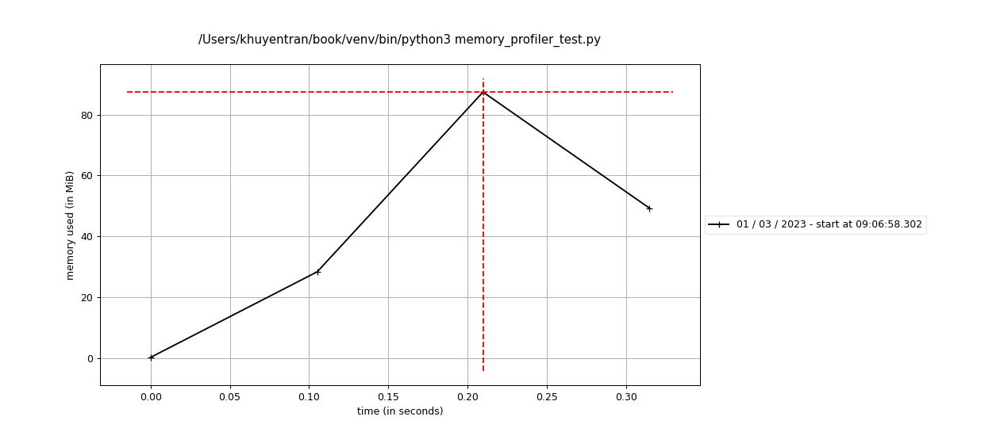

---
jupyter:
  jupytext:
    formats: ipynb,Rmd
    text_representation:
      extension: .Rmd
      format_name: rmarkdown
      format_version: '1.2'
      jupytext_version: 1.16.7
  kernelspec:
    display_name: Python 3 (ipykernel)
    language: python
    name: python3
---

```{python active="", eval=FALSE}
## Code Review
```

This section covers some tools to automatically review and improve your code such as sorting imports, checking for missing docstrings, etc. 


### isort: Automatically Sort your Python Imports in 1 Line of Code


As your codebase expands, you may find yourself importing numerous libraries, which can become overwhelming to navigate. To avoid arranging your imports manually, use isort.

isort is a Python library that automatically sorts imports alphabetically, grouping them by section and type. 

Consider the following example where your imports are unsorted:


```python
from sklearn.metrics import confusion_matrix, fl_score, classification_report, roc_curve
from sklearn.model_selection import train_test_split
from sklearn.model_selection import GridSearchCV, StratifiedKFold
from sklearn import svm
from sklearn.naive_bayes import GaussianNB, MultinomialNB
from sklearn.neighbors import KNeighborsClassifier
from sklearn.tree import DecisionTreeClassifier
from sklearn.model_selection import TimeSeriesSplit
```
By running `isort name_of_your_file.py`, isort can sort your imports automatically into the following:

```python
from sklearn import svm
from sklearn.metrics import (classification_report, confusion_matrix, fl_score,
                             roc_curve)
from sklearn.model_selection import (GridSearchCV, StratifiedKFold,
                                     TimeSeriesSplit, train_test_split)
from sklearn.naive_bayes import GaussianNB, MultinomialNB
from sklearn.neighbors import KNeighborsClassifier
from sklearn.tree import DecisionTreeClassifier
```


You can use isort with pre-commit by adding the following to your .pre-commit-config.yaml file:

```yaml
-   repo: https://github.com/timothycrosley/isort
    rev: 5.12.0
    hooks:
    -   id: isort
```


[Link to isort](https://github.com/pycqa/isort).


### interrogate: Check your Python Code for Missing Docstrings

```{python tags=c("hide-cell")}
# !pip install interrogate  
```

Sometimes, you might forget to include docstrings for classes and functions. Instead of manually searching through all your functions and classes for missing docstrings, use interrogate.

Consider the following example where there are missing docstrings:

```{python}
# %%writefile interrogate_example.py
class Math:
    def __init__(self, num) -> None:
        self.num = num

    def plus_two(self):
        """Add 2"""
        return self.num + 2

    def multiply_three(self):
        return self.num * 3
```

You can use interrogate to identify missing docstrings:
```bash
interrogate interrogate_example.py
```
Output:

```{python tags=c("hide-input")}
# !interrogate interrogate_example.py
```

You can use interrogate with pre-commit by adding the following to your .pre-commit-config.yaml file:
```yaml
- repo: https://github.com/pre-commit/mirrors-interrogate
  rev: v1.4.0
  hooks:
  - id: interrogate
```


[Link to interrogate](https://interrogate.readthedocs.io/en/latest/).


### mypy: Static Type Checker for Python


```{python tags=c("hide-cell")}
# !pip install mypy 
```

Type hinting in Python is useful for other developers to understand the expected data types to be used in your functions. To automate type checking in your code, use mypy. 

Consider the following file that includes type hinting:

```{python}
# %%writefile mypy_example.py
from typing import List, Union

def get_name_price(fruits: list) -> Union[list, tuple]:
    return zip(*fruits)

fruits = [('apple', 2), ('orange', 3), ('grape', 2)]
names, prices = get_name_price(fruits)
print(names)  # ('apple', 'orange', 'grape')
print(prices)  # (2, 3, 2)
```

When typing the following command on your terminal:
```bash
mypy mypy_example.py
```
you will get the output similar to this:

```{python tags=c("remove-input")}
# !mypy mypy_example.py
```

You can use mypy with pre-commit by adding the following to your .pre-commit-config.yaml file:

```yaml
repos:
- repo: https://github.com/pre-commit/mirrors-mypy
  rev: v0.910
  hooks:
  - id: mypy
```


[Link to mypy](https://mypy.readthedocs.io/en/latest/introduction.html).


### Refurb: Refurbish and Modernize Python Codebases


If you want to have some guidelines to improve and optimize your code, try Refurb.

For example, if you have a file like this:

```{python}
# %%writefile test_refurb.py
for n in [1, 2, 3, 4]:
    if n == 2 or n == 4:
        res = n/2 
```

You can use Refurb to refurbish your code.


```bash
$ refurb test_refurb.py
```

```{python tags=c("remove-input")}
# !refurb test_refurb.py
```

```bash
$ refurb test_refurb.py --explain FURB109
```

```{python tags=c("remove-input")}
# !refurb test_refurb.py --explain FURB109
```

Refurb only works with Python 3.10 and above.

You can use Refurb with pre-commit by adding the following to your .pre-commit-config.yaml file:

```yaml
repos:
  - repo: https://github.com/dosisod/refurb
    rev: REVISION
    hooks:
      - id: refurb
```


[Link to Refurb](https://github.com/dosisod/refurb).


### eradicate: Remove Junk Comments from Python Files

```{python tags=c("hide-cell")}
# !pip install eradicate
```

Outdated or unused code left as comments in Python files can clutter codebases, making them harder to read and maintain. 

Eradicate solves this by automatically identifying and removing commented-out code from Python files.

Let's see eradicate in action:

Example Python file:

```{python}
# %%writefile eradicate_test.py
# from math import *

def mean(nums: list):
    # print(nums)
    # TODO: check if nums is empty
    # Return mean
    return sum(nums) / len(nums)

# nums = [0, 1]
nums = [1, 2, 3]
mean(nums)
```

Preview changes:

```bash
$ eradicate eradicate_test.py
```

```{python tags=c("remove-input")}
# !eradicate eradicate_test.py
```

Apply changes:

```bash
$ eradicate eradicate_test.py -i
```

```{python tags=c("remove-input")}
# !eradicate eradicate_test.py -i
```

<!-- #region editable=true slideshow={"slide_type": ""} -->
Results:
<!-- #endregion -->

```{python editable=TRUE, slideshow={'slide_type': ''}, tags=c("remove-input")}
# show file contents
# %cat eradicate_test.py
```

In this example, eradicate removes:

1. The commented-out import statement `# from math import *`
2. The commented-out debug print statement `# print(nums)`
3. The commented-out variable assignment `# nums = [0, 1]`

However, it preserves the meaningful comments:

1. The TODO comment `# TODO: check if nums is empty`
2. The descriptive comment `# Return mean`

This cleanup improves the code's readability by removing distracting, unused code comments while keeping important notes for developers.

<!-- #region editable=true slideshow={"slide_type": ""} -->
You can use eradicate with pre-commit by adding the following to your `.pre-commit-config.yaml` file:

```yaml
repos:
- repo: https://github.com/wemake-services/eradicate/
  rev: v2.2.0
  hooks:
  - id: eradicate
```
<!-- #endregion -->

[Link to eradicate](https://github.com/wemake-services/eradicate/).

### Python Code Quality Optimization with Ruff

```{python tags=c("hide-cell")}
# !pip install -U ruff
```

Managing multiple Python code quality tools (Flake8, Black, isort, pycodestyle) requires complex setup and maintenance:

```python
# requirements-dev.txt
flake8==6.1.0
black==23.7.0
isort==5.12.0
pycodestyle==2.12.1
```

Ruff provides a unified solution with automatic fixes. Here's how to use it:

Step 1: Configure Ruff in pyproject.toml

```{python}
# %%writefile pyproject.toml
[tool.ruff]
line-length = 88

# Exclude files and directories
exclude = [
    ".git",
    ".venv",
    "__pycache__",
]

[tool.ruff.lint]
select = [
    "E", # pycodestyle
    "F", # pyflakes
    "I", # isort
]
```

The configuration enables essential rules and sets standard Python code style guidelines.

Step 2: Run Ruff on Your Code

```{python}
# %%writefile my_code.py
import pandas as pd
import numpy as np

def calculate_something(x, y):
    result = undefined_variable + np.array([1, 2])
    unused = "This variable is never used"
    return result + y

very_long_string = "This is an extremely long string that will definitely exceed the 88 character limit that was specified in your pyproject.toml file"
```

Check for code quality issues:

```{python}
# !ruff check my_code.py
```

Run Ruff with automatic fixes:

```{python}
# !ruff check --fix my_code.py
```

The resulting fixed code:

```{python}
# %cat my_code.py
```

Manually edit the rest:

```{python}
# %%writefile my_code.py
import numpy as np


def calculate_something(x, y):
    undefined_variable = np.array([2, 3])
    result = undefined_variable + np.array([1, 2])
    return result + y

very_long_string = (
    "This is an extremely long string that will definitely exceed the "
    "88 character limit that was specified in your pyproject.toml file"
)
```

```{python}
# !ruff check my_code.py
```

Ruff automatically:
- Sorts and removes unused imports
- Fixes string formatting
- Removes unused variables
- Adds type hints
- Formats code to match style guidelines

All these fixes happen 10-100x faster than running individual tools, making code quality checks practical for both small scripts and large projects.

[Link to Ruff](https://github.com/astral-sh/ruff)

### Pydantic: Enforce Data Types on Your Function Parameters at Runtime

```{python tags=c("hide-cell")}
# !pip install pydantic
```

To enforce data types and validate function parameters at runtime, use Pydantic. 

Pydantic will attempt to convert values to the correct data type. If the conversion fails, it raises a ValidationError.

```{python}
from pydantic import BaseModel
import pandas as pd

class SplitConfig(BaseModel):
    test_size: float = 0.3
    random_state: int = 1
```

```{python}
def split_data(data: pd.DataFrame, config: SplitConfig = SplitConfig()):
    test_size = config.test_size
    random_state = config.random_state
    ...


split_data(SplitConfig(random_state=1.0)) 
# --> 1 (int)

```

```{python}
split_data(SplitConfig(random_state="a"))
```

[Link to Pydantic](https://docs.pydantic.dev/).

[Build a full-stack ML application with Pydantic and Prefect](https://towardsdatascience.com/build-a-full-stack-ml-application-with-pydantic-and-prefect-915f00fe0c62?sk=b1f8c5cb53a6a9d7f48d66fa778e9cf0).


### perfplot: Performance Analysis for Python Snippets

```{python tags=c("hide-cell")}
# !pip install perfplot
```

If you want to compare the performance between different snippets and plot the results, use perfplot. 

```{python}
import perfplot


def append(n):
    l = []
    for i in range(n):
        l.append(i)
    return l


def comprehension(n):
    return [i for i in range(n)]


def list_range(n):
    return list(range(n))


perfplot.show(
    setup=lambda n: n,
    kernels=[
        append,
        comprehension,
        list_range,
    ],
    n_range=[2**k for k in range(25)],
)

```

[Link to perfplot](https://github.com/nschloe/perfplot).


### Analyze the Memory Usage of Your Python Code 

```{python tags=c("hide-cell")}
# !pip install memory_profiler
```

If you want to analyze the memory consumption of your Python code line-by-line, use memory_profiler. This package allows you to generate a full memory usage report of your executable and plot it.

```{python}
# %%writefile memory_profiler_test.py 
from memory_profiler import profile


@profile
def func():
    a = [1] * (10 ** 6)
    b = [2] * (2 * 10 ** 7)
    del b
    return a


if __name__ == "__main__":
    func()

```

```bash
$ mprof run memory_profiler_test.py
``` 

```{python tags=c("remove-input")}
# !mprof run memory_profiler_test.py
```

Plot the memory usage:
```bash
$ mprof plot
```



[Link to memory_profiler](https://github.com/pythonprofilers/memory_profiler).


### Vulture: Automatically Find Dead Python Code

```{python tags=c("hide-cell")}
# !pip install vulture
```

Unused code poses multiple issues, including:

- Increased difficulty in comprehending the code.
- Challenges in debugging and testing.
- Unnecessary consumption of memory and resources.

To automatically remove unused Python code, use Vulture.

```{python}
# %%writefile dead_code.py
# Unused Imports
import pandas as pd
import numpy as np

class DataProcessor:
    def __init__(self, data):
        self.data = data

    def clean_data(self):
        # Unused Variables
        how = 'all'
        inplace = True 

        # Data cleaning logic here
        self.data = self.data.dropna(how='any', inplace=False)

    def get_mean(self):
        # This method is defined but not used in the class
        return self.data.mean()

if __name__ == "__main__":
    data = pd.DataFrame({'A': [1, 2, None, 4]})
    
    processor = DataProcessor(data)
    processor.clean_data()

```

```bash
$ vulture dead_code.py
```

```{python tags=c("remove-input")}
# !vulture dead_code.py
```

You can use Vulture with pre-commit by adding the following to your .pre-commit-config.yaml file:


```yaml
repos:
  - repo: https://github.com/jendrikseipp/vulture
    rev: 'v2.3'  # or any later Vulture version
    hooks:
      - id: vulture
```


[Link to Vulture](https://github.com/jendrikseipp/vulture).

<!-- #region editable=true slideshow={"slide_type": ""} -->
### Beartype: Fast, Efficient Runtime Type Checking for Python
<!-- #endregion -->

```{python editable=TRUE, slideshow={'slide_type': ''}, tags=c("hide-cell")}
# !pip install beartype
```

Static type checkers like mypy perform type checking only during development/compile time. This means that type errors may not be caught until runtime, potentially causing issues.


Let's consider the following example:

```{python editable=TRUE, slideshow={'slide_type': ''}}
# %%writefile typehint.py
def calculate_statistics(data: list[float]) -> dict[str, float]:
    return {
        "mean": sum(data) / len(data),
        "first": data[0]
    }

numbers = [1, "a", 3]  # mypy error, but code will run
result = calculate_statistics(numbers)  # Fails at runtime during sum()
```

Running mypy on this code will raise an error, but the code will still run.

```{python editable=TRUE, slideshow={'slide_type': ''}}
# !mypy typehint.py # mypy error, but code will run
```

However, running the code will raise a TypeError at runtime.


```{python editable=TRUE, slideshow={'slide_type': ''}}
# !python typehint.py # Fails at runtime during sum()
```

Beartype is a runtime type checker that enhances type safety by performing type verification at runtime. This catches issues that static analysis might overlook.

```{python editable=TRUE, slideshow={'slide_type': ''}}
from beartype import beartype

@beartype
def calculate_statistics(data: list[float]) -> dict[str, float]:
    return {
        "mean": sum(data) / len(data),
        "first": data[0]
    }

# Fast runtime checking with clear errors
numbers = [1, "a", 3]
result = calculate_statistics(numbers)
```

<!-- #region editable=true slideshow={"slide_type": ""} -->
Pydantic is another popular library for runtime type checking. However, it adds overhead during model creation and validation.
<!-- #endregion -->

```{python}
from pydantic import BaseModel
from typing import List

class StatisticsInput(BaseModel):
    data: List[float]

class StatisticsOutput(BaseModel):
    mean: float
    first: float

def calculate_statistics(input_data: StatisticsInput) -> StatisticsOutput:
    return StatisticsOutput(
        mean=sum(input_data.data) / len(input_data.data),
        first=input_data.data[0]
    )

# Validates during model creation, but adds overhead
numbers = [1, "a", 3]
input_model = StatisticsInput(data=numbers)
```

<!-- #region editable=true slideshow={"slide_type": ""} -->
Beartype offers efficient runtime type checking with constant time complexity. Its dynamic wrappers around functions and methods enable flexible and efficient type-checking, making it a great choice for ensuring type safety in your code.
<!-- #endregion -->

<!-- #region editable=true slideshow={"slide_type": ""} -->
[Link to Beartype](https://github.com/beartype/beartype).
<!-- #endregion -->
