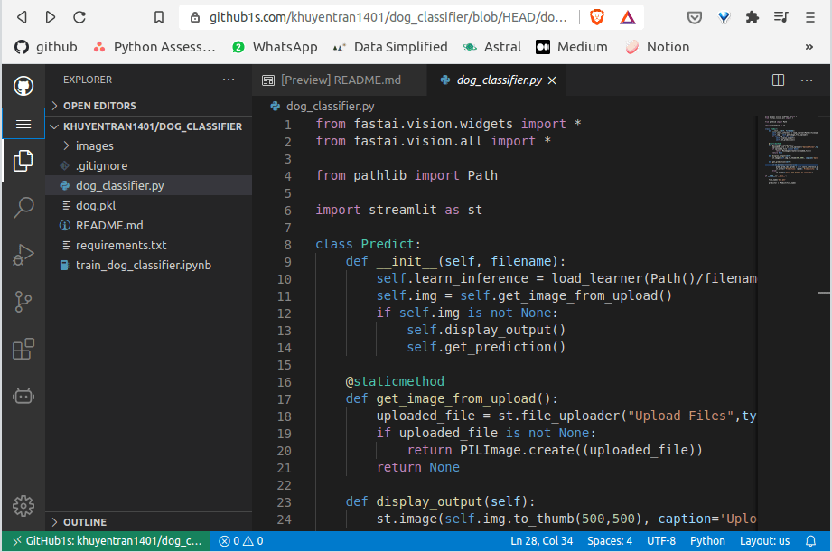
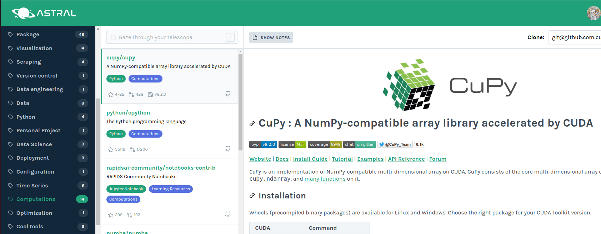

---
jupyter:
  jupytext:
    formats: ipynb,Rmd
    text_representation:
      extension: .Rmd
      format_name: rmarkdown
      format_version: '1.2'
      jupytext_version: 1.16.7
  kernelspec:
    display_name: Python 3 (ipykernel)
    language: python
    name: python3
---

# Git and GitHub


This section shows some tricks and tools to work with Git and GitHub


## GitHub CLI: Brings GitHub to Your Terminal	


If you create a local folder before creating a GitHub repository for it, you might need to go to the GitHub website then create a new repository, then add a remote to your current folder. Is there any way that all of these steps could be done in the terminal in 1 line of code?

That is when GitHub CLI  comes in handy. The code snippet below shows how to create a new Github repository in your local folder.


```bash
$ cd your_local_folder

# Create an empty local git repo
$ git init

# Create a new GitHub repo
$ gh repo create
```


With GitHub CLI, you can also manage your pull requests, issues, repositories, gists, and so much more! Check out GitHub CLI [here](https://cli.github.com/).


## Pull One File from Another Branch Using Git


Pull the files from another branch into your branch can be messy. What if you just want to pull one file from another branch? You can easily to like that with the code snippet below:


```bash
# downloads contents from remote repository
$ git fetch

# navigate to another branch
$ git checkout

# adds a change in the working directory to the staging area
$ git add 

# captures the state of a project at that point in time
$ git commit
```


Now you just update one file in your branch without messing with the rest!


## Download a File on GitHub Using wget


If you want to download a file on Github such as a csv file, instead of cloning the repo, simply use the code snippet above. For example, if the website the file you want to extract is https://github.com/khuyentran1401/Data-science/blob/master/visualization/dropdown/population.csv, type:

```bash
$ wget https://raw.githubusercontent.com/khuyentran1401/Data-science/master/visualization/dropdown/population.csv
```

Now the data is in your directory!


## github1s: Read GitHub Code with VS Code on your Browser in One Second


Syntax highlighting in VS Code makes it easy for you to understand the source code. Is there a way that you can read GitHub code with VS Code in 1s?

Yes, there is. Simply replace `github.com/yourname/repository` with `github1s.com/yourname/repository` to view Github with VS Code. It should show up like below.

[Here](https://github1s.com/khuyentran1401/Data-science) is an example.





## Astral: Organize Your Github Stars with Ease


I have been sharing many tools and you might not be able to keep up with them. To save and organize the tools you discovered on Github, you can use Astral.

With Astral, you can organize my starred Github repositories like below.

I have been using this for months, and it is super quick when I want to find the right tool for my project.





[Link to Astral](http://astralapp.com/).


## pip install -e: Install Forked GitHub Repository Using Pip


Sometimes, you might fork and make some changes to the original GitHub repository. If you want others to install your forked repo, use `pip install -e git+https://github.com/username/package.git#egg=package`.

The code below shows how to install the forked repo of NumPy.

```bash
$ pip install -e git+https://github.com/khuyentran1401/numpy.git#egg=numpy 
```


## git-open: Open a GitHub Page for a Local Repository


It can be a hassle to find a GitHub page for your local repository. 

git-open makes it easy to open a GitHub page for a repository with one command.


[Link to git-open](https://github.com/paulirish/git-open).


## gpt-commit-summarizer: Automate Pull Request Summarization


gpt-commit-summarizer is a GitHub Action that leverages the power of GPT to summarize the changes made in a pull request.

This eliminates the need for manual summarization, saving you valuable time, especially when dealing with numerous changes within a commit.


To use gpt-commit-summarizer, simply add the the following workflow file to your repository:

```yaml
name: GPT Commits summarizer
## Summary: This action will write a comment about every commit in a pull request, as well as generate a summary for every file that was modified and add it to the review page, compile a PR summary from all commit summaries and file diff summaries, and delete outdated code review comments

on:
  pull_request:
    types: [opened, synchronize]

jobs:
  summarize:
    runs-on: ubuntu-latest
    permissions: write-all  # Some repositories need this line

    steps:
      - uses: KanHarI/gpt-commit-summarizer@master
        env:
          GITHUB_TOKEN: ${{ secrets.GITHUB_TOKEN }}
          OPENAI_API_KEY: ${{ secrets.OPENAI_API_KEY }}
```


[Link to gpt-commit-summarizer](https://github.com/KanHarI/gpt-commit-summarizer/).


## Simplifying GitHub API Interactions with githubkit

```{python tags=c("hide-cell")}
# !pip install githubkit
```

Making API calls to GitHub and handling different response types and authentication methods often results in complex, hard-to-maintain code. Writing raw HTTP requests, managing tokens, and parsing JSON responses manually leads to verbose implementations and potential errors.


```{python}
TOKEN = "your_github_token"
```

```{python}
owner = "khuyentran1401"
repo_name = "Efficient_Python_tricks_and_tools_for_data_scientists"
```

```{python}
import requests

## Get repository info
url = f"https://api.github.com/repos/{owner}/{repo_name}"

headers = {
    "Authorization": f"Bearer {TOKEN}",
    "Accept": "application/vnd.github.v3+json",
}
response = requests.get(url, headers=headers)
repo = response.json()
```

```{python}
print(f"Name: {repo['name']}")
print(f"Full Name: {repo['full_name']}")
print(f"Description: {repo['description']}")
print(f"Stars: {repo['stargazers_count']}")
print(f"Forks: {repo['forks_count']}")
print(f"Language: {repo['language']}")
print(f"URL: {repo['html_url']}")
```

With githubkit, you can interact with GitHub's API using a clean, typed interface that supports both synchronous and asynchronous operations. You get automatic response parsing, built-in authentication handling, and comprehensive type hints.

```{python}
from githubkit import Response
from githubkit.versions.latest.models import FullRepository
from githubkit import GitHub

github = GitHub(TOKEN)
resp: Response[FullRepository] = github.rest.repos.get(owner, repo_name)
repo: FullRepository = resp.parsed_data
```

```{python}
print(f"Name: {repo.name}")
print(f"Full Name: {repo.full_name}")
print(f"Description: {repo.description}")
print(f"Stars: {repo.stargazers_count}")
print(f"Forks: {repo.forks_count}")
print(f"Language: {repo.language}")
print(f"URL: {repo.html_url}")
```

In this example, githubkit handles the authentication header, makes the API request, and automatically parses the response into a strongly-typed `FullRepository` object. The type hints provide IDE support and catch potential errors before runtime.


[Link to githubkit](https://github.com/yanyongyu/githubkit).
