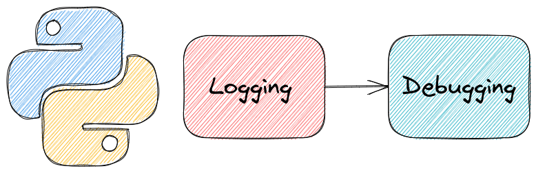
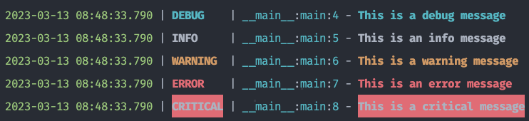
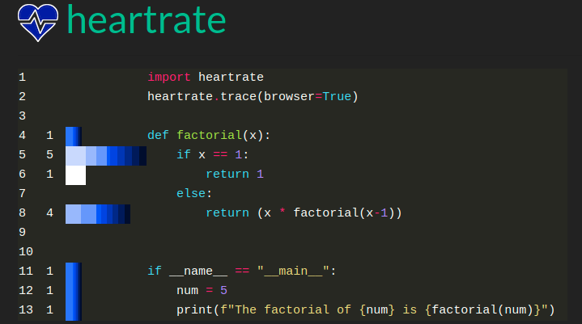
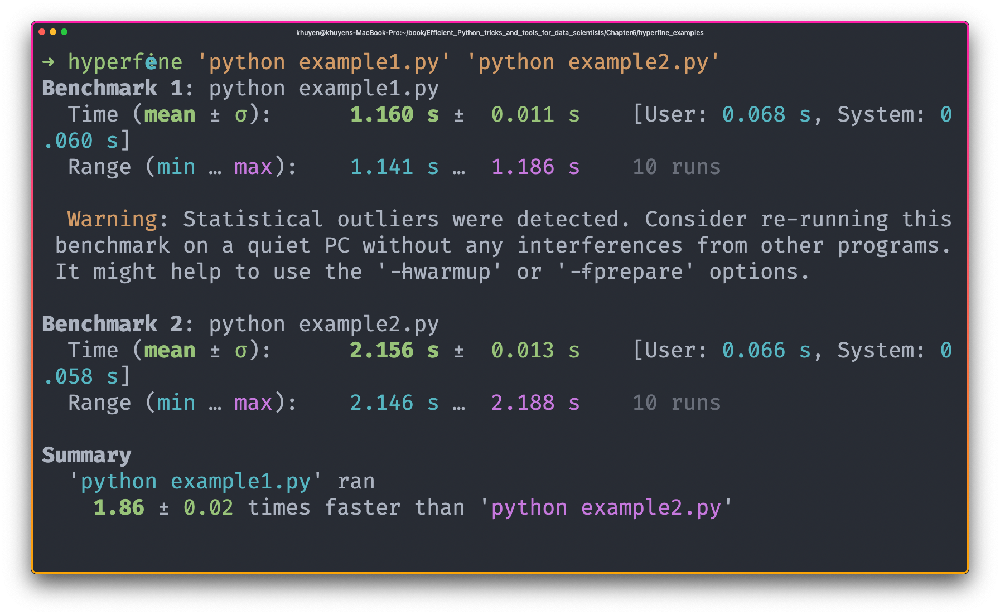
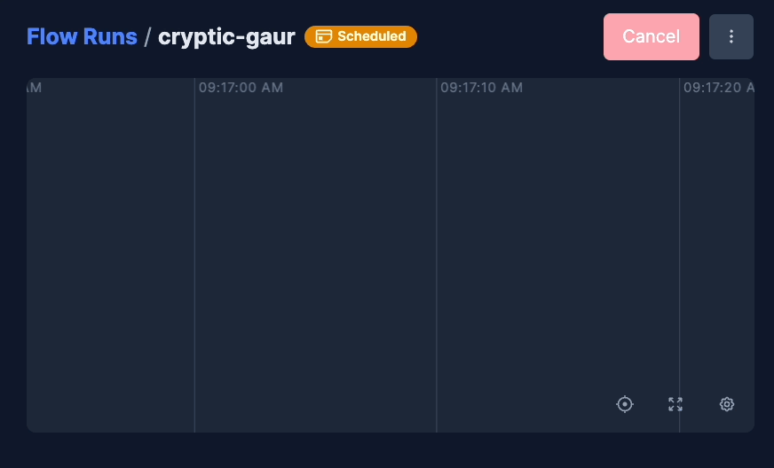

---
jupyter:
  jupytext:
    formats: ipynb,Rmd
    text_representation:
      extension: .Rmd
      format_name: rmarkdown
      format_version: '1.2'
      jupytext_version: 1.16.7
  kernelspec:
    display_name: Python 3 (ipykernel)
    language: python
    name: python3
---

```{python active="", eval=FALSE}
## Logging and Debugging
```




Collections of tools for logging and debugging Python code. 


### rich.inspect: Produce a Beautiful Report on any Python Object

```{python tags=c("hide-cell")}
# !pip install rich
```

If you want to quickly see which attributes and methods of a Python object are available, use rich’s `inspect` method.

rich’s `inspect` method allows you to create a beautiful report for any Python object, including a string.

```{python}
from rich import inspect

print(inspect("hello", methods=True))
```

### Rich’s Console: Debug your Python Function in One Line of Code

```{python tags=c("hide-cell")}
# !pip install rich
```

Sometimes, you might want to know which elements in the function created a certain output. Instead of printing every variable in the function, you can simply use Rich’s `Console` object to print both the output and all the variables in the function.

```{python}
import pandas as pd
from rich import console
from rich.console import Console

console = Console()

data = pd.DataFrame({"a": [1, 2, 3], "b": [4, 5, 6]})


def edit_data(data):
    var_1 = 45
    var_2 = 30
    var_3 = var_1 + var_2
    data["a"] = [var_1, var_2, var_3]
    console.log(data, log_locals=True)


edit_data(data)
```

[Link to my article about rich](https://towardsdatascience.com/rich-generate-rich-and-beautiful-text-in-the-terminal-with-python-541f39abf32e).

[Link to rich](https://github.com/willmcgugan/rich).


### Simplify Python Logging with Loguru


Have you ever found yourself using print() instead of a proper logger due to the hassle of setup?

With Loguru, you can get started with logging right away. A single import is all you need to begin logging with pre-configured color and format settings.


Here is the comparison between the standard Python logging library and Loguru:


Standard Python logging library:


```python
# loguru_vs_logging/logging_example.py

import logging

logging.basicConfig(format='%(asctime)s | %(levelname)s | %(module)s:%(funcName)s:%(lineno)d | %(message)s', level=logging.DEBUG)

def main():
    logging.debug('This is a debug message')
    logging.info('This is an info message')
    logging.warning('This is a warning message')
    logging.error('This is an error message')
    logging.critical('This is a critical message')

if __name__ == '__main__':
    main()
```


```bash
$ python loguru_vs_logging/logging_example.py

2023-03-13 08:46:30,802 | DEBUG | logging_example:main:6 | This is a debug message
2023-03-13 08:46:30,802 | INFO | logging_example:main:7 | This is an info message
2023-03-13 08:46:30,802 | WARNING | logging_example:main:8 | This is a warning message
2023-03-13 08:46:30,802 | ERROR | logging_example:main:9 | This is an error message
2023-03-13 08:46:30,802 | CRITICAL | logging_example:main:10 | This is a critical message
```


Loguru:


```python
# loguru_vs_logging/loguru_example.py
from loguru import logger

def main():
    logger.debug("This is a debug message")
    logger.info("This is an info message")
    logger.warning("This is a warning message")
    logger.error("This is an error message")
    logger.critical("This is a critical message")


if __name__ == '__main__':
    main()
```


```bash
$ python loguru_vs_logging/loguru_example.py
```



[Link to loguru](https://github.com/Delgan/loguru). 

### Simplified Datetime Logging with Loguru

```{python tags=c("hide-cell")}
# !pip install loguru
```

Standard Python logging makes datetime handling complex with multiple parameters and formatting options:

```{python}
import logging
from datetime import datetime

logging.basicConfig(
    format="%(asctime)s %(levelname)s: %(message)s",
    datefmt="%Y-%m-%d %H:%M:%S",
    level=logging.INFO,
)

logging.info("This is a test")
```

Loguru simplifies this with intuitive datetime formatting. Here's how to use it:

Step 1: Basic Setup

```{python}
import sys
from loguru import logger

# Remove the default handler and add a custom format
logger.remove()
logger.add(sys.stdout, format="{time:YYYY-MM-DD HH:mm:ss} {level}: {message}")

logger.info("This is a test")
```

The format specifies the date (YYYY-MM-DD) and time (HH:mm:ss) with clear, readable syntax.

Step 2: Advanced Timezone Handling

```{python}
# Add handler with timezone support
logger.remove()
logger.add(sys.stdout, format="{time:dddd DD MMMM YYYY HH:mm:ss!UTC} | {message}")

logger.info("UTC timestamp")
```

Loguru automatically handles:
- Timezone conversion (using !UTC or !LOCAL)
- Millisecond precision
- Locale-aware formatting
- Custom date and time components

This makes datetime logging both simpler and more powerful than the standard library's approach.

[Link to Loguru](https://github.com/Delgan/loguru)


### loguru: Print Readable Traceback in Python


```{python tags=c("hide-cell")}
# !pip install loguru
```

Loguru also allows you to print a readable traceback by adding decorator `logger.catch` to a function. 

```{python tags=c("hide-output")}
import numpy as np
from loguru import logger
from sklearn.metrics import mean_squared_error

logger.add("file_{time}.log", format="{time} {level} {message}")


@logger.catch
def evaluate_result(y_true: np.array, y_pred: np.array):
    mean_square_err = mean_squared_error(y_true, y_pred)
    root_mean_square_err = mean_square_err**0.5


y_true = np.array([1, 2, 3])
y_pred = np.array([1.5, 2.2])
evaluate_result(y_true, y_pred)
```

```bash
> File "/tmp/ipykernel_174022/1865479429.py", line 14, in <module>
    evaluate_result(y_true, y_pred)
    │               │       └ array([1.5, 2.2])
    │               └ array([1, 2, 3])
    └ <function evaluate_result at 0x7f279588f430>

  File "/tmp/ipykernel_174022/1865479429.py", line 9, in evaluate_result
    mean_square_err = mean_squared_error(y_true, y_pred)
                      │                  │       └ array([1.5, 2.2])
                      │                  └ array([1, 2, 3])
                      └ <function mean_squared_error at 0x7f27958bfca0>

  File "/home/khuyen/book/venv/lib/python3.8/site-packages/sklearn/utils/validation.py", line 63, in inner_f
    return f(*args, **kwargs)
           │  │       └ {}
           │  └ (array([1, 2, 3]), array([1.5, 2.2]))
           └ <function mean_squared_error at 0x7f27958bfb80>
  File "/home/khuyen/book/venv/lib/python3.8/site-packages/sklearn/metrics/_regression.py", line 335, in mean_squared_error
    y_type, y_true, y_pred, multioutput = _check_reg_targets(
            │       │                     └ <function _check_reg_targets at 0x7f27958b7af0>
            │       └ array([1.5, 2.2])
            └ array([1, 2, 3])
  File "/home/khuyen/book/venv/lib/python3.8/site-packages/sklearn/metrics/_regression.py", line 88, in _check_reg_targets
    check_consistent_length(y_true, y_pred)
    │                       │       └ array([1.5, 2.2])
    │                       └ array([1, 2, 3])
    └ <function check_consistent_length at 0x7f279676e040>
  File "/home/khuyen/book/venv/lib/python3.8/site-packages/sklearn/utils/validation.py", line 319, in check_consistent_length
    raise ValueError("Found input variables with inconsistent numbers of"

ValueError: Found input variables with inconsistent numbers of samples: [3, 2]
```

[Link to loguru](https://github.com/Delgan/loguru). 

### Icecream: Never use print() to debug again

```{python tags=c("hide-cell")}
# !pip install icecream
```

If you use print or log to debug your code, you might be confused about which line of code creates the output, especially when there are many outputs.

You might insert text to make it less confusing, but it is time-consuming.

```{python}
from icecream import ic


def plus_one(num):
    return num + 1


print("output of plus_on with num = 1:", plus_one(1))
print("output of plus_on with num = 2:", plus_one(2))
```

Try icecream instead. Icrecream inspects itself and prints both its own arguments and the values of those arguments like below.

```{python tags=c("hide-output")}
ic(plus_one(1))
ic(plus_one(2))
```

Output:
```bash  
ic| plus_one(1): 2
ic| plus_one(2): 3
```


[Link to icecream](https://github.com/gruns/icecream)

[Link to my article about icecream](https://towardsdatascience.com/stop-using-print-to-debug-in-python-use-icecream-instead-79e17b963fcc)


### heartrate — Visualize the Execution of a Python Program in Real-Time

```{python tags=c("hide-cell")}
# !pip install heartrate
```

Understanding how your Python code executes in real-time and identifying performance bottlenecks or execution patterns results in a lot of manual debugging and print statements. This often leads to cluttered code and incomplete understanding of program flow.

```{python}
def factorial(x, depth=0):
    print(f"Calculating factorial({x})")

    if x == 1:
        print(f"Base case: factorial(1) = 1")
        return 1
    else:
        result = x * factorial(x - 1, depth + 1)
        print(f"factorial({x}) = {x} * factorial({x-1}) = {result}")
        return result


if __name__ == "__main__":
    num = 5
    result = factorial(num)
    print(f"The factorial of {num} is {factorial(num)}")
```

You can use heartrate to visualize your code execution in real-time through a browser interface. It shows line execution counts, recent activity with color-coded bars, and a live stacktrace without modifying your source code.

You only need to add two lines of code to use heartrate.

```{python}
from time import sleep
```

```{python tags=c("hide-output")}
import heartrate

heartrate.trace(browser=True)


def factorial(x):
    if x == 1:
        sleep(1)
        return 1
    else:
        sleep(1)
        return x * factorial(x - 1)


if __name__ == "__main__":
    num = 5
    print(f"The factorial of {num} is {factorial(num)}")
```

You should see something similar to the below when opening the browser:




Explanation of the visualization:

- Line hit counts on the left side
- Visual bars showing recent line executions (longer = more hits, lighter = more recent)
- Currently executing lines highlighted


[Link to heartrate](https://github.com/alexmojaki/heartrate).


### pyheat: Simplify Code Profiling with Heatmap Visualization 

```{python tags=c("hide-cell")}
# !pip install py-heat
```

Profiling your code is helpful, but looking at data in a table can be a real headache. Wouldn't it be nice if you could see your code's time distribution as a heatmap? That is when pyheat comes in handy. 

```{python tags=c("remove-cell")}
import warnings

warnings.simplefilter("ignore", UserWarning)
```

```{python}
# %%writefile pyheat_example.py
def factorial(x):
    if x == 1:
        return 1
    else:
        return x * factorial(x - 1)


if __name__ == "__main__":
    num = 5
    factorial(num)
```

```{python}
from pyheat import PyHeat

ph = PyHeat("pyheat_example.py")  # file you want to profile
ph.create_heatmap()
ph.show_heatmap()
```

[Link to pyheat](https://github.com/csurfer/pyheat).


### snoop : Smart Print to Debug your Python Function

```{python tags=c("hide-cell")}
# !pip install snoop
```

If you want to figure out what is happening in your code without adding many print statements, try snoop.

To use snoop, simply add the `@snoop` decorator to a function you want to understand.

```{python}
import snoop


@snoop
def factorial(x):
    if x == 1:
        return 1
    else:
        return x * factorial(x - 1)


if __name__ == "__main__":
    num = 5
    print(f"The factorial of {num} is {factorial(num)}")
```

### Logging in Pandas Pipelines

```{python tags=c("hide-cell")}
# !pip install scikit-lego
```

When using pandas pipe, you might want to check whether each pipeline transforms your pandas DataFrame correctly. To automatically log the information of a pandas DataFrame after each pipeline, use the decorator `sklego.pandas_utils.log_step`.

```{python}
import logging

import pandas as pd
from sklego.pandas_utils import log_step
```

```{python}
df = pd.DataFrame({"col1": [1, 2, 3], "col2": ["a", "b", "c"]})
```

To use `log_step`, simply use it as a decorator for functions being applied to your DataFrame. 

```{python}
@log_step(print_fn=logging.info)
def make_copy(df: pd.DataFrame):
    return df.copy()


@log_step(print_fn=logging.info)
def drop_column(df: pd.DataFrame):
    return df[["col2"]]


@log_step(print_fn=logging.info)
def encode_cat_variables(df: pd.DataFrame):
    df["col2"] = df["col2"].map({"a": 1, "b": 2, "c": 3})
    return df
```

```{python}
df = df.pipe(make_copy).pipe(drop_column).pipe(encode_cat_variables)
```

Find more ways to customize your logging [here](https://scikit-lego.netlify.app/pandas_pipeline.html#Logging-in-method-chaining)


### Add Progress Bar to Your List Comprehension

```{python tags=c("hide-cell")}
# !pip install tqdm
```

If your for loop or list comprehension takes a long time to run, you might want to know which element is being processed. You can add clarity to your for-loop by using tqdm. Using tqdm with an iterable will show a progress bar. 

```{python}
from time import sleep

from tqdm.notebook import tqdm


def lower(word):
    sleep(1)
    print(f"Processing {word}")
    return word.lower()


words = tqdm(["Duck", "dog", "Flower", "fan"])

[lower(word) for word in words]
```

[Link to tqdm](https://github.com/tqdm/tqdm).


### Hyperfine: Compare the Speed of Two Commands


If you want to compare the speed of two arbitrary commands, use hyperfine. hyperfine creates a statistical analysis across multiple runs and detects outliers.  

In the code below, I use hyperfine to compare the execution speed of two Python files. 


```bash
$ hyperfine 'python example1.py' 'python example2.py'
```





[Link to hyperfine](https://github.com/sharkdp/hyperfine).


### Timeline View of the Execution of Your Python Functions


Have you ever wanted to see a timeline graph showing how the execution of your functions takes place in time? Prefect now allows you to do exactly that. 

To use Prefect, simply add `@task` and `@flow` to your Python functions.

```python
from prefect import task, flow
from time import sleep

@task
def task1(secs):
    sleep(secs)

@task 
def task2(secs):
    sleep(secs)

@flow
def my_flow():
    task1(2)
    task2.submit(10)
    task2.submit(2)

my_flow()
```

When running this code, you should see the following on your [Prefect UI](https://docs.prefect.io/ui/overview/).




Check out the [getting started tutorials](https://docs.prefect.io/tutorials/first-steps/) for basic concepts of Prefect. 


### WAT: Your One-Stop Tool for Python Object Exploration

```{python tags=c("hide-cell")}
# !pip install wat-inspector
```

Inspecting object states and understanding their properties often requires tedious setup of print statements or frequent context switching between code and documentation. 

With WAT, you can quickly examine an object's type, formatted value, variables, methods, parent types, signature, and documentation - all in one view. 

To use WAT, simply prepend `wat/` to any object you wish to inspect.

```{python}
import datetime

import wat

wat / datetime.datetime.now()
```

[Link to WAT](https://bit.ly/3YIEkgJ).
