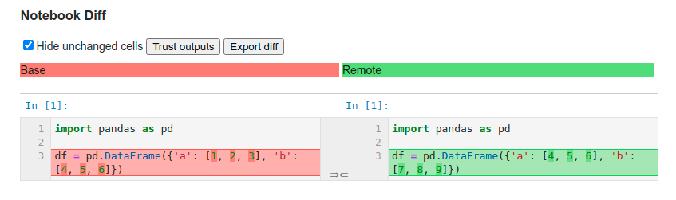

---
jupytext:
  text_representation:
    extension: .md
    format_name: myst
    format_version: 0.13
    jupytext_version: 1.16.7
kernelspec:
  display_name: Python 3 (ipykernel)
  language: python
  name: python3
---

## Jupyter Notebook

+++


+++

This section covers some tools to work with Jupyter Notebook.

+++

### nbdime: Better Version Control for Jupyter Notebook

+++

If you want to compare the previous version and the current version of a notebook, use nbdime. The image below shows how 2 versions of a notebook are compared with nbdime.



To install nbdime, type:

```bash
pip install nbdime
```
After installing, click the little icon in the top right corner to use nbdime.


+++

[Link to nbdime](https://github.com/jupyter/nbdime/blob/master/docs/source/index.rst).

+++

### display in IPython: Display Math Equations in Jupyter Notebook

+++

If you want to use latex to display math equations in Jupyter Notebook, use the display module in the IPython library.

```{code-cell} ipython3
from IPython.display import display, Math

a = 3
b = 5
print("The equation is:")
display(Math(f"y= {a}x+{b}"))
```

### Reuse The Notebook to Run The Same Code Across Different Data

+++

Have you ever wanted to reuse the notebook to run the same code across different data? This could be helpful to visualize different data without changing the code in the notebook itself.

Papermill provides the tool for this. [Insert the tag `parameters` in a notebook cell that contains the variable you want to parameterize](https://papermill.readthedocs.io/en/latest/usage-parameterize.html).

Then run the code below in the terminal. 

+++

```bash
$ papermill input.ipynb output.ipynb -p data=data1
```

+++

`-p` stands for parameters. In this case, I specify the data I want to run with `-p data=<name-data>`

+++

[Link to papermill](https://papermill.readthedocs.io/en/latest/usage-workflow.html)

+++

### watermark: Get Information About Your Hardware and the Packages Being Used within Your Notebook

```{code-cell} ipython3
:tags: [hide-cell]

!pip install watermark 
```

If you want to get information about your hardware and the Python packages being used within your notebook, use the magic extension watermark.

The code below shows the outputs of the watermark in my notebook.

```{code-cell} ipython3
%load_ext watermark
```

```{code-cell} ipython3
%watermark
```

We can also use watermark to show the versions of the libraries being used:

```{code-cell} ipython3
import numpy as np
import pandas as pd
import sklearn
```

```{code-cell} ipython3
%watermark --iversions 
```

[Link to watermark](https://github.com/rasbt/watermark#installation-and-updating).

+++

### Generate requirements.txt File for Jupyter Notebooks Based on Imports

```{code-cell} ipython3
:tags: [hide-cell]

!pip install pipreqsnb
```

`pip freeze` saves all packages in the environment, including ones that you don't use in your current project. To generate a `requirements.txt` based on imports in  your Jupyter Notebooks, use pipreqsnb. 

For example, to save all packages in your current project to a `requirements.txt` file, run:
```bash
$ pipreqsnb . 
```

```{code-cell} ipython3
:tags: [hide-input]

!pipreqsnb . 
```

Your `requirements.txt` should look like below:
```
pandas==1.3.4
numpy==1.20.3
ipython==7.30.1
scikit_learn==1.0.2
```

+++

Usage of pipreqsnb:
```bash
Usage:
    pipreqsnb [options] <path> 

Options:
    --use-local           Use ONLY local package info instead of querying PyPI
    --pypi-server <url>   Use custom PyPi server
    --proxy <url>         Use Proxy, parameter will be passed to requests library. You can also just set the
                          environments parameter in your terminal:
                          $ export HTTP_PROXY="http://10.10.1.10:3128"
                          $ export HTTPS_PROXY="https://10.10.1.10:1080"
    --debug               Print debug information
    --ignore <dirs>...    Ignore extra directories (sepparated by comma no space)
    --encoding <charset>  Use encoding parameter for file open
    --savepath <file>     Save the list of requirements in the given file
    --print               Output the list of requirements in the standard output
    --force               Overwrite existing requirements.txt
    --diff <file>         Compare modules in requirements.txt to project imports.
    --clean <file>        Clean up requirements.txt by removing modules that are not imported in project.
    --no-pin              Omit version of output packages.
```

+++

[Link to pipreqsnb](https://github.com/ivanlen/pipreqsnb)

To generate requirements.txt for Python scripts, use [pipreqs](https://khuyentran1401.github.io/Efficient_Python_tricks_and_tools_for_data_scientists/Chapter6/env_management.html#pipreqs-generate-requirements-txt-file-for-any-project-based-on-imports) instead.

+++

### ipytest: Unit Tests in IPython Notebooks

```{code-cell} ipython3
:tags: [hide-cell]

!pip install ipytest
```

It is important to create unit tests for your functions to make sure they work as you expected, even the experimental code in your Jupyter Notebook. However, it can be difficult to create unit tests in a notebook.

Luckily, ipytest allows you to run pytest inside the notebook environment. To use ipytest, simply add `%%ipytest -qq` inside the cell you want to run pytest. 

```{code-cell} ipython3
import ipytest
import pytest

ipytest.autoconfig()
```

```{code-cell} ipython3
def multiply_by_two(nums: list):
    return [num * 2 for num in nums]
```

```{code-cell} ipython3
%%ipytest -qq

def test_multiply_by_two():
    assert multiply_by_two([1, 2]) == [2, 4]
```

You can also combine ipytest and [other pytest plugins](https://khuyentran1401.github.io/Efficient_Python_tricks_and_tools_for_data_scientists/Chapter5/testing.html) to improve your tests.

```{code-cell} ipython3
%%ipytest -qq

test = [([1, 2], [2, 4]),
       ([float('nan')], [float('nan')])]

@pytest.mark.parametrize('sample, expected', test)
def test_multiply_by_two(sample, expected):
    assert multiply_by_two(sample) == expected
```

[Link to ipytest](https://github.com/chmp/ipytest).

+++

### nbQA: Run Code Formatter and Checker on Your Jupyter Notebooks

```{code-cell} ipython3
!pip install nbqa 
```

If you want to check the quality of the code in your Jupyter Notebook and automatically format it, use nbQA. With nbQA, you can run isort, black, flake8, and more on your Jupyter Notebooks.

+++

Imagine the notebook `example_notebook.ipnb` looks like the below:

+++

```python
import pandas as pd

import numpy as np

a = [1,2,3,4]
```

+++

Format the code:
```bash
$ nbqa black example_notebook.ipynb
```

```{code-cell} ipython3
:tags: [hide-input]

!nbqa black example_notebook.ipynb
```

Check style and quality of the code:
```bash
$ nbqa flake8 example_notebook.ipynb
```

```{code-cell} ipython3
:tags: [hide-input]

!nbqa flake8 example_notebook.ipynb
```

Sort the imports in the notebook:
```bash
$ nbqa isort example_notebook.ipynb
```

```{code-cell} ipython3
!nbqa isort example_notebook.ipynb
```

Your notebook after running all of the commands above will look like the below:
```python
import numpy as np
import pandas as pd

a = [1, 2, 3, 4]
```

After reding the suggestions of flake8, we can also remove two unused packages:
```python
a = [1, 2, 3, 4]
```
Now the notebook looks much cleaner!

+++

You can also automatically run nbQA every time you commit a Jupyter Notebook using [pre-commit](https://towardsdatascience.com/4-pre-commit-plugins-to-automate-code-reviewing-and-formatting-in-python-c80c6d2e9f5).

Here is how you can add nbQA to your pre-commit pipeline:

```yaml
# pre-commit-config.yaml
repos:
- repo: https://github.com/nbQA-dev/nbQA
  rev: 0.10.0
  hooks:
    - id: nbqa-flake8
    - id: nbqa-isort
    - id: nbqa-black
```

+++

[Link to nbQA](https://nbqa.readthedocs.io/en/latest/readme.html).

+++

### Debug Your Jupyter Notebook's Code with snoop

```{code-cell} ipython3
:tags: [hide-cell]

!pip install snoop
```

Have you ever tried to print multiple attributes of a Python object in your Jupyter Notebook to debug it? Wouldn't it be nice if you can automatically print all of those attributes using one magic command? That is when snoop comes in handy.

To use snoop, start with loading the library then add `%%snoop` at the beginning of the cell you want to debug. 

```{code-cell} ipython3
import numpy as np 
import pandas as pd 
```

```{code-cell} ipython3
%load_ext snoop
```

```{code-cell} ipython3
%%snoop 

arr = np.random.randint(2, 10, (3, 2))
```

```{code-cell} ipython3
%%snoop 

df = pd.DataFrame(arr, columns=["a", "b"])
```

snoop also supports debugging in a Python script.

[Link to snoop](https://github.com/alexmojaki/snoop)

+++

### Integrate Jupyter AI for Seamless Code Creation in Jupyter Notebook and Lab

```{code-cell} ipython3
:tags: [hide-cell]

!pip install jupyter_ai
```

Use Jupyter AI directly within your Jupyter Notebook and Jupyter Lab to effortlessly generate code using generative AI, eliminating the need to import code snippets from other applications.

```{code-cell} ipython3
%env OPENAI_API_KEY=YOUR_API_KEY_HERE
```

```{code-cell} ipython3
%load_ext jupyter_ai
```

```{code-cell} ipython3
%%ai chatgpt
Generate the 2D heat equation
```

```{code-cell} ipython3
%%ai chatgpt
Write Python code to create a monthly time series spanning one year.
```

[Link to jupyter-ai](https://github.com/jupyterlab/jupyter-ai).

+++

### testbook: Write Clean Unit Tests for Notebooks

```{code-cell} ipython3
:tags: [hide-cell]

!pip install testbook
```

Writing unit tests for notebooks within the notebooks themselves can lead to a messy notebook.

testbook allows unit tests to be run against notebooks in separate test files, effectively treating .ipynb files as .py files.

For example, consider the following code cell in a Jupyter Notebook "example_notebook2.ipynb":

+++

```python
# example_notebook2.ipynb
def add(num1: float, num2: float) -> float:
    return num1 + num2
```

+++

With testbook, you can write a unit test using testbook in a Python file "test_example.py" as follows:

```{code-cell} ipython3
%%writefile test_example.py
from testbook import testbook

@testbook('example_notebook2.ipynb', execute=True)
def test_func(tb):
   add = tb.get("add")
   assert add(1, 2) == 3
```

Then pytest can be used to run the test:

+++

```bash
$ pytest test_example.py
```

```{code-cell} ipython3
:tags: [remove-input]

!pytest test_example.py
```

[Link to testbook](https://bit.ly/49dzOJ4).

+++

### Navigating and Managing Files in Notebooks: Top Magic Commands

+++

To efficiently manage folders, navigate directories, write to files, and execute scripts directly from your notebook, consider using these four highly effective magic commands that simplify these tasks:
- `%mkdir`: Create new folders.
- `%cd`: Navigate through directories.
- `%%writefile`: Write content to files.
- `%run`: Run external Python scripts.

```{code-cell} ipython3
%mkdir my_project
%cd my_project
```

```{code-cell} ipython3
%%writefile process_data.py
print("Processing data...")
```

```{code-cell} ipython3
%run process_data.py
```
